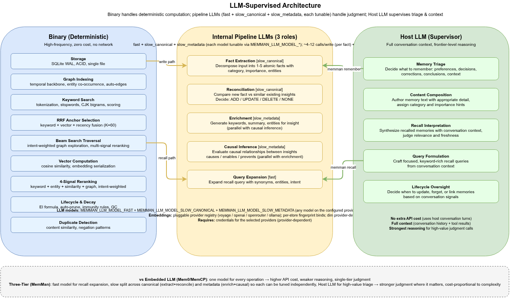

# 1. Background

[< Back to Design Overview](../DESIGN.md)

---

## 1.1 The Amnesia Problem

LLM agents suffer from three memory deficiencies:

- **Context compression loss**: After compaction or automatic compression, prior decisions and context are lost
- **Cross-session forgetting**: Each new session starts from scratch
- **Long-session decay**: Once the context window fills, early information is pushed out of attention range

Users must repeatedly restate preferences, re-explain project context, and re-derive conclusions already reached.

## 1.2 MemMan's Goal

Make an LLM remember decisions, preferences, and project context across arbitrarily many sessions.

MemMan is not a library embedded within an agent framework. It is a standalone memory engine — callable via the command line by Claude Code, Cursor, or any LLM CLI.

---

## 1.3 LLM-Supervised Pattern

Traditional LLM memory systems (such as Mem0 and the original MAGMA implementation) embed a small LLM inside the pipeline to handle memory operations — entity extraction, conflict detection, causal reasoning. This is the **LLM-Embedded** pattern.

MemMan adopts the **LLM-Supervised** pattern:

| Pattern            | Where is the LLM               | What does the LLM do                                                 | Representative        |
| ------------------ | ------------------------------ | -------------------------------------------------------------------- | --------------------- |
| **LLM-Embedded**   | Inside the pipeline            | Executor (extraction, classification, reasoning)                     | Mem0, MAGMA           |
| **File Injection** | Reads file at session start    | None — static file loaded into context window                        | Claude Code CLAUDE.md |
| **MCP Server**     | Tool provider via MCP protocol | Exposes memory operations as MCP tools for the host LLM              | MemCP                 |
| **LLM-Supervised** | Outside the pipeline           | Supervisor (reviews candidates, makes judgments, decides trade-offs) | MemMan                |

Responsibilities split into two tiers:

| Tier         | Role                      | Handles                                                                            |
| ------------ | ------------------------- | ---------------------------------------------------------------------------------- |
| **Binary**   | Deterministic computation | Storage, graph indexing, keyword search, vector math, decay formulas, auto-pruning |
| **Host LLM** | High-level judgment       | Decides what to remember, when to recall, which links to create, what to forget    |

Haiku handles pipeline intelligence (fact extraction, reconciliation, enrichment, causal inference, query expansion). The host LLM decides *when* and *what* to remember — it does not execute pipeline steps directly.

The same binary + skill works across Claude Code, Cursor, or any LLM CLI. Swapping the host LLM requires no changes to the binary.

## 1.4 Theoretical Foundations

MemMan's design draws on two directly implemented papers.

**MAGMA: Four-Graph Memory Architecture**

The [MAGMA](https://arxiv.org/abs/2601.03236) paper (Jiang et al., 2025) provides the data model and retrieval algorithms. Its key contribution: a single edge type (e.g., vector similarity) is insufficient for memory — different query intents require different relational perspectives. MAGMA's four-graph architecture (temporal, entity, causal, semantic) with intent-adaptive retrieval and multi-signal fusion gives MemMan its graph model and recall pipeline.

MAGMA also provides specific hyperparameter values adopted by MemMan. See Table 5 of the MAGMA paper for: anchor top-K (20), RRF constant (60), structural/semantic coefficients (λ1=1.0, λ2=0.3–0.7), max traversal depth (5), and similarity threshold range (0.10–0.30). These values are documented inline in [Pipelines](04-pipelines.md) and [Graph Model](03-graph-model.md).

**RRF: Reciprocal Rank Fusion**

The [RRF paper](https://dl.acm.org/doi/10.1145/1571941.1572114) (Cormack, Clarke & Buttcher, SIGIR 2009) provides the multi-signal fusion algorithm used in recall anchor selection. MemMan uses the exact `1/(k + rank)` formula with k=60, fusing keyword, vector, and recency signals into a composite anchor ranking.

**MemMan's Engineering Choices**

MemMan uses Haiku for fact extraction, reconciliation, enrichment, causal inference, and query expansion. The host LLM handles higher-level judgment (what to remember, when to recall). The write path uses LLM reconciliation (ADD/UPDATE/DELETE/NONE) instead of threshold-based comparison. The lifecycle is hook-driven: remember → reconcile → enrich → auto-prune.

Where MAGMA's reference implementation is a Python library with in-memory NetworkX graphs, MemMan persists everything in SQLite with a complete write-back lifecycle. The system is exposed through CLI commands — constrained, but auditable, portable, and sandboxed.

---

## 1.5 Design Decisions & Trade-offs

### Why LLM-Supervised Instead of an Embedded LLM?

| Dimension          | LLM-Embedded (Mem0, etc.) | LLM-Supervised (MemMan)                                                       |
| ------------------ | ------------------------- | ----------------------------------------------------------------------------- |
| LLM Capability     | Same model for everything | Host LLM + Haiku for pipeline                                                 |
| Pipeline LLM       | Same model for everything | Haiku for extraction, reconciliation, expansion, enrichment, causal inference |
| Network Dependency | Required                  | Required (OpenRouter + Voyage APIs)                                           |
| Swappability       | API-bound                 | Any LLM CLI                                                                   |

### Why SQLite WAL Instead of an Embedded Graph Database?

- **Single-file deployment**: one `.db` file per store — easy to manage and backup
- **ACID transactions**: Atomicity guarantee for the remember pipeline
- **WAL concurrency**: Supports simultaneous hook reads and CLI writes
- **Zero external dependencies**: No Redis/Neo4j/Qdrant required
- **Store isolation**: Named stores (`~/.memman/data/<name>/memman.db`) provide lightweight data isolation via `MEMMAN_STORE` env var

### Why Beam Search Instead of Full BFS?

- **Budget control**: MaxVisited parameter prevents graph explosion
- **Intent-adaptive**: Different intents use different beam widths and depths
- **Quality assurance**: Only the highest-scoring candidates are retained at each level, similar to pruning

### Why Soft Delete?

- Preserves audit trail
- Supports "undo" (recovering accidental deletions)
- Simplifies cascade cleanup
- Query consistency (`WHERE deleted_at IS NULL`)

### Key Deviations from the MAGMA Paper

| Aspect            | MAGMA Paper                                        | MemMan Implementation                                                                                                                                                                       |
| ----------------- | -------------------------------------------------- | ------------------------------------------------------------------------------------------------------------------------------------------------------------------------------------------- |
| Transition Score  | `exp(λ1·φ + λ2·sim)` (Eq. 5) — exponential wrapper | Linear `λ1·structural + λ2·semantic` — better discrimination (`exp` compresses score ratios; irrelevant edges with zero structural+semantic contribution score `exp(0) = 1.0` instead of 0) |
| Depth Decay       | `score_v = score_u · γ + s_uv` (Alg. 1) — decay γ  | No decay — accumulative scoring. Mitigated by bounded depth (4-5), beam pruning, and min-max normalized multi-factor re-ranking. γ is unspecified in the paper                              |
| RRF Weighting     | `w_keyword (Fusion): 2.0-5.0` (Table 5)            | Standard unweighted RRF — all three signals (keyword, vector, recency) contribute equally via `1/(k + rank)`                                                                                |
| Traversal Budget  | `Max Nodes: 200` (Table 5)                         | 400-500 (intent-dependent). Flat node hierarchy (insights only, no episodes/narratives) requires a larger budget for equivalent coverage                                                    |
| Intent Types      | {Why, When, Entity} — 3 types                      | Adds GENERAL (uniform 0.25 weights) as a 4th intent for queries that don't match specific patterns                                                                                          |
| Entity Extraction | LLM-driven full pipeline                           | LLM-based via Haiku (`extract_facts` + `enrich_with_llm`)                                                                                                                                   |
| Causal Reasoning  | Embedded prompt chain                              | LLM causal inference (`infer_llm_causal_edges`) via ThreadPoolExecutor                                                                                                                      |
| Deduplication     | Not addressed                                      | LLM reconciliation (ADD/UPDATE/DELETE/NONE)                                                                                                                                                 |
| Node Types        | EVENT, EPISODE, SESSION, NARRATIVE                 | Insight only (flat)                                                                                                                                                                         |
| Storage           | NetworkX (in-memory)                               | SQLite (persistent)                                                                                                                                                                         |
| Embeddings        | FAISS + OpenAI                                     | Voyage AI (voyage-3-lite, 512-dim)                                                                                                                                                          |
| Quality Review    | Slow-path LLM refinement (Alg. 3)                  | Pattern-based quality warnings + `memman insights review`                                                                                                                                   |
| Deployment        | Python library                                     | Python package (CLI)                                                                                                                                                                        |

MemMan retains MAGMA's **architectural skeleton** (four-graph separation, intent-adaptive retrieval, multi-signal fusion) while using Haiku for pipeline intelligence (fact extraction, reconciliation, query expansion, enrichment, causal inference) and the host LLM for high-level judgment.

## 1.6 Future Direction

Any LLM CLI can interact with MemMan through the CLI protocol today (agent-side pluggability). The remaining work is on the storage side.

### Storage-Side Pluggability

The storage engine is currently tightly built on SQLite — graph traversal, EI decay, and atomic transactions all depend on SQLite-specific features (WAL, single-file deployment, in-process access). This is the right choice for the current goal of zero-dependency single-package distribution, but it means the storage backend is not yet swappable.

Abstracting the storage interface — so the protocol layer can sit on top of PostgreSQL, a dedicated graph database, or a remote service — is the next architectural milestone.

The key challenge is defining the right abstraction boundary: too high and you lose the storage engine's graph-aware optimizations; too low and every backend must reimplement beam search and RRF fusion.
