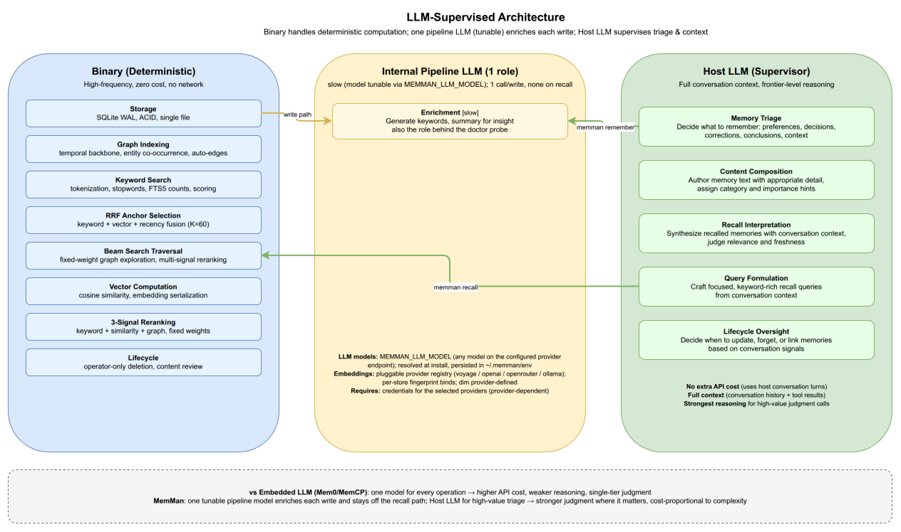
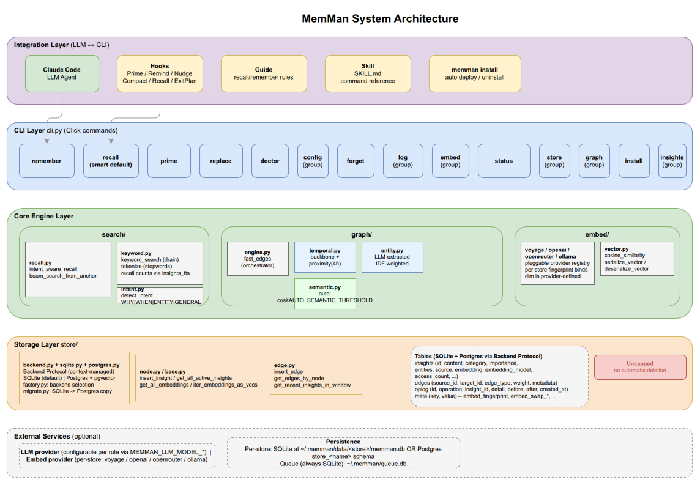

# 1. Background

[< Back to Design Overview](../DESIGN.md)

---

## 1.1 The amnesia problem

LLM agents lose context three ways:

- **Context compression loss**: after compaction, prior decisions and context disappear from the active window.
- **Cross-session forgetting**: each new session starts from scratch.
- **Long-session decay**: once the context window fills, early information falls out of attention range.

The result: users restate preferences, re-explain project context, and re-derive conclusions they already reached.

## 1.2 Scope

Persist decisions, preferences, and project context across sessions. memman is a CLI, not a library. Any LLM CLI that can shell out can call it.

---

## 1.3 LLM-Supervised pattern

Mem0 embeds an LLM inside the memory pipeline for extraction, conflict detection, and reasoning. Call this the LLM-Embedded pattern. memman adopts a different one:

| Pattern            | Where is the LLM               | What does the LLM do                                                 | Representative        |
| ------------------ | ------------------------------ | -------------------------------------------------------------------- | --------------------- |
| **LLM-Embedded**   | Inside the pipeline            | Executor (extraction, classification, reasoning)                     | Mem0                  |
| **File Injection** | Reads file at session start    | None - static file loaded into context window                        | Claude Code CLAUDE.md |
| **MCP Server**     | Tool provider via MCP protocol | Exposes memory operations as MCP tools for the host LLM              | MemCP                 |
| **LLM-Supervised** | Outside the pipeline           | Supervisor (reviews candidates, makes judgments, decides trade-offs) | memman                |

Responsibilities split into two tiers:

| Tier         | Role                      | Handles                                                                         |
| ------------ | ------------------------- | ------------------------------------------------------------------------------- |
| **Binary**   | Deterministic computation | Storage, graph indexing, keyword search, vector math, decay formulas            |
| **Host LLM** | High-level judgment       | Decides what to remember, when to recall, which links to create, what to forget |

The same binary + skill works across Claude Code, Cursor, or any LLM CLI. Swapping the host LLM requires no changes to the binary.

## 1.4 Retrieval design

Anchor selection fuses keyword, vector, and recency signals with Reciprocal Rank Fusion, the exact `1/(k + rank)` formula with k=60. [Pipelines](04-pipelines.md) documents the constants and rationale inline.

**Engineering choices.**
The pipeline uses one LLM model (`MEMMAN_LLM_MODEL`); see [§ LLM routing](04-pipelines.md#llm-routing) for the model assignment and cost-tuning rationale. The write path adds one row, or replaces the row `replace <id>` names. The lifecycle is hook-driven: remember → plan → enrich.

memman persists everything in SQLite (or Postgres + pgvector) with a complete write-back lifecycle and exposes the system through CLI commands - auditable, portable, sandboxed.

---

## 1.5 Design decisions & trade-offs

### Why LLM-Supervised instead of an embedded LLM?

| Dimension          | LLM-Embedded (Mem0, etc.) | LLM-Supervised (memman)                                                                  |
| ------------------ | ------------------------- | ---------------------------------------------------------------------------------------- |
| LLM capability     | One model for everything  | Host LLM + one worker model for enrichment (`MEMMAN_LLM_MODEL`)                          |
| Pipeline LLM       | One model for everything  | One model for enrichment and `doctor`'s connectivity probe (`MEMMAN_LLM_MODEL`)          |
| Network dependency | Required                  | Required (LLM + embedding provider APIs)                                                 |
| Swappability       | API-bound                 | Any LLM CLI                                                                              |

### Why SQLite WAL for storage?

- **Single-file deployment**: one `.db` file per store, easy to manage and back up.
- **ACID transactions**: atomicity for the remember pipeline.
- **WAL concurrency**: simultaneous hook reads and CLI writes.
- **Zero external dependencies**: no Redis/Neo4j/Qdrant required.
- **Store isolation**: named stores (`~/.memman/data/<name>/memman.db`) give data isolation via the `MEMMAN_STORE` env var.

### Why soft delete?

- Preserves audit trail.
- Supports undo (recovering accidental deletions).
- Simplifies cascade cleanup.
- Query consistency: a current row is `deleted_at is null and
  superseded_by is null`, at every read.
- Supersession is not deletion. A row a later write corrected keeps its
  content behind `superseded_by`, leaves the current view exactly as a
  deleted row does, and `memman insights show <id> --history` reads the
  chain back.

### Retrieval and graph design decisions

| Aspect            | memman Design                                                                                                                                                                                                                                                                                                                                                                                                                                                                                                                                                                                                                                                                                                                                                                                                                                                                                                                                                                                          |
| ----------------- | ------------------------------------------------------------------------------------------------------------------------------------------------------------------------------------------------------------------------------------------------------------------------------------------------------------------------------------------------------------------------------------------------------------------------------------------------------------------------------------------------------------------------------------------------------------------------------------------------------------------------------------------------------------------------------------------------------------------------------------------------------------------------------------------------------------------------------------------------------------------------------------------------------------------------------------------------------------------------------------------------------ |
| RRF Weighting     | Standard unweighted RRF - all three signals (keyword, vector, recency) contribute equally via `1/(k + rank)`                                                                                                                                                                                                                                                                                                                                                                                                                                                                                                                                                                                                                                                                                                                                                                                                                                                                                           |
| Anchor Cap        | **No cap on the fused set.** Each channel is capped at `ANCHOR_TOP_K = 30` independently, then the anchor set is the UNION of the three, so it can reach roughly 90 rows without one combined cap. Measured under the shipped reranked configuration on 420 judged real queries: capping the fused set at 30 is worth +0.0018 nDCG@5 (p=0.30), so a fused cap would buy compute time and nothing else. And a cap can only ever SHRINK the anchor set: the blend's top 100 already holds 92.20% of the relevant rows and reaches 98.97% of what a perfect reranker could score from the full pool, so there is nothing there for a cap to gain and relevant material for it to lose                                                                                                                                                                                                                                                                                                                     |
| Sim. Threshold    | **No absolute cosine floor on the vector channel.** memman shipped the bottom of the band as `VECTOR_SEARCH_MIN_SIM = 0.10` and has DELETED it, along with the `min_sim` parameter it fed through the backend Protocol. A fixed cosine means different things under different embedding models and `MEMMAN_EMBED_PROVIDER` is a config value, so the floor could not be re-derived on a provider swap and would begin to bind silently on a store whose cosines center lower. Measured inert where it shipped: over 120 queries and 166,156 (query, row) cosines under `voyage-3-lite` it removed ZERO rows from any top-30 anchor set, though 5.85% of pairs fell below it. `vector_anchors` now keeps only the sign boundary, matching `similarities` - an orthogonal row is orthogonal under every model, so that is the one floor whose meaning does not move with the provider. The consequence accepted is that a store with fewer than `k` positive-cosine rows returns fewer than `k` anchors. |
| Entity Extraction | No LLM extraction: a row's entities are exactly the `--entity` list the caller names, or the list a `replace` inherits from its target. `enrich_with_llm` returns keywords and a summary only                                                                                                                                                                                                                                                                                                                                                                                                                                                                                                                                                                                                                                                                                                                                                                                                          |
| Extraction Target | Entities carry no fixed kind: whatever a caller names with `--entity` is stored verbatim, with no People/Locations/Organizations split. Reason: the caller who knows the domain names the entity, rather than an LLM guessing a target category. Consequence: an entity ablation measuring only proper-noun entities transfers to memman only as far as a given fleet's callers choose to name proper nouns                                                                                                                                                                                                                                                                                                                                                                                                                                                                                                                                                                                            |
| Causal Reasoning  | **Not implemented at all.** memman writes no causal edge and carries no causal edge type. An earlier causal-linking stage cost 63.4 percent of the write bill to build 1.77 percent of the graph. Removing every causal edge moved the shipped reranked result in 1 case of 200 (exact McNemar p=1.0000), on an ablation that drew its cases from causal-edge endpoints and so favored the edges.                                                                                                                                                                                                                                                                                                                                                                                                                                                                                                                                                                                                      |
| Deduplication     | Not addressed: every write adds a row, and a caller retires one only by naming it with `replace <id>` or linking it with `supersede`                                                                                                                                                                                                                                                                                                                                                                                                                                                                                                                                                                                                                                                                                                                                                                                                                                                                   |
| Storage           | SQLite (persistent), or Postgres + pgvector via the `memman[postgres]` extra                                                                                                                                                                                                                                                                                                                                                                                                                                                                                                                                                                                                                                                                                                                                                                                                                                                                                                                           |
| Embeddings        | Pluggable provider registry (voyage, openai, openrouter, ollama); per-store `meta.embed_fingerprint` binds provider/model/dim at runtime                                                                                                                                                                                                                                                                                                                                                                                                                                                                                                                                                                                                                                                                                                                                                                                                                                                               |
| Quality Review    | Pattern-based quality warnings + `memman insights review`                                                                                                                                                                                                                                                                                                                                                                                                                                                                                                                                                                                                                                                                                                                                                                                                                                                                                                                                              |
| Deployment        | Python package (CLI)                                                                                                                                                                                                                                                                                                                                                                                                                                                                                                                                                                                                                                                                                                                                                                                                                                                                                                                                                                                   |
| Result Ordering   | **Relevance order on every query; no post-limit re-sort.** A chronological re-sort of the survivors after a relevance cut is safe only paired with a step that compresses a dropped node into the surviving set rather than discarding it outright; memman implements no such compression step, and its budget is undefined. Without one, a chronological re-sort of the survivors ASSERTS A TIMELINE THE RESULT SET DOES NOT CONTAIN - five rows dated across a year read as the events of that span when they are the five most relevant, arranged to look like one. Relevance order asserts only what each row's visible `score` already shows. Measured: dropping the sort is worth +0.0075 nDCG@5 at `--limit 5` and +0.0401 at `--limit 20` (t=4.7) - the shipped agent guidance is bare `memman recall "<query>"` at the shipped default limit of 20, so the larger figure is the live one, and +0.2763 on queries needing a timeline, at 20                                                    |
| Causal Ordering   | **memman carries no causal structure.** The topological sort a causal edge list would enable was never worth enacting on its own: the sort beats a random shuffle at F1 0.144 against 0.081 (t=-3.3), but emitting the edge list dominates it at F1 0.817, a paired +0.6725 (t=20.31). A caller cannot read cause from effect. It keeps `created_at` on every row                                                                                                                                                                                                                                                                                                                                                                                                                                                                                                                                                                                                                                      |
| Temporal Signal   | **Not implemented.** No date parser anywhere in `src/`. memman substitutes a query-independent recency prior on the anchor channel rather than grounding a relative expression like "yesterday" into a window. Measured worth of deleting that channel: +0.0008 nDCG@5 (p=0.68), so it is kept for cost reasons rather than measured value                                                                                                                                                                                                                                                                                                                                                                                                                                                                                                                                                                                                                                                             |
| Fact Currency     | A superseded row leaves every active read by default (`deleted_at is null and superseded_by is null`) and is reachable through `insights show <id> --history`. Reason: a recall page is bounded and acted on by an agent rather than re-reasoned over, so a retracted claim ranked beside its correction is acted on as true. Only `replace` and `supersede` retire a row. A `replace` supersedes its target with a new row holding the caller's own text, never a model-authored merge; `supersede` links two rows that both already exist                                                                                                                                                                                                                                                                                                                                                                                                                                                            |

## 1.6 Pluggability

Any LLM CLI interacts with memman through the CLI protocol (agent-side pluggability). On the storage side, the engine sits behind a backend Protocol so the same RRF / lifecycle code runs over either of two ACID-aware backends.

### Storage-side pluggability

| Backend  | Install                          | Topology                                                              | Vector storage                               |
| -------- | -------------------------------- | --------------------------------------------------------------------- | -------------------------------------------- |
| SQLite   | default                          | One `memman.db` per store under `~/.memman/data/<store>/`             | float64 BLOB in `insights.embedding`         |
| Postgres | `pip install 'memman[postgres]'` | One Postgres schema per store (`store_<name>`); shared `queue` schema | `pgvector` `vector(N)` (float32; HNSW index) |

Backend selection is per-store. `MEMMAN_BACKEND_<store>` (with `MEMMAN_DEFAULT_BACKEND` as fallback) chooses sqlite or postgres for that store; `MEMMAN_POSTGRES_DSN_<store>` (with `MEMMAN_DEFAULT_POSTGRES_DSN` as fallback) provides the connection string. Different stores under one `~/.memman/data/` can sit on different backends - a `work` store on Postgres can coexist with a `default` store on SQLite.

The storage abstraction landed at the Protocol layer (`src/memman/store/backend.py`): node access, drain-lock primitives, and queue verbs are virtualized so RRF fusion remains shared. SQLite-specific concerns (`PRAGMA`, `WAL`, BLOB serialization) and Postgres-specific concerns (pgvector adapters, schema-per-store, advisory locks) stay inside their respective implementations. Each backend has a single baseline schema (`_BASELINE_SCHEMA` / `PG_BASELINE_SCHEMA`); there is no in-place migration ladder.

`memman migrate <store>` is the operator path between backends. See [USAGE.md](../USAGE.md#migrating-between-sqlite-and-postgres) for the workflow and [CONTRIBUTING.md](../../CONTRIBUTING.md#migrating-between-sqlite-and-postgres) for the implementation outline.
