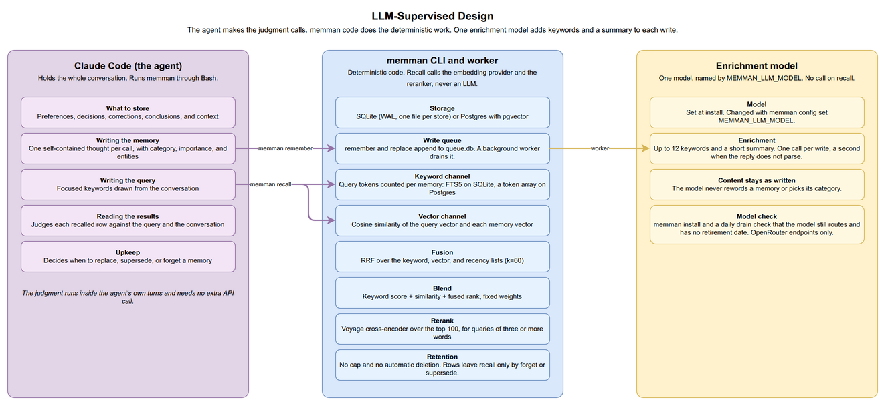
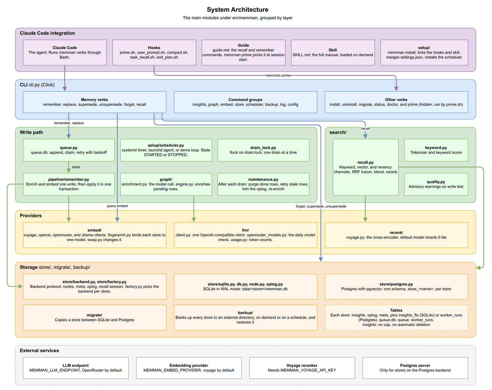

# 1. Background

[< Back to Design Overview](../DESIGN.md)

---

## 1.1 Context loss

Claude Code loses context in three ways:

- **Compaction.** After Claude Code compacts a session, earlier decisions and context leave the active window.
- **New sessions.** Each session starts with no memory of the last one.
- **Long sessions.** Once the context window fills, early information drops out of the model's attention.

The user must then repeat preferences, explain the project again, and work through earlier conclusions.

## 1.2 Scope

memman stores decisions, preferences, and project context across Claude Code sessions. The agent runs its command-line interface through Bash. Hooks remind the agent when to recall and when to store. memman supports Claude Code only.

---

## 1.3 LLM-supervised pattern

The agent supervises memory from outside the pipeline. It decides what to store, what to query, and what to retire. memman runs deterministic code, and one LLM (`MEMMAN_LLM_MODEL`) adds search aids. The work splits three ways:

| Part                                      | Role               | Work                                                                                |
| ----------------------------------------- | ------------------ | ----------------------------------------------------------------------------------- |
| The agent (Claude Code)                   | Judgment           | Decides what to remember, when to recall, and what to replace, supersede, or forget |
| The memman CLI and background worker      | Deterministic code | Storage, the write queue, keyword search, vector math, rank fusion                  |
| The enrichment model (`MEMMAN_LLM_MODEL`) | Enrichment         | Adds keywords and a short summary to each memory                                    |

The agent writes the content of every memory. The enrichment model never rewrites, merges, or categorizes a memory. Its output is stored in separate `keywords` and `summary` columns.

[Chapter 2](02-concepts.md#23-system-architecture) lists the layers in the second diagram.

## 1.4 Retrieval design

Recall combines three ranked lists (keyword, vector, and recency) with Reciprocal Rank Fusion (RRF). Each list that contains a memory contributes `1/(k + rank)` to its combined score, with k=60 and ranks counted from 1. The combined lists form the candidate set. A weighted sum of keyword overlap, cosine similarity, and the normalized RRF score orders it. When reranking is on, the Voyage reranker rescores the top 100. [Pipelines](03-pipelines.md#34-read-pipeline-recall) documents the constants.

Each write adds one memory. A `replace <id>` write also supersedes the memory it names.

---

## 1.5 Design decisions and trade-offs

### Why LLM-supervised

- The agent holds the conversation, so it judges best what is worth storing and which stored claim a new one corrects. memman provides commands to act on that judgment.
- No model decides what memman keeps. The write path makes one enrichment call per memory, and one more only when the reply does not parse as JSON.
- One model, `MEMMAN_LLM_MODEL`, serves enrichment and the `doctor` connectivity probe. [Pipelines](03-pipelines.md#llm-routing) covers model routing and the daily model check.
- memman needs network access. The background worker calls the LLM endpoint and the embedding provider. Recall calls the embedding provider, and the Voyage reranker when reranking is on.

### Why SQLite WAL for storage

- **One file per store.** Each store is one `memman.db` file, easy to copy and back up.
- **Transactions.** The worker commits each write in one transaction: the new memory, its enrichment, its vector, and any supersession link are saved together. If any part fails, none is saved.
- **Concurrent reads.** Write-ahead logging (WAL) lets readers run while one writer commits. Recall reads a store while the background worker writes to it.
- **No server.** SQLite ships with Python. A SQLite store needs no database server and no separate vector store.

### Why soft delete

`memman forget` sets `deleted_at` and keeps the row. memman never deletes a memory row. `memman store remove`, which removes a whole store, is the only exception.

- **Current memories.** A current memory is one where `deleted_at is null and superseded_by is null`. Recall and `insights review` read only current memories. `status` and `insights show` also report superseded and forgotten ones.
- **Supersession is not deletion.** A corrected memory keeps its content and records its successor in `superseded_by`. It leaves the current view, just as a forgotten memory does.
- **The supersede link stays valid.** Forgetting a successor keeps its row, so the predecessor's pointer still resolves.

### Retrieval and storage decisions

| Aspect               | memman design                                                                                                                                                                            |
| -------------------- | ---------------------------------------------------------------------------------------------------------------------------------------------------------------------------------------- |
| RRF weighting        | Unweighted. The keyword, vector, and recency lists each add `1/(k + rank)`.                                                                                                              |
| Candidate limit      | No cap on the union of the three lists. Keyword and recency each take `ANCHOR_TOP_K` = 30. Vector takes `RERANK_SHORTLIST` = 100.                                                        |
| Filtered recall      | With a `--cat` or `--source` filter, a larger `--limit` raises each list to at least `--limit`.                                                                                          |
| Similarity threshold | The vector list keeps every positive cosine and has no other floor. A fixed cosine means different things under different embedding models, while the sign boundary does not.            |
| Entities             | No model extracts them. A memory's entities are the `--entity` values the caller passes, stored verbatim with no fixed types. A `replace` without `--entity` inherits the target's list. |
| Deduplication        | Not automatic. Only `replace <id>` and `supersede` retire a memory. A retried queued write stores one memory, keyed by its `queue_uuid`.                                                 |
| Recency ranking      | No date parsing. The recency list ranks by `created_at`, whatever the query says.                                                                                                        |
| Result ordering      | Relevance order at every `--limit`. Nothing re-sorts after the cut, because a date sort would make the results read as a timeline.                                                       |
| Current facts        | Superseded and forgotten memories leave recall. `replace` stores the caller's text unchanged as the successor.                                                                           |
| Embeddings           | voyage, openai, openrouter, or ollama (ollama only through `memman config set`). `meta.embed_fingerprint` binds each store to one provider, model, and dimension.                        |
| Quality review       | `remember` and `replace` return pattern-based `quality_warnings` and store the text anyway. `memman insights review` runs the same patterns on stored memories.                          |

---

## 1.6 Storage backends

The `Backend` Protocol in `src/memman/store/backend.py` defines every per-store storage operation. `store/sqlite.py` and `store/postgres.py` implement it, so recall and the write pipeline run unchanged over either backend. Each backend has one baseline schema and no in-place migration steps.

| Backend  | Install                           | Layout                                                           | Vector column                                                             |
| -------- | --------------------------------- | ---------------------------------------------------------------- | ------------------------------------------------------------------------- |
| SQLite   | default                           | One `memman.db` file per store, under `<data dir>/data/<store>/` | `insights.embedding`: a BLOB of little-endian float64 values              |
| Postgres | `pipx install 'memman[postgres]'` | One Postgres schema per store, named `store_<name>`              | `insights.embedding`: a pgvector `vector(N)` column (float32), HNSW index |

The write queue is SQLite in both cases: one `queue.db` per data directory, whatever backend each store uses.

Backend selection is per store. `MEMMAN_BACKEND_<store>` picks sqlite or postgres, with `MEMMAN_DEFAULT_BACKEND` as the fallback. `MEMMAN_POSTGRES_DSN_<store>` gives the connection string, with `MEMMAN_DEFAULT_POSTGRES_DSN` as the fallback. A `work` store on Postgres can share a data directory with a `default` store on SQLite. [USAGE](../USAGE.md#backend-selection) documents these settings.

`memman migrate --store NAME --to postgres` moves a store to Postgres, and `--to sqlite` moves it back. [USAGE](../USAGE.md#migrating-between-sqlite-and-postgres) covers the workflow. [CONTRIBUTING](../../CONTRIBUTING.md#migrating-between-sqlite-and-postgres) covers the implementation.
