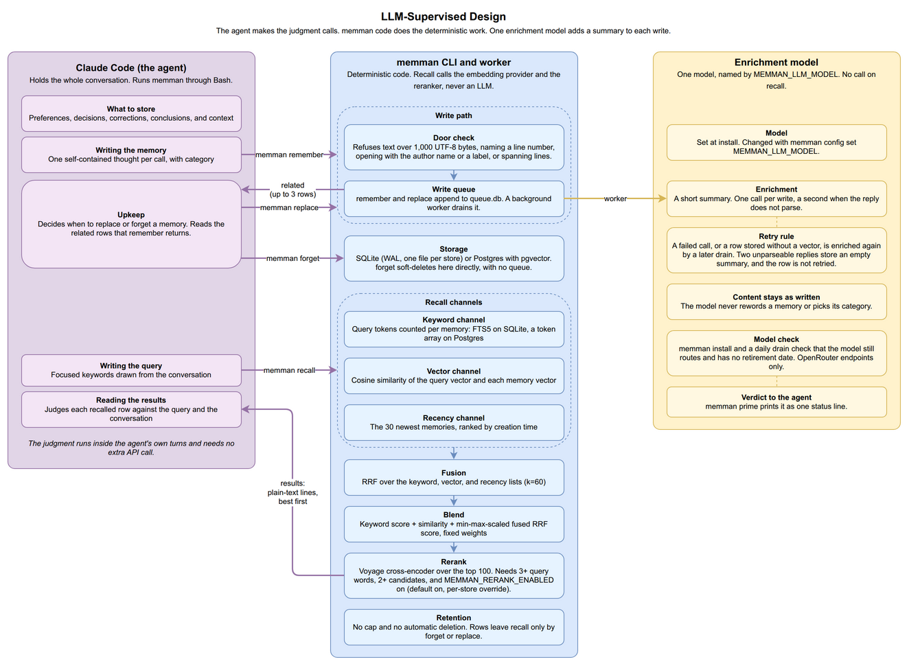

# 1. Background

[Design overview](../DESIGN.md) | [Next: core concepts](02-concepts.md)

## 1.1 The problem

A coding agent cannot rely on its conversation window as a permanent record. New sessions lack the full history, and compaction condenses earlier work. The user may have to explain decisions, preferences, and project details again.

memman gives the agent a separate store for knowledge worth keeping. It saves individual claims that the agent can search later, rather than archiving entire conversations.

## 1.2 Scope

The included integration supports Claude Code. The agent uses memman's CLI through Bash, guided by lifecycle hooks and an installed skill. The same CLI is available for direct use and scripts.

Memories are explicit: the agent chooses their text and category. memman does not decide which conversation details matter or automatically resolve contradictory claims. The agent uses `replace` to correct a memory and `forget` to remove it from recall.

## 1.3 Responsibilities

| Part                         | Responsibility                                                                        |
| ---------------------------- | ------------------------------------------------------------------------------------- |
| Coding agent                 | Decide what to remember, formulate queries, and judge which memories need correction. |
| CLI and worker               | Validate and queue writes, maintain storage, and retrieve memories.                   |
| Enrichment model             | Produce a short display summary of each memory.                                       |
| Embedding model and reranker | Help rank stored memories against a query.                                            |

This division is what **LLM-supervised memory** means here: the coding agent directs memory use. The enrichment model does not rewrite the original content, pick categories, merge claims, or decide what to keep.

## 1.4 Design trade-offs

| Choice                                 | Benefit                                                                                           | Trade-off                                                                |
| -------------------------------------- | ------------------------------------------------------------------------------------------------- | ------------------------------------------------------------------------ |
| Process writes in the background       | `remember` does not wait for model requests.                                                      | Recall sees it only after the worker stores it.                          |
| Combine keywords, vectors, and recency | Find exact terms, related wording, and recent context.                                            | Recency may introduce unrelated results; the agent must judge relevance. |
| Make corrections explicit              | Preserve the original claim and its replacement history.                                          | The agent must identify duplicates and contradictions.                   |
| Retain memories indefinitely           | A store grows more useful as it accumulates claims, and no cap deletes a true claim to make room. | Outdated claims need review.                                             |
| Soft delete                            | A forgotten successor keeps its row, so its predecessor's `replaced_by` still resolves.           | Forgotten rows stay on disk.                                             |

Recall follows these rules:

| Aspect             | Rule                                                                                                               | Reason                                                                                                                             |
| ------------------ | ------------------------------------------------------------------------------------------------------------------ | ---------------------------------------------------------------------------------------------------------------------------------- |
| Rank fusion        | Keyword, vector, and recency rankings contribute equally to RRF.                                                   | No single channel decides the fused order.                                                                                         |
| Candidate pool     | Union of up to 30 keyword, 100 vector, and 30 recent memories.                                                     | The vector channel fills the reranker's 100-row shortlist.                                                                         |
| Vector threshold   | Positive cosine similarity, with no fixed floor above zero.                                                        | A fixed cosine value has a different meaning under each embedding model. The sign boundary has the same meaning under every model. |
| Recency            | Creation time, without interpreting dates in the query.                                                            | Each recall line prints `created_at`, so the agent reads the dates itself.                                                         |
| Result order       | Scored recall returns results in relevance order, and no later step re-sorts them. `--basic` returns newest first. | A date sort would make results read as a timeline, and a larger limit keeps earlier rows in place.                                 |
| Duplicate handling | Explicit replacement for repeated claims. A queue UUID prevents a retried write from inserting twice.              | The agent has the conversation context, so it judges which claim a new one corrects.                                               |
| Quality review     | Advisory patterns flag potentially temporary information and never block a write.                                  | The agent judges what is durable.                                                                                                  |

[Chapter 3](03-pipelines.md#34-read-pipeline-recall) gives the scoring formula and reranking behavior.

## 1.5 Storage choices

| Backend  | Installation                      | Store layout                        | Vector search                      |
| -------- | --------------------------------- | ----------------------------------- | ---------------------------------- |
| SQLite   | Included by default               | One `memman.db` per store           | Matrix product over stored vectors |
| Postgres | `pipx install 'memman[postgres]'` | One `store_<name>` schema per store | pgvector with HNSW candidate index |

SQLite requires no database server. Write-ahead logging allows recall to read while the worker commits. Both backends save each memory and any replacement link in one transaction and implement the same storage interface.

A data directory can contain stores using either backend. `memman migrate` moves stores between them.

The write queue is always a local SQLite database that the stores in one data directory share. SQLite storage does not make memman work offline: the worker and recall still call the configured providers.

[Core concepts](02-concepts.md) describes the data model, and [the migration guide](../USAGE.md#migrating-between-sqlite-and-postgres) covers changing backends.
