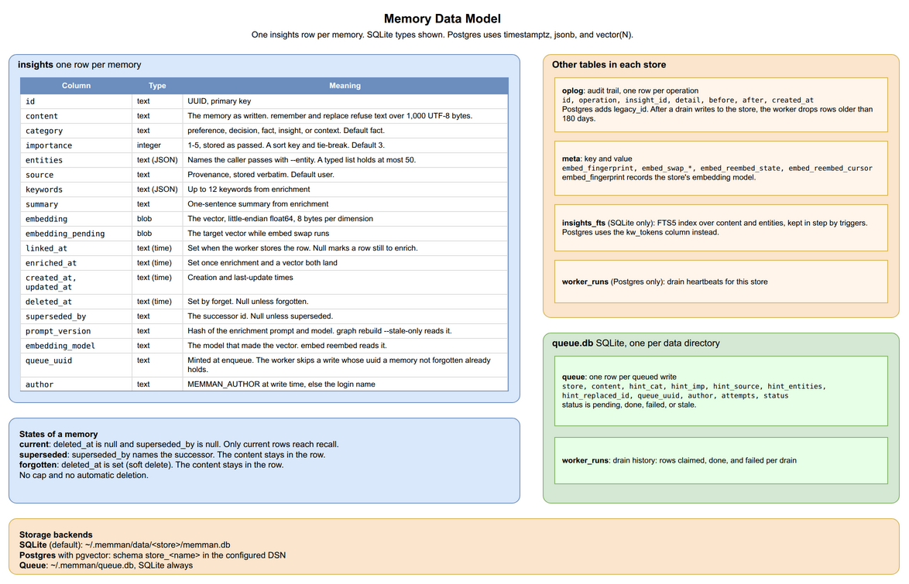

# 2. Core Concepts and Architecture

[< Back to Design Overview](../DESIGN.md)

---

## 2.1 The memory record

A memory is one stored claim. The caller sets its text and metadata. The background worker adds the rest.

| Field                 | Set by                                       | Meaning                                                                                                                            |
| --------------------- | -------------------------------------------- | ---------------------------------------------------------------------------------------------------------------------------------- |
| `content`             | the `remember` or `replace` text             | The claim, stored as written. At most 1,000 UTF-8 bytes.                                                                           |
| `category`            | `--cat`, default `fact`                      | One of the five categories below.                                                                                                  |
| `importance`          | `--imp`, 1-5, default 3                      | A sort key, stored as passed.                                                                                                      |
| `entities`            | `--entity`, once per name                    | Names the caller attaches, stored verbatim. At most 50, each at most 200 characters.                                               |
| `source`              | `--source`, default `user`                   | Source: `user`, `agent`, or a location such as a URL.                                                                              |
| `author`              | `MEMMAN_AUTHOR`, otherwise the OS login name | Who wrote the memory.                                                                                                              |
| `id`                  | the worker                                   | A version 4 UUID. Every command that takes an id also accepts an unambiguous prefix.                                               |
| `keywords`, `summary` | the enrichment model                         | Search aids. The drain and `graph rebuild` embed the keywords with the content. Recall prints the summary in place of the content. |
| `created_at`          | the worker                                   | When the worker stored the memory.                                                                                                 |
| `queue_uuid`          | `remember` or `replace`, when queued         | A unique key that prevents retries from creating duplicate memories.                                                               |

`replace` inherits the target's category, importance, source, and entities for each flag it omits. `--entity ''` clears the list.

[USAGE](../USAGE.md#what-remember-and-replace-refuse) lists every rule `remember` and `replace` enforce on the text.

Five categories describe what a memory holds:

| Category     | Meaning                                              | Example                                                                |
| ------------ | ---------------------------------------------------- | ---------------------------------------------------------------------- |
| `preference` | A preference the user stated                         | "Prefers communicating in Chinese"                                     |
| `decision`   | An architectural or design decision                  | "Chose SQLite over PostgreSQL for the cache"                           |
| `fact`       | A fact about a system, tool, or domain               | "The billing API rate limit is 100 req/s"                              |
| `insight`    | A conclusion drawn from several sources              | "The flaky test fails only when the cache is cold"                     |
| `context`    | Background: project setup, user role, or environment | "The user maintains the billing service and deploys it with Terraform" |

Importance is a sort key. `recall --basic` orders by importance, then by `created_at`, both descending. Keyword results and ranked recall use importance to break score ties. memman never deletes, keeps, or protects a memory because of its importance ([Lifecycle](04-lifecycle.md)).

---

## 2.2 Database schema



Each store has its own tables. SQLite keeps them in one `memman.db` file per store. Postgres keeps them in one schema per store, named `store_<name>`. The schema has one source per backend, with no in-place migration steps:

- SQLite: `_BASELINE_SCHEMA` in `src/memman/store/db.py`, plus `_FTS_STATEMENTS` for the keyword index.
- Postgres: `PG_BASELINE_SCHEMA` in `src/memman/store/postgres.py`.
- The write queue: `_BASELINE_SCHEMA` in `src/memman/queue.py`.

Each store has its own backend setting, `MEMMAN_BACKEND_<store>`, so a `work` store on Postgres can share a data directory with a `default` store on SQLite. `memman migrate` moves a store in either direction and updates that setting. `MEMMAN_DEFAULT_BACKEND` picks the backend of a new store. The first drain that serves a store writes its `MEMMAN_BACKEND_<store>` from the default, so a later change to the default leaves that store in place. [USAGE](../USAGE.md#migrating-between-sqlite-and-postgres) covers the workflow.

The maintainer applies a schema change to each live store by hand, once. [CONTRIBUTING](../../CONTRIBUTING.md#baseline-schemas) gives the procedure.

The per-store tables, with SQLite types:

```sql
insights (
  id                text primary key,     -- UUID4
  content           text not null,
  category          text default 'fact',
  importance        integer default 3,
  entities          text default '[]',    -- JSON list
  source            text default 'user',
  keywords          text,                 -- JSON list, from enrichment
  summary           text,                 -- from enrichment
  embedding         blob,                 -- vector of content plus keywords, or content alone
  embedding_pending blob,                 -- target vector during embed swap
  linked_at         text,                 -- set once enrichment was tried
  enriched_at       text,                 -- set when enrichment and a vector were both saved
  created_at        text not null,
  updated_at        text not null,
  deleted_at        text,                 -- set by forget
  prompt_version    text,                 -- hash of enrichment prompt and model
  embedding_model   text,                 -- model that made the vector
  queue_uuid        text,                 -- the queued write this came from
  superseded_by     text,                 -- successor id, no foreign key
  author            text
)

insights_fts (content, entities)          -- SQLite only, FTS5

oplog (
  id                integer primary key autoincrement,
  operation         text not null,
  insight_id        text,
  detail            text default '',
  created_at        text not null,
  before            text,                 -- JSON copy before the change
  after             text                  -- JSON copy after the change
)

meta (
  key               text primary key,
  value             text not null
)
```

**Current memories.** A memory is current when `deleted_at is null and superseded_by is null`. Recall and `insights review` read only current memories. `status` and `insights show` also report retired ones. `superseded_by` carries no foreign key. The worker sets the pointer before it inserts the successor. The migrators copy rows in id order, so a predecessor can be inserted before its successor. The `supersession_integrity` check in `memman doctor` is the only check that validates the pointer.

**Keyword index.** On SQLite, `insights_fts` is an FTS5 table (SQLite's full-text search extension) over `content` and `entities`. It holds only the terms. The text stays in `insights`. Triggers keep the index up to date when rows are inserted or deleted or either column changes. It indexes every row, including forgotten and superseded memories. Queries join it with `insights` to return only current rows. Opening a store that lacks the table creates and fills it in one transaction. On Postgres, the `kw_tokens` column plays this role.

**Model-change markers.** `prompt_version` holds the first 16 hex characters of a SHA-256 hash over the enrichment prompt and `MEMMAN_LLM_MODEL`. A memory whose non-null `prompt_version` differs from the current hash is stale, and `memman graph rebuild --stale-only` re-enriches it. `embedding_model` names the model behind the vector. `memman embed reembed` re-embeds each current memory in every SQLite store whose `embedding_model` or vector length differs from the target. [Pipelines](03-pipelines.md) covers both re-runs.

**Meta keys.**

- `embed_fingerprint`: the store's embedding model, as provider, model, and dimension. [Lifecycle](04-lifecycle.md) explains the binding.
- `embed_swap_state`, `embed_swap_cursor`, `embed_swap_target_provider`, `embed_swap_target_model`, `embed_swap_target_dim`: the progress of an `embed swap`.
- `embed_reembed_state`, `embed_reembed_cursor`: the progress of an `embed reembed`.

**Postgres differences.** The logical layout matches. These columns differ:

| Column                  | SQLite                        | Postgres                                                           |
| ----------------------- | ----------------------------- | ------------------------------------------------------------------ |
| timestamps              | ISO 8601 text                 | `timestamptz`                                                      |
| `entities`, `keywords`  | JSON text                     | `jsonb`                                                            |
| `oplog.before`, `after` | JSON text                     | `jsonb`                                                            |
| `embedding`             | BLOB of little-endian float64 | `vector(N)`, where N is the store's embedding dimension            |
| `embedding_pending`     | in the baseline               | added by `embed swap`, renamed to `embedding` at cutover           |
| `kw_tokens`             | absent                        | `text[] not null`: the distinct tokens of `content` and `entities` |
| `oplog.legacy_id`       | absent                        | `bigint unique`: the SQLite oplog id a migration copied            |
| `worker_runs`           | absent                        | one row per drain that opens the store, with a heartbeat time      |

**Indexes.** Both backends index `category`, `importance`, `created_at`, `deleted_at`, `source`, `queue_uuid`, and `oplog.created_at`. Two composite indexes serve fixed queries:

- `idx_insights_pending_link` on `(linked_at, created_at)`, limited to current memories with no `linked_at`. The enrichment pass reads pending memories in order from it.
- `idx_insights_current_listing` on `(deleted_at, superseded_by, importance, created_at)`. `recall --basic` reads its filter and sort order from it.

Postgres adds a GIN index on `kw_tokens` and an HNSW index on `embedding`, both limited to current memories. Opening a Postgres store for reading and writing builds the HNSW index if it is missing.

**The write queue.** `queue.db` sits in the data directory and serves every store. It is always SQLite:

```sql
queue (
  id, store, content,
  hint_cat, hint_imp, hint_source, hint_entities,
  hint_replaced_id,                       -- replace target, null for remember
  queue_uuid,                             -- unique
  priority, queued_at, claimed_at, worker_pid, attempts,
  status,                                 -- pending, done, failed, or stale
  last_error, processed_at, author
)

worker_runs (                             -- drain history, at most one idle row a minute
  id, started_at, finished_at, worker_pid,
  rows_claimed, rows_done, rows_failed, duration_ms, error
)
```

The worker skips a queued write if a stored memory already has its `queue_uuid`, unless that memory is forgotten. This prevents a retry from creating a duplicate memory.

---

## 2.3 System architecture

memman groups its modules into seven layers:

```
+---------------------------------------------------------------------+
| Integration  hook scripts, guide.md, SKILL.md (setup/assets/claude) |
|              setup/   (install, wizard, settings.json merge)        |
+---------------------------------------------------------------------+
| CLI          cli.py: remember, recall, replace, supersede,          |
|              unsupersede, forget, insights, graph, embed, store,    |
|              migrate, scheduler, backup, log, config, status,       |
|              doctor, install, uninstall, prime (hooks only)         |
+---------------------------------------------------------------------+
| Write path   the drain loop in cli.py                               |
|              queue.py (the write queue, SQLite)                     |
|              drain_lock.py (one drain at a time)                    |
|              setup/scheduler.py (systemd, launchd, or serve loop)   |
|              pipeline/remember.py (enrich, embed, one transaction)  |
|              graph/   (engine, enrichment)                          |
|              maintenance.py (runs after each drain)                 |
+---------------------------------------------------------------------+
| Search       search/  (recall, keyword, quality)                    |
+---------------------------------------------------------------------+
| Providers    embed/   (voyage, openai_compat, openrouter, ollama,   |
|                        registry, fingerprint, swap, vector)         |
|              rerank/  (voyage)                                      |
|              llm/     (client, shared, usage, openrouter_models)    |
+---------------------------------------------------------------------+
| Storage      store/   (backend, base, config, errors, factory, db,  |
|                        node, oplog, model, sqlite, postgres)        |
|              migrate/ (SQLite <-> Postgres)                         |
|              backup/  (external backups)                            |
+---------------------------------------------------------------------+
| External     LLM endpoint (MEMMAN_LLM_ENDPOINT, MEMMAN_LLM_MODEL)   |
|              embedding provider (voyage, openai, openrouter, ollama)|
|              Voyage reranker                                        |
|              Postgres + pgvector (optional backend)                 |
+---------------------------------------------------------------------+
```

The code tree:

```
memman/
+-- src/memman/
|   +-- cli.py              # Click CLI: every command and the drain loop
|   +-- config.py           # env file reader, INSTALL_DEFAULTS
|   +-- session.py          # opens the active store for one command
|   +-- queue.py            # the write queue in queue.db
|   +-- drain_lock.py       # the lock file that serializes drains
|   +-- maintenance.py      # queue cleanup, oplog trim, re-enrichment
|   +-- doctor.py           # memman doctor checks
|   +-- trace.py            # JSON-lines debug trace
|   +-- extras.py           # detects optional install extras
|   +-- exceptions.py       # domain errors
|   +-- _http.py            # HTTP client pools and retry policy
|   +-- pipeline/           # one queued write: enrich, embed, apply
|   +-- store/              # Backend Protocol, SQLite and Postgres
|   +-- search/             # recall, keyword search, quality warnings
|   +-- graph/              # enrichment pass over pending memories
|   +-- embed/              # embedding providers, fingerprint, swap
|   +-- rerank/             # Voyage cross-encoder client
|   +-- llm/                # LLM client, JSON parsing, usage, model check
|   +-- migrate/            # shared types for memman migrate
|   +-- backup/             # memman backup and cron translation
|   +-- setup/              # install, wizard, scheduler units, assets
+-- scripts/
|   +-- rebuild_stale.py    # graph rebuild --stale-only over many stores
+-- tests/
+-- pyproject.toml          # Poetry package, memman[postgres] extra
+-- Makefile
```

## 2.4 Data directory layout

The default data directory is `~/.memman`:

```
~/.memman/
+-- env                         # installed settings and API keys, mode 0600
+-- env.lock                    # serializes writes to env
+-- active                      # name of the active store
+-- queue.db                    # the write queue and drain records
+-- drain.lock                  # held by drains, migrate, backup restore
+-- model.state                 # result of the daily model check
+-- scheduler.state             # started or stopped
+-- scheduler.serve_interval    # interval of a running serve loop
+-- debug.state                 # debug trace on or off
+-- backup.state                # last minute a serve-loop backup ran
+-- compact/                    # flag files from the PreCompact hook
+-- bin/                        # launchd wrapper scripts (macOS)
+-- archive/                    # store sources memman migrate set aside
+-- logs/
|   +-- enrich.log, enrich.err  # scheduler output of each drain
|   +-- backup.log, backup.err  # scheduler output of each backup
|   +-- memman.log              # worker log, rotated, three backups
|   +-- debug.log               # debug trace
+-- data/
    +-- default/
    |   +-- memman.db           # one SQLite file per store, WAL mode
    +-- <name>/
        +-- memman.db
```

`--data-dir` or `MEMMAN_DATA_DIR` sets the data directory. These paths move with it: `env`, `env.lock`, `active`, `queue.db`, `drain.lock`, `model.state`, `archive/`, `data/`, and `logs/memman.log`.

These paths stay under `~/.memman` regardless of the data directory:

- The four state files: `scheduler.state`, `scheduler.serve_interval`, `debug.state`, and `backup.state`.
- `compact/`, `bin/`, and `logs/debug.log`.
- The four files that receive scheduler output, `logs/enrich.{log,err}` and `logs/backup.{log,err}`. The systemd units write to `%h/.memman/logs`, and the launchd wrappers hold the absolute home path from install time, so neither uses the data directory setting.

`memman scheduler status` prints the log paths. `memman log worker --stack` reads the rotated worker log together with its backups.

A Postgres-backed store keeps its rows in its `store_<name>` schema. The write queue stays in `queue.db`. The included files (`guide.md`, `SKILL.md`, and the hook scripts) stay inside the installed package. [Integration](05-integration.md) describes how `memman install` links them into `~/.claude`.

## 2.5 Store isolation

A named store is an isolated set of memories. Memories and the oplog never cross stores. All stores in one data directory share one env file and one write queue, and each drain serves them all.

Named stores isolate memories within one data directory. Changing `--data-dir` also changes the env file and queue, and every caller must pass the full path. A process can select a named store with a single setting. `MEMMAN_STORE=work` points one process at the `work` store, so two Claude Code sessions on one host can use different stores.

Resolution order, highest first:

```
--store flag  >  MEMMAN_STORE env  >  <data dir>/active file  >  "default"
```

| Mechanism          | Scenario                                                              |
| ------------------ | --------------------------------------------------------------------- |
| `--store` flag     | One-off override on a single command or script                        |
| `MEMMAN_STORE` env | Per-process isolation: two sessions on one host use different stores  |
| `active` file      | Persistent choice, set with `memman store use work`                   |
| `"default"`        | Fallback when none of the above is set                                |

[USAGE](../USAGE.md#store-management) documents the store commands.
