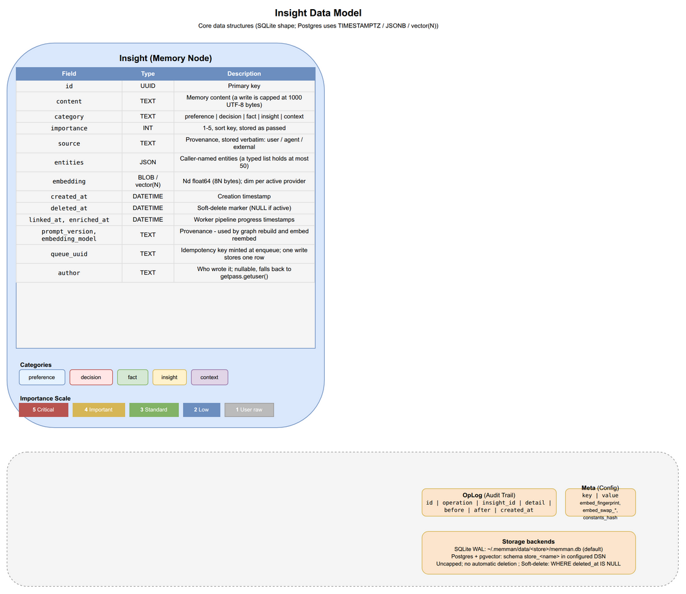

# 2. Core Concepts & Architecture

[< Back to Design Overview](../DESIGN.md)

---



## 2.1 Insight (memory node)

```
┌──────────────────────────────────────────────┐
│ Insight                                      │
├──────────────────────────────────────────────┤
│ id         : UUID                            │
│ content    : "Chose Qdrant over Milvus..."   │
│ category   : decision                        │
│ importance : 5  (1-5)                        │
│ entities   : ["Qdrant", "Milvus"]            │
│ source     : "user"     (provenance)         │
│ queue_uuid : "9b0c…"    (idempotency key)    │
│ author     : "bob"      (who wrote it)       │
│ created_at : 2026-02-18T10:00:00Z            │
└──────────────────────────────────────────────┘
```

Five categories distinguish the nature of a memory:

| Category     | Meaning                          | Example                                        |
| ------------ | -------------------------------- | ---------------------------------------------- |
| `preference` | User preference                  | "Prefers communicating in Chinese"             |
| `decision`   | Architectural/technical decision | "Chose SQLite over PostgreSQL"                 |
| `fact`       | Objective fact                   | "API rate limit is 100 req/s"                  |
| `insight`    | Reasoning conclusion             | "RRF fusion beats a single ranked signal here" |
| `context`    | Project context                  | "Phase 3 completed, 118 tests passing"         |

Importance is a sort key: listings order by it, and recall and the keyword rung break score ties on it. The value is the caller's: `--imp` (1-5, default 3) is stored as passed. No retention tier reads it; nothing is protected from or offered for deletion by importance (see [05-lifecycle.md](05-lifecycle.md)).

Exit: the column, its two indexes, the listing-index key, the sort keys and the payload key go in the next schema release when more than 95% of post-release rows carry 3; the column stays when the non-default share is above that.

## 2.2 Database schema

Each named store is physically isolated via its own backend, chosen per store via `MEMMAN_BACKEND_<store>` (falling back to `MEMMAN_DEFAULT_BACKEND` when unset):

- **SQLite (default)** - one `~/.memman/data/<store>/memman.db` file per store, in WAL mode (concurrent reads + serial writer). Schema source of truth: `_BASELINE_SCHEMA` in `src/memman/store/db.py`.
- **Postgres** - one Postgres schema per store (`store_<name>`) sharing one database; `pgvector` provides the `vector(N)` column type. Schema source of truth: `PG_BASELINE_SCHEMA` in `src/memman/store/postgres.py`. Enabled with the `memman[postgres]` install extra.

Backend choice is per-store, so a `work` store on Postgres can coexist with a `default` store on SQLite under the same data dir. `memman migrate <store>` is symmetric (`--to postgres` / `--to sqlite`) and flips `MEMMAN_BACKEND_<store>` accordingly; `MEMMAN_DEFAULT_BACKEND` only changes what newly-created stores fall back to. See [Migrating between SQLite and Postgres](../USAGE.md#migrating-between-sqlite-and-postgres).

The logical column layout below is shared between backends; the type translations are SQLite `TEXT`/`BLOB` ↔ Postgres `TIMESTAMPTZ`/`JSONB`/`vector(N)`.

```sql
-- Memory nodes
insights (
  id, content, category, importance,
  entities, source,
  embedding,                                    -- embedding vector (active provider)
  embedding_pending,                            -- shadow vector during online provider swap
  keywords, summary,                            -- LLM enrichment columns
  linked_at, enriched_at,                       -- Pipeline progress timestamps
  prompt_version, embedding_model,              -- Provenance for re-enrichment
  created_at, updated_at, deleted_at,
  queue_uuid,                                   -- Idempotency key from the queue row (one write stores one row)
  superseded_by,                                -- Successor id once a later write corrected this row (nullable, no FK)
  author                                        -- Who wrote it (nullable; resolved from MEMMAN_AUTHOR or getpass.getuser())
)

-- A current row is `deleted_at is null and superseded_by is null`;
-- every read and count applies both clauses. The pointer carries no
-- foreign key: the pipeline writes it before the successor row
-- exists, and the migrators apply rows in id order, so a predecessor
-- can land before its successor. Doctor's `supersession_integrity`
-- is the pointer's only validity check.

-- Keyword index over insights (SQLite only; FTS5 external content,
-- kept in sync by triggers on insert/delete/update-of the two
-- indexed columns). Postgres counts against the rows themselves.
insights_fts (
  content, entities                 -- terms only; the text stays in insights
)

-- Operation log (audit trail, queryable with --since/--stats)
oplog (
  id, operation, insight_id, detail,
  before, after,                                -- forensic delta (pre/post payload)
  created_at
)

-- Key/value metadata (e.g., embed fingerprints)
meta (
  key, value
)
```

Provenance columns (`prompt_version`, `embedding_model`) record what produced each insight, and they are read for two different jobs. `embedding_model` is write provenance: the model behind the row's vector. `prompt_version` is the STALENESS KEY, and it hashes exactly what `graph rebuild --stale-only` can replay -- the enrichment prompt and the `slow` model. `embedding_model` powers `memman embed reembed` the same way.

---

## 2.3 System architecture

memman's architecture is divided into five layers:

```
┌─────────────────────────────────────────────────────────────────┐
│  Integration Layer    Hook / Skill / Guide                      │
├──────────────────────────────────────────────────────────────┤
│  CLI Layer            remember · recall · replace · forget      │
│                       prime · status · doctor · install         │
│                       graph · scheduler · insights · store      │
│                       embed · log · config                      │
├──────────────────────────────────────────────────────────────┤
│  Pipeline             pipeline/ (remember, drain worker)        │
├──────────────────────────────────────────────────────────────┤
│  Core Engine          search/ (recall, keyword,                 │
│                                quality)                         │
│                       graph/  (engine, enrichment)              │
│                       embed/  (voyage, openai_compat,           │
│                                openrouter, ollama, vector)      │
│                       llm/    (client, shared,                  │
│                                openrouter_models)               │
├──────────────────────────────────────────────────────────────┤
│  Storage Layer        store/   (backend, base, factory, db,     │
│                                node, oplog, model,              │
│                                sqlite, postgres)                │
│                       queue.py (deferred-write queue)           │
│                       migrate.py (SQLite -> Postgres copy)      │
├──────────────────────────────────────────────────────────────┤
│  External             LLM endpoint (OpenAI-compat URL via       │
│                         MEMMAN_LLM_ENDPOINT; per-role models    │
│                         via MEMMAN_LLM_MODEL_*)                 │
│                       Embed provider (per-store; voyage /       │
│                         openai / openrouter / ollama)           │
│                       Postgres + pgvector (optional backend)    │
└─────────────────────────────────────────────────────────────────┘
```

Project code structure:

```
memman/
├── src/memman/
│   ├── __init__.py
│   ├── cli.py                # Click CLI (all commands)
│   ├── config.py             # Env-file resolver (INSTALLABLE_KEYS)
│   ├── doctor.py             # Health checks (memman doctor)
│   ├── drain_lock.py         # Cross-process drain.lock
│   ├── maintenance.py        # GC, EI recompute
│   ├── migrate.py            # SQLite -> Postgres migration
│   ├── queue.py              # Deferred-write queue
│   ├── trace.py              # JSONL debug tracing
│   ├── pipeline/             # remember (drain worker)
│   ├── store/                # Storage backends (sqlite, postgres)
│   ├── graph/                # Enrichment link scheduling
│   ├── search/               # Retrieval algorithms
│   ├── embed/                # Pluggable embedding providers
│   ├── rerank/               # Cross-encoder rerank (pluggable)
│   ├── llm/                  # LLM client + enrichment
│   └── setup/                # LLM CLI integration + install wizard
├── scripts/
│   └── rebuild_stale.py       # Operator helper to rebuild stale embeddings
├── tests/
├── pyproject.toml            # Poetry package config (memman[postgres] extra)
└── Makefile
```

## 2.4 Data directory layout

```
~/.memman/
├── active                        # Current default store name (plain text)
├── env                           # Mode-600 API-key exports for the scheduler
├── queue.db                      # Deferred-write queue (SQLite)
├── cache/                        # LLM response cache
├── compact/                      # Session-compact flag files
├── logs/                         # Scheduler redirects + rotated worker log
│   ├── enrich.log
│   ├── enrich.err
│   ├── backup.log
│   ├── backup.err
│   └── memman.log
└── data/                         # Each store has its own isolated directory
    ├── default/
    │   └── memman.db             # SQLite database (WAL mode)
    ├── work/
    │   └── memman.db
    └── <name>/
        └── memman.db
```

That tree is the default layout, where the data directory is `~/.memman`. Under a non-default `--data-dir`, `env`, `active`, `queue.db`, `data/` and `logs/memman.log` all move with it. What stays under `~/.memman` is `compact/` and the four scheduler redirects, `logs/enrich.{log,err}` and `logs/backup.{log,err}`: the systemd unit pins those to `%h/.memman/logs`, and the launchd plist bakes the absolute home in at install time, so neither reads the data dir. `memman scheduler status` prints the enrich and rotated paths, and `memman log worker --stack` reads the rotated one together with its backups.

Each store is fully independent - insights and oplog do not cross stores. On SQLite this is one `memman.db` per store; on Postgres it is one `store_<name>` schema per store inside one shared database. Shipped assets (`guide.md`, `SKILL.md`) live inside the installed package and are read via `importlib.resources`; nothing memman deploys lives under `~/.memman/`. `~/.memman/` is user state: memory data, API keys, caches, logs, queued work.

`Backend` is a context manager; CLI and pipeline call sites open it via `with open_backend(store, data_dir) as backend:` so the SQLite handle or Postgres pool checkout releases deterministically. `BaseNodeStore` in `src/memman/store/base.py` holds Python-side computations (effective-importance recomputation, low-retention candidate scoring) shared by both backends.

When a store routes to Postgres, its `~/.memman/data/<store>/memman.db` file is unused at runtime - rows live in `store_<name>` and drain heartbeats in `store_<name>.worker_runs`. The deferred-write queue is always SQLite at `~/.memman/queue.db`. The SQLite store file remains on disk after `memman migrate <store>` as a durable fallback; the operator removes it after verifying the new backend with `memman doctor`.

## 2.5 Store isolation

memman supports named stores for data isolation between different agents, projects, or scenarios.

**Why named stores instead of just `--data-dir`?** `--data-dir` overrides the entire base directory - a blunt instrument that requires callers to manage full paths. Named stores give semantic clarity (`MEMMAN_STORE=work` vs `--data-dir ~/.memman-work`) and work naturally with environment variables, the standard isolation mechanism for concurrent processes.

Resolution priority (highest to lowest):

```
--store flag  >  MEMMAN_STORE env  >  ~/.memman/active file  >  "default"
```

| Mechanism          | Scenario                                                      |
| ------------------ | ------------------------------------------------------------- |
| `--store` flag     | One-off CLI override, scripting                               |
| `MEMMAN_STORE` env | Per-process isolation - different agents use different stores |
| `active` file      | Persistent user preference - `memman store use work`          |
| `"default"`        | Zero-config fallback                                          |
