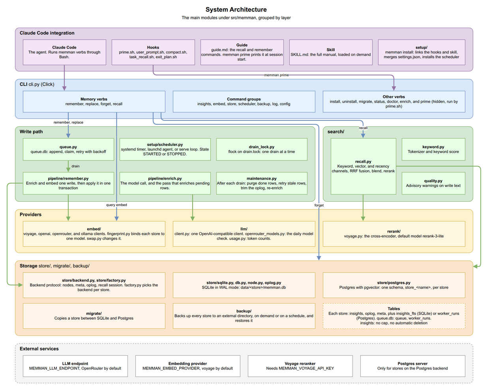

# 2. Core concepts and architecture

[Previous: background](01-background.md) | [Design overview](../DESIGN.md) | [Next: pipelines](03-pipelines.md)

## 2.1 The memory record

A memory is one saved claim. The CLI and database call it an **insight**. The caller supplies the content; the worker adds a summary and embedding.

| Field        | Meaning                                                                       |
| ------------ | ----------------------------------------------------------------------------- |
| `content`    | Original text, preserved as written. The CLI accepts up to 1,000 UTF-8 bytes. |
| `author`     | `MEMMAN_AUTHOR` at submission time, falling back to the OS login name.        |
| `id`         | UUID assigned when the write is queued. It becomes the stored memory's ID.    |
| `queue_uuid` | The same UUID, used to prevent duplicate inserts when a write is retried.     |
| `summary`    | Optional display text from enrichment. Search uses the original content.      |
| `created_at` | Time the worker stored the memory.                                            |

Every command that takes an id accepts an unambiguous prefix, such as the eight-character prefix that recall prints. The numeric `queue_id` identifies the queue entry, which maintenance deletes shortly after the drain stores the memory. The `id` remains valid after the queue entry is gone.

[Input rules](../USAGE.md#rejected-input) lists the checks the text must pass.

## 2.2 Database schema

Each store has a separate SQLite database or Postgres schema named `store_<name>`. Both backends expose the same logical model.

A **current memory** has both `deleted_at` and `replaced_by` unset. Recall and quality review consider only current memories. Replacement preserves the old row and points it to its successor; forgetting sets `deleted_at`. [Chapter 4](04-lifecycle.md#41-retention) explains these transitions.

The main tables are:

- `insights`: memories, their generated fields, and lifecycle markers.
- `oplog`: an operation log with before/after snapshots where supplied.
- `meta`: embedding fingerprints and progress markers for model changes.
- `insights_fts` on SQLite: the full-text index over memory content. Postgres uses `kw_tokens` instead.

The field reference below uses SQLite types. The executable schemas are listed under [Schema sources](#schema-sources).

```sql
insights (
  id                text primary key,     -- UUID4
  content           text not null,
  summary           text,                 -- from enrichment
  embedding         blob,                 -- vector of content
  embedding_pending blob,                 -- target vector during embed swap
  enrich_attempted_at text,               -- set on insert and after every enrichment pass, whether or not it succeeded
  enriched_at       text,                 -- set when enrichment and a vector were both saved
  created_at        text not null,
  updated_at        text not null,
  deleted_at        text,                 -- set by forget
  embedding_model   text,                 -- model that made the vector
  queue_uuid        text,                 -- the queued write this came from
  replaced_by       text,                 -- successor id, no foreign key
  author            text,
  summary_model     text                  -- LLM model that wrote the summary
)

insights_fts (content)                    -- SQLite only, FTS5

oplog (
  id                integer primary key autoincrement,
  operation         text not null,
  insight_id        text,
  detail            text default '',
  created_at        text not null,
  before            text,                 -- JSON copy before the change
  after             text                  -- JSON copy after the change
)

meta (
  key               text primary key,
  value             text not null
)
```

The [memory data-model diagram](../diagrams/03-insight-datamodel.drawio.png) shows these tables and lifecycle states together.

### Indexes and backend differences

SQLite's FTS5 index covers all memory content and is maintained by triggers. Searches join back to `insights` to exclude retired memories. Opening a store without the index creates and populates it in a transaction. Postgres stores distinct content tokens in `kw_tokens`, with a GIN index for keyword lookup.

| Detail               | SQLite                              | Postgres                                       |
| -------------------- | ----------------------------------- | ---------------------------------------------- |
| Timestamps           | ISO 8601 text                       | `timestamptz`                                  |
| Operation snapshots  | JSON text                           | `jsonb`                                        |
| Embeddings           | Little-endian float64 BLOB          | pgvector `vector(N)`, float32                  |
| Vector lookup        | Matrix product                      | HNSW index on current memories                 |
| Pending swap vectors | Baseline `embedding_pending` column | Column added during a swap                     |
| Migration log IDs    | Native oplog ID                     | Additional unique `legacy_id`                  |
| Store worker history | In the shared queue database        | Additional `worker_runs` table with heartbeats |

Both backends index creation time, deletion time, queue UUID, and oplog time. Composite indexes support pending enrichment and current-memory listings. Postgres creates a missing HNSW index when opening a store for reading and writing.

`replaced_by` has no foreign key. The worker sets the pointer before it inserts the successor, and the migrators copy rows in id order, so a pointer may refer to a row that has not yet been inserted. `memman doctor` checks the chain through its `replacement_integrity` check.

### Schema sources

The executable schemas are in the source tree:

- [SQLite baseline and FTS](../../src/memman/store/db.py)
- [Postgres baseline](../../src/memman/store/postgres.py)
- [Queue baseline](../../src/memman/queue.py)

There are no automatic in-place schema migrations. Maintainers apply schema changes using the [baseline schema procedure](../../CONTRIBUTING.md#baseline-schemas).

### Queue and generated-field markers

`<data dir>/queue.db` is always SQLite and serves all stores in that directory. Each entry records the store, content, author, replacement target, UUID, attempt count, status, and timestamps. Its `worker_runs` table records drain outcomes. [Queue states](../USAGE.md#queue) and [write processing](03-pipelines.md#32-write-pipeline-remember) describe its use.

The worker checks `queue_uuid` against all stored memories, including forgotten and replaced ones, before inserting a retried write.

Generated fields carry markers for later maintenance:

| Marker                                       | Purpose                                                                           |
| -------------------------------------------- | --------------------------------------------------------------------------------- |
| `summary_model`                              | LLM model that wrote the memory's summary. Null when the enrichment call failed.  |
| `embedding_model`                            | Model that produced the memory's vector.                                          |
| `enrich_attempted_at`                        | Records an enrichment attempt.                                                    |
| `enriched_at`                                | Records that enrichment and a vector were both saved.                             |
| `meta.embed_fingerprint`                     | Store's embedding provider, model, and dimension.                                 |
| `meta.embed_swap_*` / `meta.embed_reembed_*` | Progress of an embedding model change.                                            |

[Chapter 3](03-pipelines.md#35-handling-model-changes) explains how these markers identify work to repeat.

## 2.3 System architecture



| Area        | Main modules                                                                                                                        | Responsibility                                                                                      |
| ----------- | ----------------------------------------------------------------------------------------------------------------------------------- | --------------------------------------------------------------------------------------------------- |
| Integration | `setup/`, `setup/assets/claude/`                                                                                                    | Installation, hooks, guide, and skill.                                                              |
| Commands    | `cli.py`, `session.py`, `config.py`                                                                                                 | CLI entry points, store sessions, and settings.                                                     |
| Worker      | `cli.py` (`_drain_queue`, `_process_queue_row`), `queue.py`, `drain_lock.py`, `pipeline/`, `maintenance.py`, `setup/scheduler.py`   | Claim queued writes, enrich and embed them, commit changes, maintain stores, and install the timer. |
| Search      | `search/`                                                                                                                           | Keyword matching, rank fusion, and quality checks.                                                  |
| Providers   | `llm/`, `embed/`, `rerank/`                                                                                                         | Model clients, usage accounting, embedding bindings, and model swaps.                               |
| Storage     | `store/`, `migrate/`, `backup/`, `branch.py`                                                                                        | Backend interface, SQLite and Postgres, migration, snapshots, and store branches.                   |
| Diagnostics | `doctor.py`, `trace.py`                                                                                                             | Health checks and debug events.                                                                     |

The `Backend` protocol in [store/backend.py](../../src/memman/store/backend.py) separates pipelines from database details. The shared queue and scheduler coordinate writes across stores.

## 2.4 Data directory layout

The default data directory is `~/.memman`:

```
~/.memman/
+-- env                         # installed settings and API keys, mode 0600
+-- env.lock                    # serializes writes to env
+-- active                      # name of the active store
+-- queue.db                    # the write queue and drain records
+-- drain.lock                  # held by drains, migrate, backup restore
+-- model.state                 # result of the daily model check
+-- scheduler.state             # started or stopped
+-- scheduler.serve_interval    # interval of a running serve loop
+-- debug.state                 # debug trace on or off
+-- backup.state                # last minute a serve-loop backup ran
+-- compact/                    # flag files from the PreCompact hook
+-- bin/                        # launchd wrapper scripts (macOS)
+-- archive/                    # store sources memman migrate set aside
+-- logs/
|   +-- enrich.log, enrich.err  # scheduler output of each drain
|   +-- backup.log, backup.err  # scheduler output of each backup
|   +-- memman.log              # worker log, rotated, three backups
|   +-- calls.log               # one line per agent-verb call
|   +-- debug.log               # debug trace
+-- data/
    +-- default/
    |   +-- memman.db           # one SQLite file per store, WAL mode
    +-- <name>/
    |   +-- memman.db
    +-- <parent>__<label>_<id>/ # a store branch, always SQLite
        +-- memman.db
```

`--data-dir` or `MEMMAN_DATA_DIR` sets the data directory. The following paths follow the data directory: `env`, `env.lock`, `active`, `queue.db`, `drain.lock`, `model.state`, `archive/`, `data/`, `logs/memman.log`, and `logs/calls.log`.

These paths stay under `~/.memman` regardless of the data directory:

- The four state files: `scheduler.state`, `scheduler.serve_interval`, `debug.state`, and `backup.state`.
- `compact/`, `bin/`, and `logs/debug.log`.
- The four files that receive scheduler output, `logs/enrich.{log,err}` and `logs/backup.{log,err}`. The systemd units write to `%h/.memman/logs`, and the launchd wrappers record the absolute home path at install time, so neither reads the data directory setting.

`memman scheduler status` prints the log paths. `memman log worker --stack` reads the rotated worker log together with its backups.

A Postgres-backed store keeps its rows in its `store_<name>` schema. The write queue stays in `queue.db`. The included files (`guide.md`, `SKILL.md`, and the hook scripts) stay inside the installed package. [Integration](05-integration.md) describes how `memman install` links them into `~/.claude`.

## 2.5 Store isolation

A named store isolates its memories and its operation log. Stores in one data directory share settings and a write queue, and one drain can serve all of them. Each store can use its own backend and embedding model.

Store selection follows this order:

```text
--store flag > MEMMAN_STORE environment variable > active-store file > default
```

`memman store use work` changes the shared default. `MEMMAN_STORE=work` selects a store for one process and its children, which lets separate agent sessions use different stores. The agent verbs also accept `--store` after the verb, which routes like the global flag and matches the `Bash(memman <verb>:*)` allow rules and the Codex rules.

The selected store must already exist. `store create`, `store branch`, `migrate`, `backup restore`, and `memman install` are the only commands that create one. Every other command that opens a store, and `remember` and `replace` before they queue, refuse a missing store and write nothing: no directory, no Postgres schema, and no `MEMMAN_BACKEND_<store>` key. On SQLite a store exists when its directory does. On Postgres it exists when the `store_<name>` schema does. A Postgres connection error is neither answer, so `remember` and `replace` queue the write, and the drain reports the error.

Changing the data directory also changes the settings file and queue. A scheduler drains only its configured directory, so named stores separate projects within one installation. [Store management](../USAGE.md#store-management) covers the commands and directory-based selection.

### Store branches

A branch is an empty SQLite store layered over its live parent store. One research thread writes into it. A pasted instruction line adds `--store <branch>` to every memory verb of that thread. Other sessions keep writing to the parent. Recall on the branch ranks the branch's rows and the parent's current rows in one pass. The thread ends with `store merge`, which replays the branch into the parent, or `store drop`, which lists the branch's current rows and deletes it. [Chapter 3](03-pipelines.md#36-store-branches) describes the three flows.

A store is a branch exactly when its `meta` table holds `branch_parent`, whose value names the parent. `store branch` also writes `branch_created_at`, the UTC creation time, and `branch_token`, a random value. The parent's meta holds the same token under `branch_token:<branch>`. `store branch` also copies the parent's `embed_fingerprint`. No code reads the parent from the store name. `merge` and `drop` act only on a store with `branch_parent`, so no agent-callable verb can delete an ordinary store.

The name is `<parent>__<label>_<id>`, where `<id>` is four lowercase hex digits. `__` is reserved: `store create` refuses a name holding it, and a label may not hold it, so an ordinary store never carries the branch shape. The branch takes `MEMMAN_BACKEND_<branch>=sqlite` and copies the parent's `MEMMAN_RERANK_ENABLED_<parent>` when set. `store branch` refuses a branch as parent. `store use` refuses a branch, because the active-store file would route every session on the host into it. `migrate` skips a branch. `backup` bundles branches like other stores. A branch exists only on the host that made it. The parent opens read-only through the branch, so work on a branch cannot write it.

A branch row whose id the parent holds is a copy, made when the branch replaced or forgot that parent row. Every other branch row is branch-only. Every id the branch holds hides the parent row with that id.
