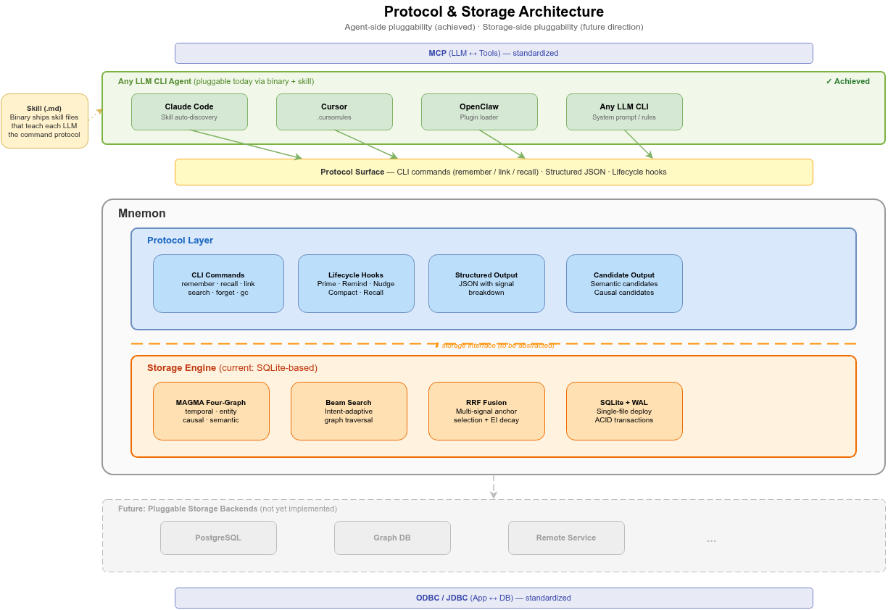

# 2. Design Philosophy

[< Back to Design Overview](../DESIGN.md)

---

## 2.1 LLM-Supervised: Binary as Organ, LLM as Supervisor

Traditional LLM memory systems (such as Mem0 and the original MAGMA implementation) embed a small LLM inside the pipeline to handle memory operations — entity extraction, conflict detection, causal reasoning. This is the **LLM-Embedded** pattern.

Mnemon adopts the **LLM-Supervised** pattern:

| Pattern            | Where is the LLM               | What does the LLM do                                                 | Representative        |
| ------------------ | ------------------------------ | -------------------------------------------------------------------- | --------------------- |
| **LLM-Embedded**   | Inside the pipeline            | Executor (extraction, classification, reasoning)                     | Mem0, MAGMA           |
| **File Injection** | Reads file at session start    | None — static file loaded into context window                        | Claude Code CLAUDE.md |
| **MCP Server**     | Tool provider via MCP protocol | Exposes memory operations as MCP tools for the host LLM              | MemCP                 |
| **LLM-Supervised** | Outside the pipeline           | Supervisor (reviews candidates, makes judgments, decides trade-offs) | Mnemon                |

Under the LLM-Supervised pattern, responsibilities are clearly separated into two tiers:

| Tier                      | Role                      | Handles                                                                                             |
| ------------------------- | ------------------------- | --------------------------------------------------------------------------------------------------- |
| **Binary (organ)**        | Deterministic computation | Storage, graph indexing, keyword search, vector math, decay formulas, auto-pruning                  |
| **Host LLM (supervisor)** | High-value judgment       | Causal chain evaluation, semantic relevance judgment, entity enrichment, memory retention decisions |

This means:

- **Stronger judgment capability**: The host LLM (e.g., Opus) evaluates candidate links, while Haiku handles fact extraction and reconciliation
- **LLM swappable**: The same Binary + Skill works across Claude Code, Cursor, or any LLM CLI

## 2.2 Tools are Organs, Skills are Textbooks

This philosophy can be understood through a game development analogy:

| Game Development                | Agent Ecosystem              | Mnemon Equivalent            |
| ------------------------------- | ---------------------------- | ---------------------------- |
| Game engine (Unity/Unreal)      | LLM CLI (Claude Code/Cursor) | Host environment             |
| Native plugin (C++ Plugin)      | Binary tool                  | `mnemon` binary              |
| Script/Blueprint (C#/Blueprint) | Skill (.md definition)       | `SKILL.md` command reference |
| Gameplay logic                  | Agent behavior config        | `guide.md` execution manual  |

- **Binary = Organ** — defines what *can* be done. Encapsulates storage, graph traversal, lifecycle management, and other deterministic capabilities
- **Skill (.md) = Textbook** — defines *how* to do it. Teaches the LLM when to retrieve memories, how to judge deduplication, and which commands to invoke

Binary encapsulates all logic that does not require an LLM; Skill only teaches the LLM the parts that require intelligent judgment. **Memory management logic moves from prompt to code — deterministic, testable, portable.**

## 2.3 Memory Gateway: Protocol, Not Database

Most Agent memory projects blend two distinct problems into one: **how to store and retrieve memories** (a storage engine problem) and **how an LLM decides when to write, what to query, and how to interpret results** (an interaction protocol problem). Mem0 embeds LLM calls inside the write path — storage and LLM logic are interleaved. MemGPT invents OS-style memory paging where the context management strategy is inseparable from the storage model. OpenViking builds its own virtual filesystem abstraction. Each project reinvents the LLM-to-database interaction layer from scratch — the equivalent of every web application inventing its own HTTP.

**The protocol stack has a gap.** MCP standardizes how LLMs discover and invoke tools. ODBC/JDBC standardizes how applications access databases. But how LLMs interact with databases using memory semantics — this layer has no protocol:

```
  LLM
   ↕  MCP (LLM ↔ Tools)         ← standardized
  Tools
   ↕  ??? (LLM ↔ Database)      ← no protocol exists
  Database
   ↕  ODBC/JDBC (App ↔ Database) ← standardized
  Storage
```

Mnemon treats these as two separate layers by design:



Both layers carry real value. The **storage engine** — four-graph model, intent-adaptive Beam Search, RRF fusion, EI decay — is where retrieval quality comes from. The **protocol surface** — CLI commands, structured JSON output with signal transparency, lifecycle hooks — defines how any LLM interacts with memory. Neither alone would be sufficient.

**Why the protocol surface has this shape.** The three core commands — `remember`, `link`, `recall` — are not an arbitrary API design. They map to the universal paradigm of graph construction engines: **Extract → Candidate → Associate**. Every agent memory system, regardless of its underlying storage model, implements these three primitives — the differences lie only in how explicit or degenerate each step is. The write path decomposes into `remember` (Extract + Candidate) and `link` (Associate); the read path is `recall` (Extract + Candidate + Associate in reverse). On graph-structured storage, this paradigm achieves its most complete expression, and crucially, read and write paths are **symmetric**: both follow the same three-step model in opposite directions, meaning the LLM needs to master only one cognitive pattern for both operations.

This positions Mnemon's protocol surface as analogous to MCP:

| Dimension            | MCP                                | Memory Layer Protocol                               |
| -------------------- | ---------------------------------- | --------------------------------------------------- |
| **Problem**          | How LLMs discover and invoke tools | How LLMs read/write databases with memory semantics |
| **Primitives**       | 3 (resources / tools / prompts)    | 3 (remember / link / recall)                        |
| **Backend-agnostic** | Any tool implements MCP server     | Any DB implements protocol adapter                  |
| **Protocol nature**  | Discovery + invocation             | Write + associate + retrieve                        |

**Agent-side pluggability is already achieved.** Through package distribution + skill files, the upper boundary is decoupled today. The same `mnemon` package ships with a skill definition (`.md`) that teaches each host LLM the command protocol. Claude Code discovers it as a skill, Cursor reads it as rules, OpenClaw loads it as a plugin — the agent-side integration is a markdown file, not a code dependency. Swapping the LLM or the CLI framework requires zero changes to the binary.

This mirrors Claude Code's foundational design insight: **separate engineering problems from LLM problems.** Claude Code does not reinvent the terminal — it lets the LLM operate Unix's decades of accumulated tooling through bash. Mnemon follows the same principle: build a specialized storage engine for memory graphs, and expose it to LLMs through a clean protocol boundary. DB optimization belongs to DB; LLM interaction belongs to the protocol layer.

## 2.4 Key Insights

- **No need to build the engine layer yourself** — major vendors continuously optimize LLMs and CLI tools; developers just adopt and use them
- **Skills have near-zero marginal cost** — defining agent behavior via markdown is like game blueprints enabling non-programmers to participate
- **The memory layer is the only part worth deep investment** — memory has a compound interest effect; it is the dividing line between an agent as a "tool" versus an "assistant"
- **The LLM itself is the best orchestrator** — no need for Python DAG orchestration of call chains; the LLM reads the Skill and knows what to do
- **Separate storage from protocol** — how memories are stored and retrieved (engine) and how an LLM interacts with them (protocol) are different problems with different optimization strategies. Keeping them decoupled lets each side evolve independently

## 2.5 Theoretical Foundations

Mnemon's design draws on two directly implemented papers and makes its own engineering choices for the bridge between them.

**MAGMA: Four-Graph Memory Architecture**

The [MAGMA](https://arxiv.org/abs/2601.03236) paper (Jiang et al., 2025) provides the concrete methodology for **what the memory environment should contain**. Its key contribution: a single edge type (e.g., vector similarity) is insufficient for memory — different query intents require different relational perspectives. MAGMA's four-graph architecture (temporal, entity, causal, semantic) with intent-adaptive retrieval and multi-signal fusion gives Mnemon its data model and retrieval algorithms.

MAGMA also provides specific hyperparameter values adopted by mnemon. See Table 5 of the MAGMA paper for: anchor top-K (20), RRF constant (60), structural/semantic coefficients (λ1=1.0, λ2=0.3–0.7), max traversal depth (5), and similarity threshold range (0.10–0.30). These values and their derivations are documented inline in [Pipelines](05-pipelines.md) and [Graph Model](04-graph-model.md).

**RRF: Reciprocal Rank Fusion**

The [RRF paper](https://dl.acm.org/doi/10.1145/1571941.1572114) (Cormack, Clarke & Buttcher, SIGIR 2009) provides the multi-signal fusion algorithm used in the recall anchor selection phase. Mnemon uses the exact `1/(k + rank)` formula with k=60, fusing keyword, vector, and recency signals into a composite anchor ranking.

**LLM-as-Orchestrator: Mnemon's Design Choice**

Mnemon adopts the LLM-Supervised pattern: the host LLM orchestrates memory operations as a supervisor, while the binary handles deterministic computation. This is a deliberate engineering choice driven by practical observation:

- **LLM-first pipelines work**: LLM fact extraction and reconciliation (Haiku) handle write-path intelligence, while the host LLM handles high-value judgment (evaluating candidates, deciding what to link).
- **Intent-native protocol**: The protocol surface uses `remember` instead of INSERT, `link` instead of CREATE EDGE, `recall` instead of SELECT — command names are semantic, mapping directly to the LLM's cognitive vocabulary rather than the database's operational vocabulary.
- **Stronger judgment capability**: An Opus-class host LLM evaluates candidate links, not an embedded gpt-4o-mini doing double duty as both data processor and judge.

Mnemon uses Haiku for fact extraction, reconciliation, and query expansion in the pipeline, while the host LLM handles higher-level judgment. The write path uses LLM reconciliation (ADD/UPDATE/DELETE/NONE) instead of threshold-based diff. The lifecycle is hook-driven: remember → reconcile → link → gc.

Where MAGMA's reference implementation is a Python library with in-memory NetworkX graphs, Mnemon persists everything in SQLite with a complete write-back lifecycle. CLI commands as the interface — constrained, but auditable, portable, and sandboxed.


