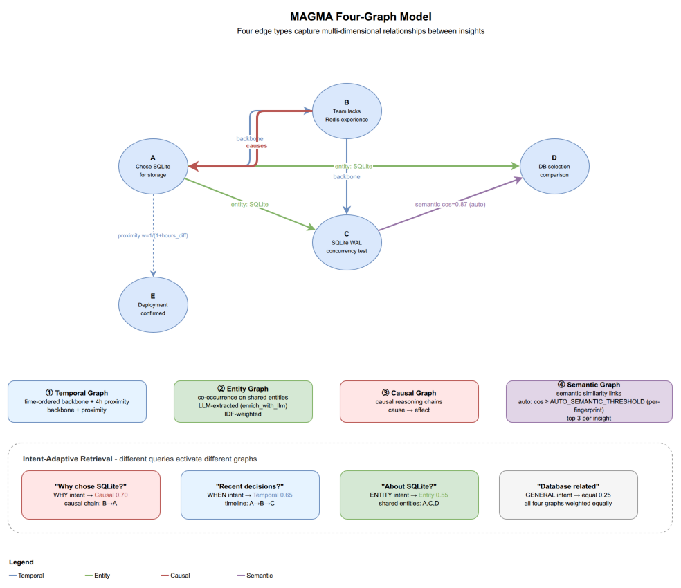

# 3. Graph Model

[< Back to Design Overview](../DESIGN.md)

---

MAGMA's argument: a single edge type (e.g., vector similarity) cannot capture every relationship between memories. WHY asks for rationale, WHEN for timelines, ABOUT-X for entity associations. memman implements three graphs, each capturing one relational dimension.

memman keeps three of the paper's four edge types and writes no causal edge. [01-background.md](01-background.md) records the deviation. No auto type makes a network call. Temporal is three indexed queries. Entity and semantic are O(N) in-process per insight: on a copy of the largest SQLite store, every row embedded, `fast_edges` (temporal plus entity) takes 252 ms per insight, of which the entity `json_each` scans are the bulk at about 22 ms per entity over 20 entities; `create_semantic_edges` takes 45 ms with a prebuilt cache, and the cache itself 36 ms per drain batch of `MAX_LINK_BATCH = 20`, 1.8 ms amortized. About 300 ms per insight in all, against the several LLM calls each write makes in the same drain. The read value of every typed-edge weighting is bounded at +0.0103 nDCG@5 on the 285-query MAIN set because the shortlist already reaches 0.9897 of the oracle, so `INTENT_WEIGHTS` (section 3.2) stays unswept: a sweep can move at most that ceiling and fits the reranker and corpus it was swept on. What reopens the question: the per-insight edge time becoming a material share of a drain row's wall time on the largest store (the `json_each` scans and the per-call `np.asarray` in `cosine_similarity` are the two places to look; an ndarray cache is an optimization, not a keep-or-drop question), a recall change that raises the typed-edge ceiling, or a store an order of magnitude above today's largest.

## 3.1 Edge type reference

| Edge Type | Purpose                                                      | How edges are created                                                                                                                                                                                                                                                                                                                                                                                               | Weight                                                | Key constants                                                                                                                                                          |
| --------- | ------------------------------------------------------------ | ------------------------------------------------------------------------------------------------------------------------------------------------------------------------------------------------------------------------------------------------------------------------------------------------------------------------------------------------------------------------------------------------------------------- | ----------------------------------------------------- | ---------------------------------------------------------------------------------------------------------------------------------------------------------------------- |
| Temporal  | Chronological ordering and session-window co-occurrence      | Auto. Two sub-types: a mirrored pair of `backbone` edges between each new insight and the most recent insight sharing its `session_id` (`remember --session`; a null or empty session creates no backbone edge), one per direction, each carrying a `direction` value (`precedes`, `succeeds`) that no read path consumes, and bidirectional `proximity` edges to insights within a `TEMPORAL_WINDOW_HOURS` window. | proximity: `1 / (1 + hours_diff)`; backbone: `1.0`    | `TEMPORAL_WINDOW_HOURS = 4`, `MAX_PROXIMITY_EDGES = 5`                                                                                                                 |
| Entity    | Link insights that mention the same entity                   | Auto. Bidirectional edges to insights sharing each entity enrichment derived (or `--entity` supplied). Edge weight is IDF-weighted so rare entities produce stronger links.                                                                                                                                                                                                                                         | `log(N/df) / log(N)` floored at 0.1; `1.0` when N ≤ 5 | `MAX_ENTITY_LINKS = 5` per entity, `MAX_TOTAL_ENTITY_EDGES = 50` per insert; both caps are deviations from the paper, recorded in [01-background.md](01-background.md) |
| Semantic  | Connect semantically similar insights via embedding distance | Auto. Bidirectional edges to the top `MAX_AUTO_SEMANTIC_EDGES` insights with cosine similarity ≥ `AUTO_SEMANTIC_THRESHOLD`. Recomputed after enrichment when keywords are appended to the embedding.                                                                                                                                                                                                                | cosine similarity                                     | `AUTO_SEMANTIC_THRESHOLD` (runtime-resolved per `(provider, model, surface)`; see note below), `MAX_AUTO_SEMANTIC_EDGES = 3`                                           |

> **Which carriers an entity links.** `MAX_ENTITY_LINKS` is a defined set, not a sample. `find_with_entity` returns the newest active carriers of the name, ordered by `created_at` descending and tied on ascending id, and both backends answer the same ids in the same order for the same content. The order matters beyond read time because `create_entity_edges` writes an edge to every id returned, in both directions, so a divergence between backends would be permanent in the stored graph. Two things make the shared key mean the same thing on both sides. The tiebreak carries the ordering rather than decorating it, because both insert paths stamp `created_at` from one Python clock read cut to the whole second, so rows written in the same second tie and their ids decide. And the stamp is written by the code rather than left to the column default, since Postgres `now()` is the transaction clock at microsecond resolution and would order rows that SQLite leaves tied. The one part that does not match is the name fold: SQLite's `lower()` is ASCII-only while Postgres's is Unicode-aware, so a name whose case differs outside ASCII matches on Postgres alone. Closing that needs a normalized key decided in Python on the write path.

Edge metadata is JSON:

- temporal: `{"sub_type": "proximity", "hours_diff": "2.34"}`
- entity:   `{"entity": "Qdrant"}`
- semantic: `{"created_by": "auto", "cosine": "0.8234"}`

> **Threshold resolution.** `AUTO_SEMANTIC_THRESHOLD` is resolved per `(provider, model, surface)` at runtime in this order: (1) per-store env override `MEMMAN_AUTO_SEMANTIC_THRESHOLD_<store>`; (2) `memman.embed.thresholds.resolve(provider, model, surface)` against the calibrated table in `memman.embed._thresholds_generated`; (3) surface-wide median fallback via `thresholds.resolve_with_fallback`. The `surface` dimension is a closed set `{'code', 'claw'}` resolved per store via `MEMMAN_SURFACE_<store>` (default `'code'`). Uncalibrated triples fall through to the surface median rather than skipping edges entirely; `memman doctor`'s `embed_threshold` check reports the `source` (`calibrated`, `surface_median`, `override`, or `override_skip`). See `docs/design/05-lifecycle.md` § 5.3.1a-5.3.1b for the calibrated table and the fallback values. The module default `AUTO_SEMANTIC_THRESHOLD = 0.62` remains as a back-compat path for callers that pass no `threshold=` kwarg.

## 3.2 Intent-adaptive weighting

Different query intents activate different graph-traversal weights:

| Intent      | Temporal  | Entity    | Semantic |
| ----------- | --------- | --------- | -------- |
| **WHY**     | **0.666** | 0.167     | 0.167    |
| **WHEN**    | **0.764** | 0.118     | 0.118    |
| **ENTITY**  | 0.056     | **0.611** | 0.333    |
| **GENERAL** | 0.334     | 0.333     | 0.333    |

"Why was SQLite chosen?" leans on the temporal backbone, which orders a decision against what preceded it. "Memories related to React" puts entity weight highest.

The distributions draw on MAGMA's intent-adaptive traversal (§3.3) and the weight ranges in Table 5. Table 5 gives per-edge-type ranges but no per-intent distribution, so memman interpolates each intent's values from those ranges and the paper's qualitative guidance. Every vector sums to 1.0. That is not about comparing intents, which never happens in one call; it fixes the structural term's scale against the anchor's RRF score and the semantic term it is summed with, neither of which these weights touch. Scaling only the structural term re-ranks rows and changes which nodes the beam keeps, so editing a vector here changes retrieved order. WHY leans temporal hard enough to stay distinct from GENERAL's near-flat baseline.
