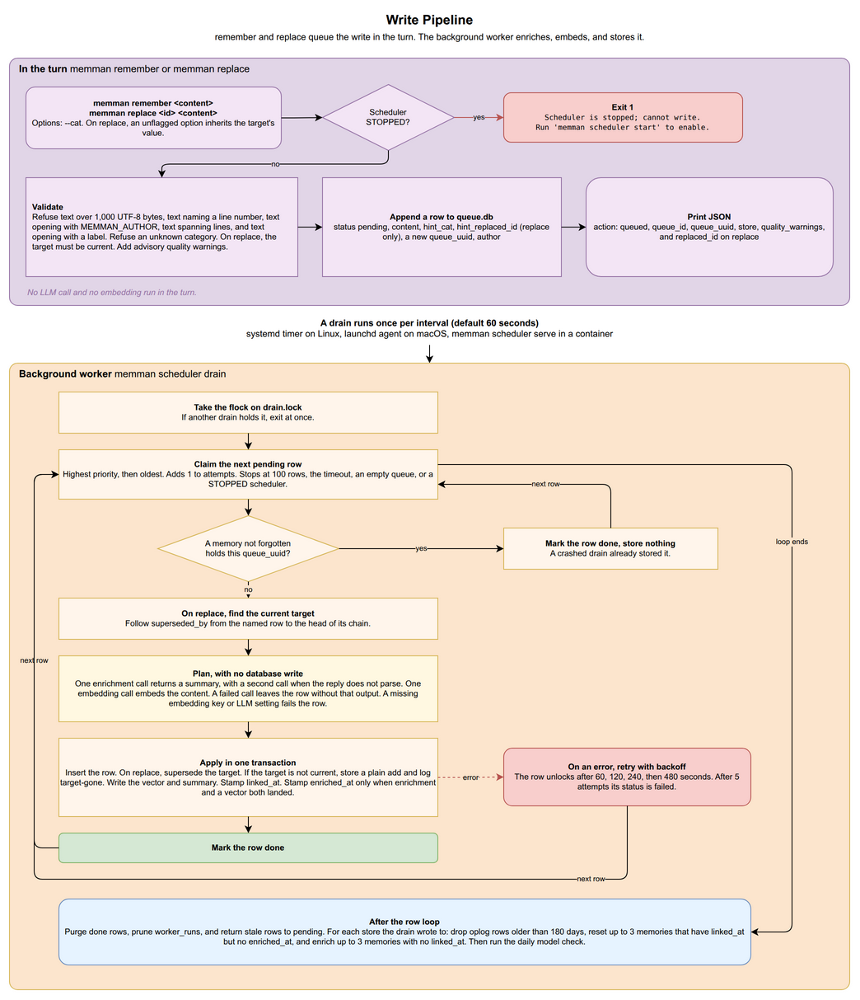
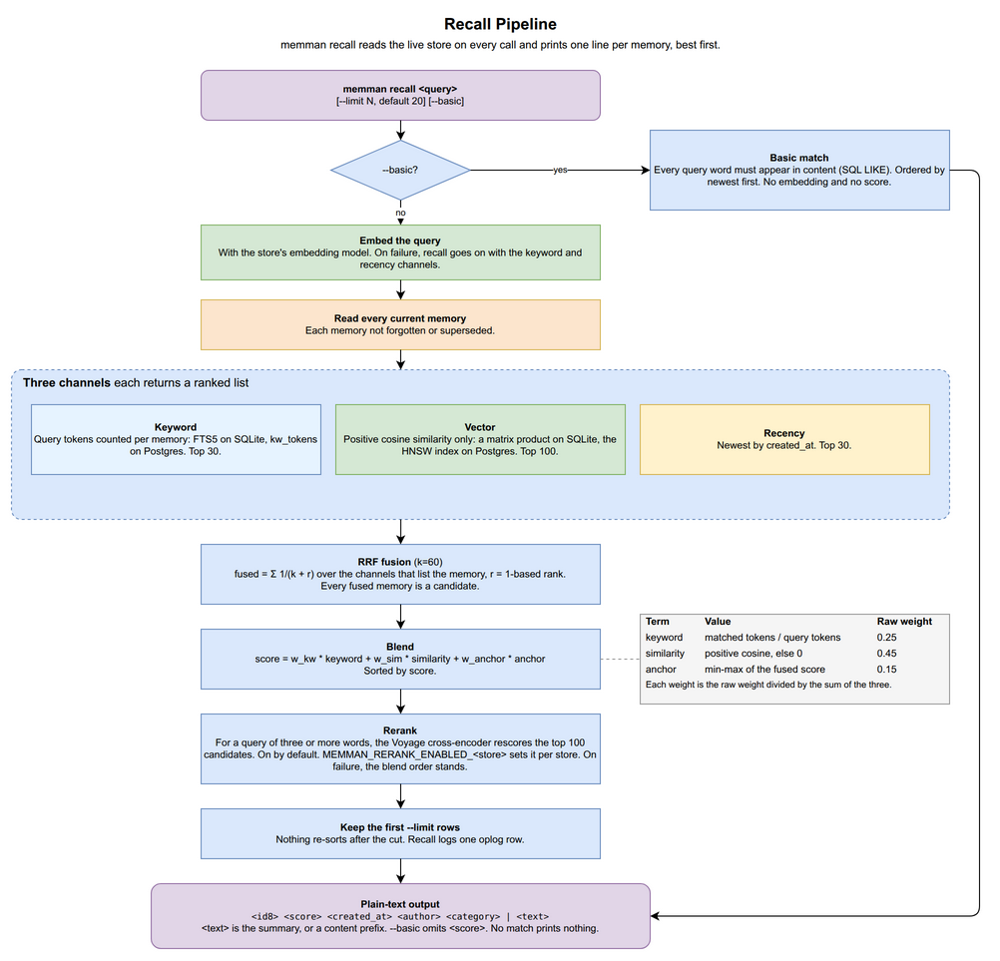

# 3. Read & Write Pipelines

[< Back to Design Overview](../DESIGN.md)

---

## 3.1 The turn and the background worker

memman runs commands during the agent's turn and processes queued writes in a background worker. The agent waits for commands to finish. The worker runs separately on a timer.

| Work                                   | Where it runs     | Model calls                                                    |
| -------------------------------------- | ----------------- | -------------------------------------------------------------- |
| `remember`, `replace`: check and queue | in the turn       | none                                                           |
| Enrich, embed and store a queued write | background worker | one LLM call (two if parsing fails) and one embedding call     |
| `forget`, `supersede`                  | in the turn       | none                                                           |
| `unsupersede`                          | in the turn       | one embedding call                                             |
| `recall`                               | in the turn       | one query embedding call and, when enabled, one reranking call |

- **When memories become available.** Recall cannot see a queued write until a drain stores it. Recall reads the live store on every call, so a stored memory is recallable at once, in the same session or any later one.
- **No write in the turn calls the LLM.** `remember` and `replace` call no model. Recall calls the embedding model and the reranker but never the LLM. The LLM runs in the drain, in `memman graph rebuild`, and in the `memman doctor` probe.
- **Recall-only while stopped.** When the scheduler is stopped, `remember`, `replace`, `forget`, `supersede` and `unsupersede` report that writes are disabled and ask the user to run `memman scheduler start`. `memman scheduler trigger` also refuses to run. Recall keeps working. A drain in progress stops claiming rows once it reads the stopped state.

[USAGE](../USAGE.md#scheduler) covers the scheduler commands and the queue states.

---

<a id="32-write-pipeline-remember-deferred-two-tier"></a>

## 3.2 Write pipeline: remember



### Step 1: queue the write during the session

`memman remember [--cat C] "<text>"` runs these steps in order:

1. Stop if the scheduler is stopped.
2. Reject text over 1,000 UTF-8 bytes or text containing a line number, an opening author name, a line break, or a leading label. Reject an unknown category. [USAGE](../USAGE.md#what-remember-and-replace-refuse) lists each refusal.
3. Run the quality check. Regular expressions flag temporary information, such as an AWS instance id, the word "currently", or a dated observation. The warnings return as `quality_warnings` and never block the write.
4. Add one row to the queue, `<data dir>/queue.db`, with `status='pending'`, the text, the flag values, and a newly generated random UUID in `queue_uuid`. Every store shares this one SQLite file, in WAL mode, whatever backend the store uses.
5. Print `{action: queued, queue_id, queue_uuid, store, quality_warnings}`.

`queue_id` names the queue row. The maintenance step after a drain deletes done rows older than 60 seconds, so the ID soon becomes unavailable. The drain records `queue_uuid` on every memory created by the write, so the UUID outlives the queue row. `memman insights by-queue <uuid>` returns those memories.

`memman replace <id> "<text>"` runs the same steps, with three differences:

- It rejects a target that is not current. If the target is superseded, the error names its successor.
- When `--cat` is omitted, the replacement inherits the target's value.
- The queue row carries the target as `hint_replaced_id`, and the output adds `replaced_id`.

### Step 2: process the write in the background worker

A drain is one run of the hidden `memman scheduler drain`. The scheduler starts one every interval, 60 seconds by default. On systemd and launchd the unit file holds the interval, and `memman scheduler interval --seconds N` rewrites it. `memman scheduler serve` reads `--interval`, then `MEMMAN_INTERVAL`, then 60.

| Host                            | Scheduler                                                                      | Drain timeout (seconds)                     |
| ------------------------------- | ------------------------------------------------------------------------------ | ------------------------------------------- |
| Linux with systemd              | user timer `~/.config/systemd/user/memman-enrich.timer`                        | `max(60, interval - 20)`                    |
| macOS                           | launchd agent `~/Library/LaunchAgents/com.memman.enrich.plist`                 | `max(60, interval - 20)`                    |
| Host without systemd or launchd | `memman scheduler serve` in the foreground, with `MEMMAN_SCHEDULER_KIND=serve` | `max(10, interval - 10)`, 300 at interval 0 |

`memman scheduler serve` runs as the container's main process. It reads the scheduler state before each drain and every second while it waits, and exits once the state is `stopped`. SIGTERM or SIGINT stops the drain after the row in hand, and the process exits 0.

Drains never overlap. Each drain takes an exclusive flock on `<data dir>/drain.lock`. A flock is an advisory file lock that the kernel releases when the holding process exits, so a crash leaves no stale lock. A drain that finds the lock held prints a `skipped` result and exits.

A drain claims rows one at a time until it has handled 100 (`--limit`), reaches its timeout, empties the queue, or reads the stopped state. The drain processes each row as follows:

1. **Claim.** One `update ... returning` statement takes the oldest pending row and adds 1 to `attempts`. A claim older than 600 seconds (`STALE_CLAIM_SECONDS`) can be claimed again, so a crashed drain loses no row.
2. **Open the store.** The first row for a store opens it, checks its embedding fingerprint, and builds its embedding client ([chapter 4](04-lifecycle.md)). If the store cannot be opened, the row fails. Before each row the drain checks that the fingerprint has not changed, because a swap that finished mid-drain would make the cached client write vectors of the wrong size.
3. **Check for an earlier attempt.** When the store holds a memory with the row's `queue_uuid`, the drain marks the row done and stores nothing. A superseded memory counts. A forgotten one does not. This check makes a replay after a crash safe. The UUID identifies the write across retries. Restoring a backup can reset the queue's row ID counter.
4. **Redirect a replacement.** If an earlier queued replacement has already superseded the target, the new replacement follows the `superseded_by` chain to the current memory and targets it. The result carries `redirected_from`.
5. **Enrich.** One LLM call returns a one-sentence summary. A reply with no JSON object gets one more call. memman then drops a summary at least 85% as long as the content. This limit is defined in code. Changing it leaves the prompt and `prompt_version` unchanged.
6. **Embed.** The store's embedding model embeds the content.
7. **Apply.** One transaction commits the write:
   - For a replacement, supersede the target and write an oplog row `replace` with detail `replaced by <id>`. If the target has been forgotten or superseded by this point, the new memory is stored without replacing it. The oplog records `target-gone` against the new memory and names the target. The result lists the target under `targets_gone`.
   - Insert the memory with its `prompt_version` and `embedding_model`, store the vector, write an oplog row `remember`, set `linked_at`, and store the summary.
   - Set `enriched_at` only when both enrichment and the vector were saved.
8. **Finish.** Mark the row `done`. Any exception in steps 2-7 calls `mark_failed` instead.

### Metadata used in a replacement

A replacement never edits a memory in place. It supersedes the target and stores one successor. The target keeps its content and records its successor in `superseded_by`. Recall and listings skip it.

| Field                         | Value used                               | Why                                                       |
| ----------------------------- | ---------------------------------------- | --------------------------------------------------------- |
| `content`                     | incoming                                 | the replacement text, stored as written                   |
| `category`                    | flag value if supplied, otherwise target | omitted flag inherits the target's metadata               |
| `queue_uuid`, `author`        | incoming                                 | identifies the write that produced the row and its author |
| `summary`, vector             | fresh                                    | enrichment and embedding use the replacement text         |
| `created_at`                  | successor's own                          | the successor is a new row                                |
| `superseded_by` on the target | the successor's id                       | `insights show --history` and `unsupersede` read the link |

`memman supersede <predecessor> <successor>` links two memories that both exist. It runs in the turn, in one transaction, with no queue and no model call. Both memories must be current and different. It writes an oplog row `supersede`. One successor can supersede several predecessors.

### Failure and retry

Some errors cause the queued write to fail. Others allow it to be stored without complete enrichment or an embedding.

- **The row fails.** A store that fails to open, a missing LLM endpoint or model, a missing embedding credential, a changed fingerprint, or an insert error raises an exception. `mark_failed` records the error. The row then waits 60, 120, 240 and 480 seconds before successive retries. The fifth failed attempt sets `status='failed'`. The failed row stays in the queue, with its text, until `memman scheduler queue retry <id>` returns it to pending.
- **The memory is stored without complete enrichment or an embedding.** An LLM or embedding call that still fails after the client's retries does not cause the row to fail. The memory is stored without `enriched_at`, and the re-enrichment pass retries it (next section). When neither reply carries a JSON object, enrichment ends for that memory. The memory gets an empty summary. If its vector was saved, it also gets `enriched_at`, so later drains do not repeat the enrichment call.

### Maintenance after each drain

After processing rows, the drain runs maintenance. It skips the whole step when less than 30 seconds of its timeout remain.

1. Delete done queue rows older than 60 seconds.
2. Delete `worker_runs` rows older than 7 days.
3. Return every `stale` queue row to pending.
4. For each store where the drain finished a row:
   - Delete oplog rows older than 180 days.
   - Re-enrichment pass: clear `linked_at` on up to 3 memories that carry `linked_at` but no `enriched_at` (`MAINTENANCE_REENRICH_MAX`), so `link_pending` picks them up.
   - `link_pending`: enrich and embed up to 3 memories with no `linked_at` (`MAINTENANCE_LINK_PENDING_MAX`).
   - When `link_pending` had work, keep the newest 5,000 oplog rows (`MAX_OPLOG_ENTRIES`). On SQLite, also run one `incremental_vacuum` step.

Then, regardless of the time remaining, the drain runs the daily model check ([3.3](#daily-model-check)).

Maintenance reaches only the stores where the drain finished a row. An incomplete memory in any other store waits for that store's next write or for `memman graph rebuild`.

### Operational controls

| Command                                   | Effect                                                                                           |
| ----------------------------------------- | ------------------------------------------------------------------------------------------------ |
| `memman scheduler queue list [--limit N]` | list recent queue rows and their status                                                          |
| `memman scheduler queue failed`           | list failed rows                                                                                 |
| `memman scheduler queue show <id>`        | print a queue row's full content                                                                 |
| `memman scheduler queue retry <id>`       | return a failed row to pending (`--all-stale` for every stale row)                               |
| `memman scheduler queue purge --done`     | delete done rows older than 60 seconds (`--stale` deletes stale rows)                            |
| `memman scheduler status`                 | install state, interval, next run, log paths, last drain summary                                 |
| `memman scheduler start`                  | accept writes and resume drains. Repeated calls have no additional effect                        |
| `memman scheduler stop`                   | make memman recall-only. The unit files stay on disk                                             |
| `memman scheduler interval --seconds N`   | set the systemd or launchd interval, at least 60. Serve mode needs a restart with `--interval N` |
| `memman scheduler trigger`                | dispatch a drain and return without waiting (refused when stopped or in serve mode)              |

`memman graph rebuild` re-enriches and re-embeds every current memory, for use after a model or prompt change. `--stale-only` limits it to rows whose `prompt_version` differs from the current version. Both forms require a stopped scheduler unless `--dry-run` is set.

---

## 3.3 LLM calls

### LLM routing

One client, `MemmanLLMClient`, makes every LLM call: enrichment in the drain and in `memman graph rebuild`, and the connectivity probe in `memman doctor`. One model, `MEMMAN_LLM_MODEL`, serves every call. The client posts to `<MEMMAN_LLM_ENDPOINT>/chat/completions` in the OpenAI chat format. Switching vendors changes `MEMMAN_LLM_ENDPOINT`, `MEMMAN_LLM_API_KEY` and `MEMMAN_LLM_MODEL`, and no code. The default endpoint at installation is `https://openrouter.ai/api/v1`.

The client makes up to 3 attempts. After a 429, 500, 502, 503, 504 or 529 response, the client waits 1 second before the first retry and 2 seconds before the second. After an empty reply, the client waits 0.1 seconds before retrying. Each call asks for at most 4,096 output tokens and has a 60-second timeout.

On an OpenRouter endpoint the client adds memman's attribution headers and a `provider` routing block built from three env file values:

| Variable                     | Install default                      | Sent as                                         |
| ---------------------------- | ------------------------------------ | ----------------------------------------------- |
| `MEMMAN_LLM_PROVIDER_ONLY`   | `amazon-bedrock,azure,google-vertex` | `only`, the vendors allowed to serve the call   |
| `MEMMAN_LLM_DATA_COLLECTION` | `deny`                               | `data_collection`                               |
| `MEMMAN_LLM_ZDR`             | `true`                               | `zdr: true`, zero-data-retention endpoints only |

The call fails if no vendor meets the configured routing requirements. An empty `MEMMAN_LLM_PROVIDER_ONLY` sends no `only` list. Any other endpoint receives neither the headers nor the routing block.

On an OpenRouter endpoint, installation sets the model `qwen/qwen3-235b-a22b-2507` from `INSTALL_DEFAULTS`. Other endpoints have no default model, because the shipped id is an OpenRouter id that another endpoint rejects. The install wizard asks for the model id. A noninteractive installation fails if `MEMMAN_LLM_MODEL` is missing. `memman config set MEMMAN_LLM_MODEL <id>` changes the model. memman never changes it on its own.

### Daily model check

On an OpenRouter endpoint, `llm/openrouter_models.py` checks the configured model against two public catalogs. It sends no API key and makes no LLM call.

- `/endpoints/zdr` must list a zero-data-retention endpoint for the exact model id on a vendor in `MEMMAN_LLM_PROVIDER_ONLY`. The vendor is the endpoint tag before its first `/`. An empty provider list allows every vendor.
- `/models` must carry no `expiration_date` for the model.

`memman install` runs the check at once and prints the result under `[model]`. If a catalog cannot be read, installation prints an error and continues. Each drain runs the check unless `model.state` records a check of the configured model less than 24 hours old (`CHECK_INTERVAL_SECONDS = 86_400`). It writes `{model, checked_at, notice}` to `<data dir>/model.state`. A failed fetch keeps the existing notice and restarts the 24-hour clock. `memman prime` prints the recorded notice if it refers to the configured model. The LLM client never reads a catalog: it sends the configured id through unchanged.

If the configured model becomes unavailable, memories are still stored. The enrichment call fails, so the write is stored without a summary, and the re-enrichment pass enriches it once a working model is set.

### Per-stage token accounting

Each `complete` call names its stage: `enrichment`, `probe`, or `harness` for measurement tools outside the pipeline. An unknown stage raises an exception. The client records the provider's `usage` block once per attempt, inside the retry loop, because every HTTP 200 attempt is billed, even an empty one.

- A non-2xx attempt increments only `http_errors`.
- An HTTP 200 reply with no `usage` block counts under `missing_usage` and adds no tokens.
- The tally is process-wide. The drain records the current tally before processing each row. Each `queue_done` and `queue_failed` trace event carries that row's usage. The drain's JSON output (`llm_usage`) and its `llm_usage_summary` trace event carry the drain total.

---

<a id="34-read-pipeline-smart-recall"></a>

## 3.4 Read pipeline: recall



### Output

`memman recall "<query>"` prints one line per memory, best first:

```
<id8> <score> <created_at> <author> <category> | <text>
```

- `id8` is the first 8 characters of the id. Every command that takes an id accepts an unambiguous prefix.
- `score` has two decimals. Compare scores only within the same result page.
- `author` is `-` when unset. Whitespace inside it becomes `_`.
- `text` is the summary, or else the first 200 characters of content, with `...` marking shortened text. Line breaks become spaces, so each memory takes one line.

An empty page prints nothing and exits 0. `--limit` defaults to 20. Recall writes one oplog row and nothing else, and it works while the scheduler is stopped.

### `--basic`

`--basic` returns before the steps below and computes no score. Each whitespace-separated query word must appear as a substring of the content. The match ignores letter case (ASCII letters only on SQLite). Rows sort newest first. The line omits `score`.

`--limit` still applies. `--basic` passes the limit straight to SQL `limit`, so `--basic --limit 0` returns nothing. The scored path treats `--limit 0` as no limit.

### Step 1: combine keyword, vector, and recency rankings

The store's embedding model embeds the query once ([chapter 4](04-lifecycle.md)). When the embedding call fails, recall logs a warning and runs the keyword and recency channels only.

| Channel | Ranks by                                                    | Takes                |
| ------- | ----------------------------------------------------------- | -------------------- |
| Keyword | distinct query words the memory holds                       | `anchor_k`           |
| Vector  | cosine similarity to the query vector, positive values only | `max(100, anchor_k)` |
| Recency | `created_at`, newest first                                  | `anchor_k`           |

- `anchor_k` is `ANCHOR_TOP_K = 30`.
- The vector channel takes at least `RERANK_SHORTLIST = 100` rows, so the reranker can see a full shortlist of the query's nearest memories.

**Keyword search.** memman lowercases the query, splits it on every character outside `[a-zA-Z0-9]`, and drops stopwords. The count covers the memory's content. The store counts the matches, so recall never tokenizes every row per query.

- SQLite runs one FTS5 probe per query word.
- Postgres stores each memory's word set in `insights.kw_tokens` at write time and counts with one GIN-indexed array intersection.
- A word with a letter outside ASCII splits differently in FTS5 than in memman's tokenizer, so SQLite counts can differ from Postgres counts on such text.

**Vector search.** SQLite scores every stored vector in one matrix product. Postgres queries its pgvector HNSW index. The channel keeps positive cosines only. A memory at zero or negative cosine is not a vector candidate, so a store with fewer positive rows than the channel size returns fewer rows. There is no additional cosine threshold. Positive values provide a common threshold across models, while the meaning of a specific score varies by model.

**Fusion.** Reciprocal Rank Fusion (RRF) sums one term for each channel that ranks a memory:

```
rrf = Σ 1 / (k + r)    over the channels that rank the memory
      k = 60 (RRF_K), r = the memory's 1-based rank in that channel
```

`RRF_K = 60` is the standard RRF constant. A channel adds at most 1/61 to a memory's score, so no single channel decides the fused order. All combined results become candidates for reranking.

### Step 2: calculate a combined score

Each candidate gets three scores and one weighted sum:

```
keyword    = (distinct query words the memory holds) / (distinct query words)
similarity = cosine(query vector, memory vector), 0 when not positive or missing
anchor     = (rrf - min rrf) / (max rrf - min rrf), over this query's candidates

score = w_kw * keyword + w_sim * similarity + w_anchor * anchor
```

The weights come from `_RERANK_WEIGHTS_RAW = (0.25, 0.45, 0.15)` divided by their sum, 0.85, so they sum to 1:

| Term         | Raw weight | Weight used |
| ------------ | ---------- | ----------- |
| `keyword`    | 0.25       | 0.294       |
| `similarity` | 0.45       | 0.529       |
| `anchor`     | 0.15       | 0.176       |

The `anchor` term is the only one that carries the recency channel into the score, so a recent memory with no keyword or vector match can still rank. Candidates sort by score.

### Step 3: rerank with a cross-encoder

A cross-encoder reads the query and one memory's text together and scores their relevance directly. Cosine similarity compares two independently computed vectors. The cross-encoder catches a match that cosine and word overlap miss.

Reranking is on by default. It runs when all three conditions hold:

- Reranking is on for the store: `MEMMAN_RERANK_ENABLED_<store>` when set, otherwise `MEMMAN_RERANK_ENABLED` (install default `true`).
- The query has more than 2 whitespace-separated words (`MIN_RERANK_TOKENS = 2`).
- At least 2 candidates exist.

Recall sends the query and the content of the top `min(100, candidates)` (`RERANK_SHORTLIST`) to the reranker that `MEMMAN_RERANK_PROVIDER` names. The only provider is `voyage`. It uses the model `MEMMAN_VOYAGE_RERANK_MODEL` (default `rerank-3-lite`) and the key `MEMMAN_VOYAGE_API_KEY`. The rerank score replaces the blended score on the shortlist, and the shortlist reorders by it. Any failure, including a missing key, logs a WARNING and preserves the Step 2 order.

`memman config set MEMMAN_RERANK_ENABLED_<store> false` turns rerank off for one store. Recall has no rerank flag, so the agent never makes this choice.

Reranking changes how the Step 2 weights affect the results:

- With 100 or fewer candidates, rerank rescores all of them, and the weights have no effect on the final order.
- With more than 100, the weights decide which candidates reach the reranker. The first 100 results then use reranker scores, and the remaining results keep their combined scores. The default limit excludes those remaining results. `--limit 0` or a limit over 100 returns both groups. Compare scores only within the same group.

### Order and limit

A positive `--limit` is applied last, with no further sorting. Increasing the limit preserves the order of the existing results. Results stay in relevance order because sorting them by date could suggest a timeline. Each line includes `created_at` for readers who need dates.

### Recall trace events

With tracing on (`MEMMAN_DEBUG=1`, or `memman scheduler debug on`), recall emits two events:

- `recall_anchors`: `anchor_k`, `vector_k`, each channel's hit count, the number of combined candidates, the candidate count per `via` label, and whether a filter was set. `vector_hits` below `vector_k` means the filter or the store left fewer positive-cosine rows than the channel asked for.
- `recall_rerank`: the shortlist size and `moved`, the number of shortlist positions whose memory changed. The count compares ids, because the reranker replaces every score.

Only the drain and `memman scheduler serve` attach the trace file handler (`~/.memman/logs/debug.log`). A `memman recall` process does not, so its events are not written to a file.

---

## 3.5 Handling model changes

Prompts, models and providers change. memman does not aim for identical output across versions. It records what produced each memory and re-runs the work when an input changes.

1. **Process writes in the background.** The write path defers LLM work to the drain (Step 2 in [3.2](#32-write-pipeline-remember)). Recall calls only the embedding model and the reranker.
2. **Record how outputs were produced.** Each model output records its origin so a command can repeat the work when the model or prompt changes. memman does not compare outputs from multiple models or apply a fixed similarity cutoff. A fixed cutoff would tie the code to one model's behavior.

### Records used to detect changes

| Record                                                         | Stored at | Detects                               | Operator action                                                |
| -------------------------------------------------------------- | --------- | ------------------------------------- | -------------------------------------------------------------- |
| `embed_fingerprint`                                            | `meta`    | the store's embedding model           | `memman embed swap` or `memman embed reembed` (chapter 4)      |
| `embed_swap_state`, `embed_swap_cursor`, `embed_swap_target_*` | `meta`    | a swap in progress                    | cutover or `--abort` deletes them. Doctor warns if keys remain |
| `embedding_model`                                              | per row   | the model behind the row's vector     | `memman embed reembed` re-embeds rows that differ              |
| `prompt_version`                                               | per row   | enrichment prompt or LLM model change | doctor warns, `memman graph rebuild --stale-only`              |
| `linked_at`, `enriched_at`                                     | per row   | enrichment progress                   | maintenance retries 3 per drain, or `memman graph rebuild`     |

- The doctor check for leftover swap keys is `no_stale_swap_meta`. The check for a changed prompt version is `provenance_drift`.
- A null `prompt_version` is not treated as outdated.

A per-row marker shows the scope of a change. `provenance_drift` reports how many memories each prompt version produced, so a rebuild can target only rows with outdated versions.
