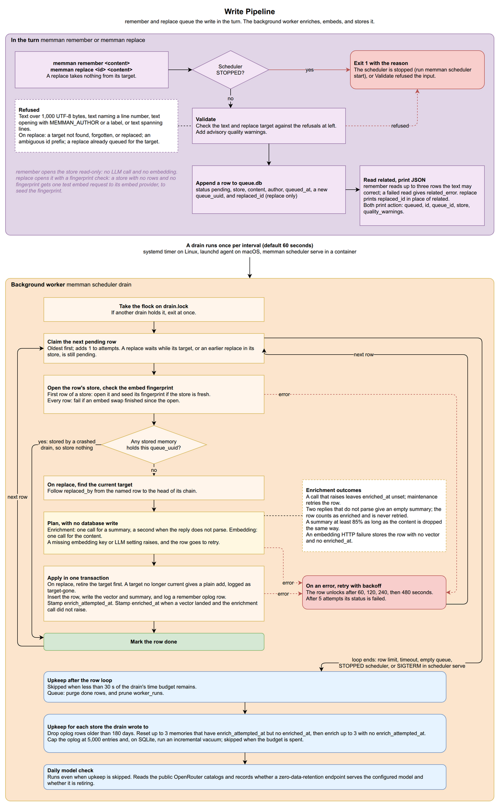
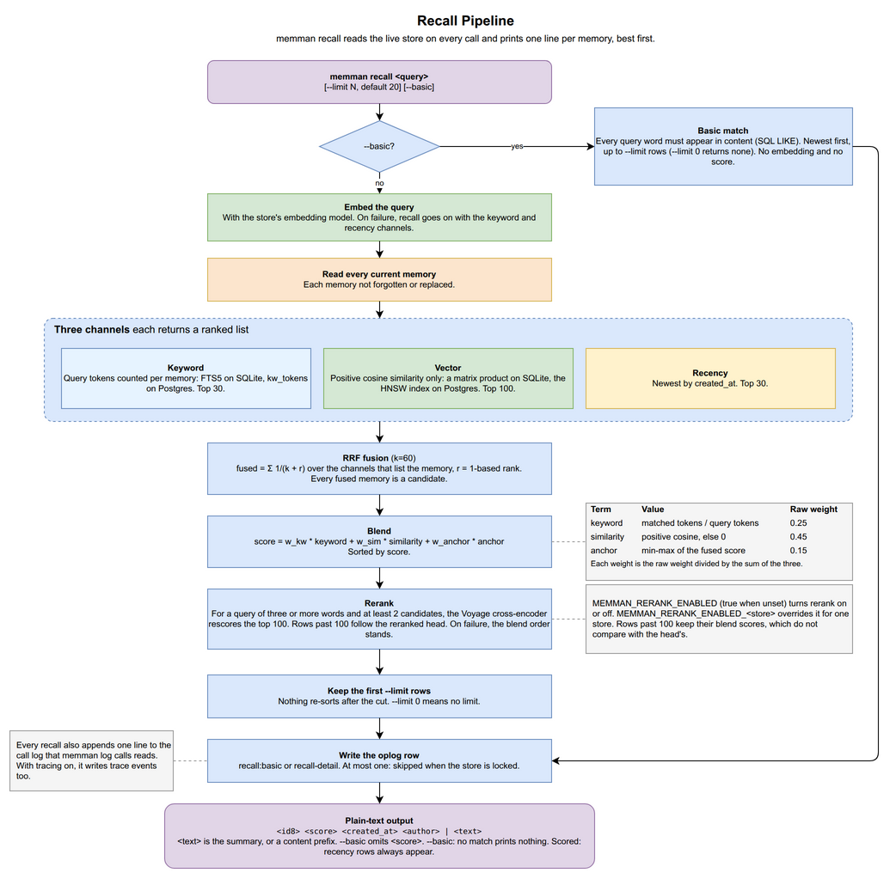

# 3. Read and write pipelines

[Previous: core concepts](02-concepts.md) | [Design overview](../DESIGN.md) | [Next: lifecycle and embedding](04-lifecycle.md)

## 3.1 The turn and the background worker

The agent runs CLI commands during its turn and waits for each to return. A separate worker processes queued writes. A **drain** is one worker run, scheduled every 60 seconds by default.

| Operation                               | Runs in      | Model work                               |
| --------------------------------------- | ------------ | ---------------------------------------- |
| Validate and queue `remember`           | Agent's turn | None                                     |
| Enrich, embed, and store a queued write | Worker       | Summary generation and content embedding |
| `replace` and `forget`                  | Agent's turn | None                                     |
| Scored `recall`                         | Agent's turn | Query embedding and optional reranking   |
| `recall --basic`                        | Agent's turn | No query embedding or reranking          |

`replace`, `forget`, and recall open normal store sessions. Their store-opening checks can require embedding credentials or send a probe, separate from the model work listed above. Summary generation and content embedding for a new write always run in the worker.

A queued memory becomes searchable only after the worker stores it. Recall reads the store on each call, so it can see a memory saved earlier in the same session.

Stopping the scheduler disables `remember`, `replace`, `forget`, and manual drain triggers. Recall remains available. Maintenance commands that rebuild generated fields require this stopped state ([scheduler controls](../USAGE.md#scheduler)).

## 3.2 Write pipeline: remember



### Write queuing

`remember` performs these steps before returning:

1. Check that writes are enabled, then validate the text against the [input rules](../USAGE.md#rejected-input).
2. Identify potentially temporary information and report it as advisory `quality_warnings`.
3. Append a pending entry to `queue.db`, including a new UUID, the selected store, and the caller's author identity.
4. Look for up to three related current memories. This uses word overlap and calls no model.
5. Return JSON with `action: queued`, `id`, `queue_id`, `store`, `quality_warnings`, and `related`.

Related memories must be at most 1,000 bytes. Their score is shared-word count divided by the square root of the memory's distinct-word count. This favors focused matches. A missing SQLite store yields an empty list. A failed read returns `related_error`; the write remains queued and the command succeeds. The Postgres read defaults `PGCONNECT_TIMEOUT` to three seconds unless already configured.

The UUID returned as `id` becomes the memory's persistent ID. The numeric `queue_id` identifies the queue entry, which maintenance can delete after processing.

`replace` also queues a write, with a `replaced_id`. It accepts a current memory or a queued write in the same store. It rejects forgotten or replaced targets and targets with a replacement already queued. Its response includes `replaced_id` instead of `related`.

### Write processing

A systemd timer or launchd agent runs the hidden `scheduler drain` command, and the serve loop runs the same drain inside its own process. An exclusive file lock on `<data dir>/drain.lock` prevents overlapping drains; the operating system releases it if the process exits. A drain that cannot acquire the lock reports `skipped`.

Each drain processes up to 100 entries by default, stopping when it reaches its limit or timeout, empties the queue, or sees the stopped state. Under `scheduler serve`, SIGTERM or SIGINT also stops it.

1. **Claim an entry.** An atomic update claims the oldest eligible pending write and increments its attempt count. A claim older than 600 seconds (`STALE_CLAIM_SECONDS`) can be claimed again, so a crashed drain loses no entry. A replacement waits for its pending target and for earlier replacements in the same store, so the worker stores replacements in queue order. A write that fails or goes stale no longer blocks the entries behind it.
2. **Open the store.** Resolve its backend and embedding fingerprint. Before each write, check that the fingerprint still matches the cached client, because a swap that finishes mid-drain would leave that client writing vectors of the wrong size. An error while opening the store, from the fingerprint check, or from planning (a missing LLM setting or embedding credentials) takes the same backoff retry as an apply error.
3. **Check for a completed attempt.** If any memory already carries the entry's `queue_uuid`, mark the entry done without inserting again. Retired memories count too. The UUID identifies the write across retries, since a backup restore can reset the queue's row id counter.
4. **Resolve a replacement.** Follow an existing replacement chain to its current successor when necessary, recording `redirected_from`.
5. **Generate a summary and embedding.** Enrichment requests a one-sentence summary, with one additional request if no JSON object parses. A summary at least 85% as long as the original content is discarded. The embedder processes the original content.
6. **Commit one transaction.** Retire the replacement target by linking it to the new ID when it is still current, then insert the new memory, save generated fields and markers, and record operations.
7. **Finish the queue entry.** Mark it done, or record an error for retry.

A replacement always creates a new memory with its own content, author, timestamps, summary, and vector. If the target is no longer current at commit time, the worker stores the new memory without a replacement link and records `target_gone` in the result and `target-gone` in the operation log.

### Failure and retry

| Failure                                                                                                                | Outcome                                                                                                                                                                                              |
| ---------------------------------------------------------------------------------------------------------------------- | ---------------------------------------------------------------------------------------------------------------------------------------------------------------------------------------------------- |
| Store cannot open; required configuration or embedding credentials are missing; fingerprint changes; transaction fails | Retry the queued write.                                                                                                                                                                              |
| LLM request or a handled embedding HTTP/runtime error persists after client retries                                    | Save the memory with incomplete generated fields.                                                                                                                                                    |
| Neither enrichment response contains a JSON object                                                                     | Save an empty summary. With a saved vector, this counts as completed enrichment, so later drains do not repeat the paid call. A summary at least 85% as long as the content is dropped the same way. |

Queue retries wait 60, 120, 240, and 480 seconds. After five failed attempts, the entry stays `failed` until an explicit retry ([queue commands](../USAGE.md#queue)).

`enrich_attempted_at` records the attempt. `enriched_at` is set only when both enrichment and a vector were saved. A memory with an attempt but no completion is **stranded** and can be retried through maintenance or `enrich --stale-only`.

### Maintenance after each drain

Maintenance runs when at least 30 seconds remain in the drain's timeout:

- Delete completed queue entries older than 60 seconds and drain history older than seven days.
- For each store where this drain completed an entry, trim operation logs older than 180 days (`OPLOG_RETENTION_DAYS`), make up to three stranded memories eligible for enrichment (`MAINTENANCE_REENRICH_MAX`), and enrich up to three pending memories (`MAINTENANCE_ENRICH_PENDING_MAX`).
- Unless the time budget is spent, end each store's pass with the operation-log cap, which retains the newest 5,000 entries (`MAX_OPLOG_ENTRIES`), and on SQLite one incremental-vacuum step.

A store with no completed entry in the drain gets no store maintenance. Its stranded memories wait for a later write or an explicit [re-enrichment](../USAGE.md#re-enrichment).

The daily model check runs outside maintenance, so it runs even when maintenance is skipped for lack of time.

### Scheduler implementations

| Host                      | Mechanism                         | Drain timeout in seconds                            |
| ------------------------- | --------------------------------- | --------------------------------------------------- |
| Linux                     | systemd user timer                | `max(60, interval - 20)`                            |
| macOS                     | launchd agent                     | `max(60, interval - 20)`                            |
| Other hosts or containers | Foreground `scheduler serve` loop | `max(10, interval - 10)`; 300 when interval is zero |

The systemd/launchd interval is written into the installed unit. The serve loop takes `--interval`, then the installed `MEMMAN_INTERVAL`, then 60. It checks stopped state while waiting and exits when stopped. SIGTERM or SIGINT lets it finish the current memory before exiting successfully.

## 3.3 LLM calls

### LLM routing

`MemmanLLMClient` handles enrichment and the `doctor` connectivity probe. It posts to `<MEMMAN_LLM_ENDPOINT>/chat/completions` using `MEMMAN_LLM_MODEL` and `MEMMAN_LLM_API_KEY`.

Each request allows up to 4,096 output tokens and has a 60-second timeout. The client makes up to three attempts. Retriable HTTP responses (429, 500, 502, 503, 504, 529) use one- and two-second waits; empty replies use a 0.1-second wait. The enrichment parser's extra request is separate from these transport retries.

On OpenRouter, the client adds attribution headers and provider routing:

| Setting                      | Install default                      | Request field     |
| ---------------------------- | ------------------------------------ | ----------------- |
| `MEMMAN_LLM_PROVIDER_ONLY`   | `amazon-bedrock,azure,google-vertex` | `only`            |
| `MEMMAN_LLM_DATA_COLLECTION` | `deny`                               | `data_collection` |
| `MEMMAN_LLM_ZDR`             | `true`                               | `zdr`             |

No eligible provider means the request fails. An empty provider list removes the `only` restriction. Other endpoints receive neither OpenRouter headers nor routing fields.

The OpenRouter install default is `qwen/qwen3-235b-a22b-2507`. Other endpoints require an explicit model ID, because the installed default is an OpenRouter model ID that another endpoint rejects. memman never changes the selected model on its own ([provider setup](../USAGE.md#provider-setup)).

### Daily model check

For OpenRouter, installation and the worker check public catalogs without an API key or an LLM request:

- `/endpoints/zdr` must list a zero-data-retention endpoint for the exact model id on a vendor in `MEMMAN_LLM_PROVIDER_ONLY`. The vendor is the endpoint tag before its first `/`, and an empty provider list allows every vendor.
- `/models` must not list an expiration date for it.

The worker writes `{model, checked_at, notice}` to `<data dir>/model.state` and skips the check while that record names the configured model and is less than 24 hours old (`CHECK_INTERVAL_SECONDS`). A model change therefore triggers a check on the next drain. A failed fetch keeps the existing notice and restarts the interval. `memman prime` prints the notice when it concerns the configured model. A catalog outage does not stop installation.

The check never selects a replacement model. If enrichment requests fail, the worker still stores the memories without summaries, and re-enrichment supplies the summaries once a working model is set.

### Token accounting

LLM calls identify their stage as `enrichment` or `probe`. Usage is counted for each attempt, including an HTTP 200 response that is empty and subsequently retried. Missing usage blocks and HTTP errors have separate counters; tokens reported in an error response still count.

The drain reports totals in `llm_usage`. Debug events include per-entry usage in `queue_done` and `queue_failed`, plus a drain-level `llm_usage_summary`.

## 3.4 Read pipeline: recall



Recall considers current memories only. The [command reference](../USAGE.md#recall) describes its output and limits.

### Basic matching

`--basic` bypasses scoring. Every whitespace-separated query word must appear as a substring of the content. Matching is case-insensitive, limited to ASCII case folding on SQLite. Results are newest first.

This path skips query embedding and reranking, but normal store-opening checks still run, so the command can still require an API key and a network call.

### Candidate selection

Scored recall embeds the query with the store's bound model. If embedding fails, it logs a warning and proceeds with keyword and recency retrieval.

| Channel | Ranking                                       | Candidate count          |
| ------- | --------------------------------------------- | ------------------------ |
| Keyword | Number of distinct query terms in the content | `ANCHOR_TOP_K` = 30      |
| Vector  | Positive cosine similarity                    | `RERANK_SHORTLIST` = 100 |
| Recency | Creation time, newest first                   | `ANCHOR_TOP_K` = 30      |

The union of these lists forms the candidate set, with no further cap. The vector channel takes 100 so the reranker sees a full shortlist of the query's nearest memories.

Keyword tokenization lowercases text, splits outside `[a-zA-Z0-9]`, and removes stopwords. SQLite uses an FTS5 probe per term; Postgres counts intersections with `kw_tokens`. Non-ASCII text can yield different counts because FTS5 tokenizes it differently.

SQLite computes vector similarities in a matrix product. Postgres uses pgvector, including HNSW for vector candidates. The vector candidate list excludes zero and negative cosines and applies no other floor. A fixed cosine threshold means different things under different embedding models, while the sign boundary means the same under every model. `tests/test_vector_anchor_floor.py` fails if an absolute floor is reintroduced.

### Combined scoring

Reciprocal Rank Fusion (RRF) gives a candidate one contribution per channel that found it:

```text
rrf = sum(1 / (RRF_K + rank))    # RRF_K = 60, ranks start at 1
```

The fused score is normalized across the candidate set and combined with keyword overlap and cosine similarity:

```text
keyword = matched distinct query terms / distinct query terms
anchor  = (rrf - minimum rrf) / (maximum rrf - minimum rrf)
score   = (0.25 * keyword + 0.45 * similarity + 0.15 * anchor) / 0.85
```

The raw weights are `_RERANK_WEIGHTS_RAW`, divided by their sum so the used weights sum to 1. The division rescales the printed score and changes no ranking. The raw values are hand-chosen defaults. No labeled evaluation set is large enough to fit or certify other values.

With no query terms, the keyword term is zero. With equal RRF scores, the anchor term is zero. Missing vectors and nonpositive cosines contribute zero similarity. Candidates sort by the combined score.

Recency contributes only through the anchor term, so a recent memory can appear without a keyword or vector match. The agent judges each row's relevance.

### Reranking and limits

A cross-encoder reads the query and one memory together and scores their relevance directly, so it catches matches that cosine and word overlap miss. Voyage reranking runs when enabled, the query has more than two whitespace-separated words (`MIN_RERANK_TOKENS`), and at least two candidates exist. It scores the query against the original content of the top 100 candidates (`RERANK_SHORTLIST`), then replaces their scores and order. A failed request, including a missing key, preserves the combined ranking and logs a warning.

The default model is `rerank-3-lite`. `MEMMAN_RERANK_ENABLED_<store>` overrides the global `MEMMAN_RERANK_ENABLED` setting. Reranking always uses `MEMMAN_VOYAGE_API_KEY`, whatever the embedding provider. Recall has no rerank flag, so the agent never makes this choice.

Reranking changes what the blend weights decide:

- With more than 100 candidates, the weights decide which ones reach the reranker. In a store holding at least 100 memories with a positive cosine to the query, the vector channel alone fills 100 slots, and keyword and recency hits outside it push the pool past 100.
- With 100 or fewer candidates, the reranker rescores all of them, and the weights have no effect on the final order.
- When reranking does not run (a query of two or fewer words, reranking disabled for the store, or a failed request), the weights set the final order.

A positive `--limit` applies last, with no further sort. A larger limit keeps the earlier rows in place. Results stay in relevance order, because a date sort would present them as a timeline. Each line includes `created_at`, so dates remain available. Reranked candidates precede any remaining candidates, which keep their combined scores. A limit over 100, or `--limit 0`, can expose both groups; their scores are not comparable. Scores also cannot be compared across queries. On the basic path, `--limit 0` returns no rows; on the scored path it means no limit.

### Recall trace events

With tracing enabled, `recall_anchors` reports each channel's hits and the candidate union; `recall_rerank` reports shortlist size and changed positions. These events help distinguish poor candidate selection from an ineffective rerank.

Only the drain and serve loop attach the trace file handler. A standalone recall process does not write these events to `~/.memman/logs/debug.log`.

## 3.5 Handling model changes

Prompts, models, and providers change over time. memman does not aim for identical output across versions. It records the inputs behind each summary and vector, so an operator can rebuild only the affected fields. It applies no fixed similarity cutoff, because a cutoff would tie the code to one model's behavior.

| Record                                      | Detects                                 | Check or recovery                                           |
| ------------------------------------------- | --------------------------------------- | ----------------------------------------------------------- |
| `prompt_version`                            | Changed enrichment prompt or LLM model  | `provenance_drift`; `enrich --stale-only`                   |
| `enrich_attempted_at` without `enriched_at` | Incomplete enrichment or missing vector | `enrichment_coverage`; maintenance or `enrich --stale-only` |
| `embed_fingerprint`                         | Store's bound embedding model           | `embed status`; model swap or re-embed                      |
| `embedding_model`                           | Model recorded for a memory's vector    | `embed reembed` checks model and vector width               |
| `embed_swap_*`                              | Unfinished model swap                   | `no_stale_swap_meta`; resume or abort                       |

An enriched memory with a null `prompt_version` counts as current. A change to the summary-length filter alone leaves the prompt hash unchanged. [Chapter 4](04-lifecycle.md) covers embedding model changes, and [re-enrichment](../USAGE.md#re-enrichment) covers the commands.
