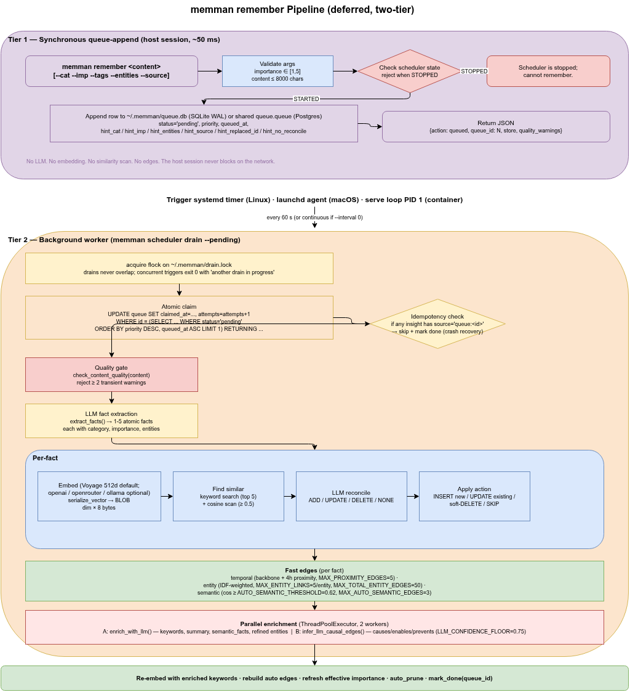
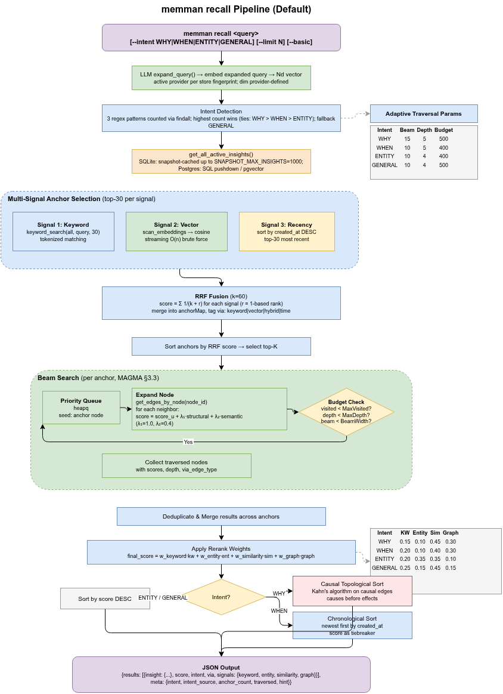

# 4. Read & Write Pipelines

[< Back to Design Overview](../DESIGN.md)

---

## 4.1 Write Pipeline: Remember (deferred, two-tier)

`memman remember` is a fast queue-append (~50 ms). A user-scope scheduler (systemd timer on Linux, launchd agent on macOS) invokes the hidden worker entrypoint `memman scheduler drain --pending` every 60 s to drain the queue through the full extraction + reconciliation + enrichment pipeline out of band.



### Tier 1: Synchronous queue-append (host session)

1. `memman remember [--cat X --imp Y --entities a,b] "<text>"` validates input.
2. Inserts one row into the deferred-write queue with `status='pending'`, priority, queued_at, and the raw text + hints. On `MEMMAN_BACKEND=sqlite` (default), the queue is `~/.memman/queue.db` (SQLite WAL); on `MEMMAN_BACKEND=postgres`, it is the shared `queue.queue` table in the configured Postgres database.
3. Returns `{action: queued, queue_id: N, store: ...}` to the caller.

No LLM calls. No embeddings. No similarity scan. No edges. The host session never blocks.

There is no sync path: every write goes through the queue. When the scheduler is **stopped**, memman is recall-only and writes reject with a fixed error pointing at `memman scheduler start`.

### Tier 2: Background worker (scheduler-driven)

`memman scheduler drain --pending` (hidden subcommand; only the trigger invokes it) is run by an environment-native trigger:

- **Linux host**: `systemctl --user` timer at `~/.config/systemd/user/memman-enrich.timer`, `Persistent=true` so sleep/off catch-up is automatic.
- **macOS host**: launchd agent at `~/Library/LaunchAgents/com.memman.enrich.plist` with `StartInterval=60`.
- **nanoclaw container** (no systemd / launchd): `memman scheduler serve --interval 60` runs as PID 1. Set `MEMMAN_SCHEDULER_KIND=serve`. The drain loop polls the state file every iteration, so `scheduler stop` is observed within seconds; the loop then exits — in a PID-1 container that exits the container.

Per-blob processing inside `_process_queue_row`:

1. **Atomic claim** — `UPDATE queue SET claimed_at=..., attempts=attempts+1 WHERE id = (SELECT ... WHERE status='pending' ORDER BY priority DESC, queued_at ASC LIMIT 1) RETURNING ...`. Race-free under SQLite WAL; on Postgres the equivalent claim runs inside a `FOR UPDATE SKIP LOCKED` cursor in the `queue` schema. Stale claims (>10 min) are reclaimable. Drains never overlap: an `fcntl.flock` on `~/.memman/drain.lock` gates `_drain_queue` regardless of backend.
2. **Idempotency check** — if the target store already has any insight with `source='queue:<id>'`, skip and mark done (crash-recovery after partial commit).
3. **Quality gate** — regex-based `check_content_quality()` rejects transient patterns.
4. **LLM fact extraction** — decomposes into 1–5 atomic facts with category/importance/entities.
5. **Per-fact**: embed (Voyage), keyword + cosine similarity scan, `reconcile_memories` → ADD/UPDATE/DELETE/NONE, insert/update, fast edges.
6. **Parallel enrichment + causal inference** (ThreadPoolExecutor, 2 workers).
7. **Re-embed** with enriched keywords; rebuild auto edges.
8. `mark_done(queue_id)` on success, or `mark_failed` (retry up to 5 times across stale-claim windows before status='failed').

Errors propagate. Edge upserts in `graph/temporal.py`, `graph/semantic.py`, `graph/entity.py`, and `graph/engine.py` and the LLM/embed call sites in `pipeline/remember.py` no longer carry silent `except Exception: pass` swallows -- a real failure (constraint violation, network error, malformed payload) drops through to `mark_failed` and contributes to the retry budget rather than appearing as a silent green drain. Best-effort cleanup (HTTP session resets, platform probes, pool teardown) keeps narrow typed catches with `logger.debug`.

### LLM routing

Both the session path (`memman recall` query expansion) and the scheduler path route through OpenRouter. They use three role slots: `MEMMAN_LLM_MODEL_FAST` for the recall hot path (and `doctor`'s connectivity probe), `MEMMAN_LLM_MODEL_SLOW_CANONICAL` for the worker's canonical-content path (fact extraction, reconciliation), and `MEMMAN_LLM_MODEL_SLOW_METADATA` for the worker's derived-metadata path (enrichment summaries/keywords, causal-edge inference). All three are populated by `memman install`, which queries OpenRouter's `/models` endpoint once per role and writes the resolved id to `~/.memman/env`. Runtime never queries the model inventory; it reads the persisted id and sends it through unchanged. Re-run `memman install` to bump to a current version when a new model family ships. Splitting the slow worker into `_CANONICAL` and `_METADATA` lets you tune enrichment cost (e.g., a cheaper model for summaries) independently of the load-bearing extraction prompt.

### Operational controls

| Command                                   | Effect                                                                                     |
| ----------------------------------------- | ------------------------------------------------------------------------------------------ |
| `memman scheduler queue list [--limit N]` | inspect pending/done/failed rows                                                           |
| `memman scheduler queue retry <id>`       | re-queue a failed row                                                                      |
| `memman scheduler queue purge --done`     | delete completed rows                                                                      |
| `memman scheduler status`                 | install state, interval, next run, queue depth                                             |
| `memman scheduler start`                  | activate the trigger (idempotent)                                                          |
| `memman scheduler stop`                   | deactivate the trigger; trigger files stay                                                 |
| `memman scheduler interval --seconds N`   | change cadence; min 60 s for systemd/launchd; serve mode accepts `>= 0` (`0` = continuous) |
| `memman scheduler trigger`                | run the drain now (rejects when stopped)                                                   |

`memman graph rebuild` re-enriches all already-stored insights through the full LLM pipeline (useful after model/prompt changes; rejects when the scheduler is stopped). Auto-created edges (semantic, entity, temporal) are recomputed automatically on DB open when edge constants change — no operator command for that.

---

## 4.2 Read Pipeline: Smart Recall

`memman recall` combines LLM query expansion, intent detection, multi-signal anchor selection, beam search graph traversal, and multi-factor re-ranking. Use `--basic` for SQL LIKE fallback.



### Step 0: LLM Query Expansion (opt-in, off by default)

`expand_query(llm_client, query)` sends the raw query to the LLM, which returns:
- **expanded_query**: original + synonyms and related terms
- **keywords**: extracted search keywords
- **entities**: entities mentioned or implied in the query
- **intent**: WHY / WHEN / ENTITY / GENERAL (can override regex detection)

Expansion runs only when the user passes `--expand` to `memman recall`. By default the raw query is embedded directly. Expansion is gated because the LLM has no domain scope: it can pull the candidate pool toward general-knowledge synonyms that are then amplified by recency-aware rerank (Step 4). Voyage embeddings already capture most synonym intent; recency does the rest. See section 4.3.

### Step 1: Intent Detection

Query intent is identified via regex matching (or LLM override from Step 0):

| Intent  | Trigger Patterns                                                                       |
| ------- | -------------------------------------------------------------------------------------- |
| WHY     | `why`, `reason`, `because`, `cause`, `motivation`, `rationale`                         |
| WHEN    | `when`, `time`, `date`, `before`, `after`, `during`, `timeline`, `history`, `sequence` |
| ENTITY  | `what is`, `who is`, `tell me about`, `describe`, `about`                              |
| GENERAL | None of the above match                                                                |

Supports the `--intent` flag to manually override automatic detection.

### Step 2: Multi-Signal Anchor Selection (RRF Fusion)

Multiple signals run in parallel and are merged via Reciprocal Rank Fusion:

```
Signal 1: Keyword     → KeywordSearch(all_insights, query, top-30)
Signal 2: Vector      → CosineSimilarity(query_vec, all_embeddings, top-30)
Signal 3: Recency     → sort by created_at DESC, top-30

RRF Score = Σ  1 / (k + r)    (k = 60, r = 1-based rank)
                 for each signal
```

> Code uses 0-based `enumerate` with `1/(k + rank + 1)` to produce equivalent 1-based ranks.

Each insight may rank differently across signals; RRF fusion produces a robust composite ranking.

**Rationale:**

- **`ANCHOR_TOP_K = 30`**: Per-signal anchor pool size. MAGMA Table 5 specifies 20; MemMan uses 30 to give beam search a richer starting frontier given the flat insight hierarchy (no episode/narrative super-nodes).
- **`RRF_K = 60`**: Standard value from the original RRF paper (Cormack, Clarke & Büttcher, SIGIR 2009). MAP scores nearly flat from k=50–90, with k=60 validated across four TREC collections.
- **`VECTOR_SEARCH_MIN_SIM = 0.10`**: Noise floor matching MAGMA's lower similarity threshold bound. Below 0.10, vector search hits add noise rather than signal.

### Step 3: Beam Search Graph Traversal

Starting from each anchor, beam search traverses the four graphs:

```
for each anchor:
    priority_queue = [(anchor, initial_score)]
    visited = {}

    while budget_remaining:
        node = pop(priority_queue)
        for edge in GetEdgesFrom(node):
            neighbor = edge.target
            structural_score = edge.weight × intent_weight[edge.type]
            semantic_score = cosine(vec_neighbor, vec_query)
            total = score_node + λ₁·structural + λ₂·semantic
            //  λ₁ = 1.0 (structural weight), λ₂ = 0.4 (semantic weight)

            if total > best_score[neighbor]:
                update(neighbor, total)
                push(priority_queue, neighbor)
```

**Adaptive parameters**:

| Intent  | Beam Width | Max Depth | Max Visited |
| ------- | ---------- | --------- | ----------- |
| WHY     | 15         | 5         | 500         |
| WHEN    | 10         | 5         | 400         |
| ENTITY  | 10         | 4         | 400         |
| GENERAL | 10         | 4         | 500         |

WHY queries use a wider beam and deeper traversal because causal chains typically span multiple hops.

**Rationale:**

- **`LAMBDA1 = 1.0`**: Directly from MAGMA Table 5 ("λ1 (Structure Coef.): 1.0 (Base)").
- **`LAMBDA2 = 0.4`**: Falls within MAGMA's empirically tuned range ("λ2 (Semantic Coef.): 0.3–0.7"). 0.4 chosen as a conservative value — structural signal is weighted 2.5× semantic, prioritizing graph topology over embedding similarity during traversal.
- **Max depth 5** (WHY/WHEN): Directly from MAGMA Table 5. WHY gets beam width 15 (50% wider than base 10) because causal chains typically span more hops. GENERAL gets max_visited=500 (matching WHY) because unknown intent should not restrict exploration. WHEN/ENTITY get 400 as a moderate budget — their primary edges (temporal/entity) form shorter chains.

### Step 4: Multi-Factor Re-Ranking

For all collected candidates, a four-dimensional score is computed and combined via weighted sum:

```
keyword_score  = token_intersection / query_token_count
entity_score   = matched_entities / max(1, query_entities_count)
similarity     = cosine(vec_candidate, vec_query)
graph_score    = (traversal_score - min) / (max - min)   // min-max normalization

final = w_kw·keyword + w_ent·entity + w_sim·similarity + w_gr·graph
```

Weights vary by intent:

| Intent  | Keyword | Entity   | Similarity | Graph    |
| ------- | ------- | -------- | ---------- | -------- |
| WHY     | 0.15    | 0.10     | **0.45**   | **0.30** |
| WHEN    | 0.20    | 0.10     | **0.40**   | **0.30** |
| ENTITY  | 0.20    | **0.35** | **0.35**   | 0.10     |
| GENERAL | 0.25    | 0.15     | **0.45**   | 0.15     |

These extend MAGMA's intent-adaptive philosophy (which steers beam search via edge type weights) into the final reranking stage. MAGMA does not define a separate reranking stage — this is MemMan's extension.

Embeddings are Voyage AI 512-dim vectors. The expanded query from Step 0 is embedded for vector search and reranking.

### Step 4b: Cross-Encoder Rerank

When the caller passes `--rerank` and the query has more than `MIN_RERANK_TOKENS` (default 2) whitespace tokens, the top `RERANK_SHORTLIST` (default 100) candidates from Step 4 are re-scored by Voyage's `rerank-2.5-lite` cross-encoder, and the rerank score replaces the multi-signal score for the final ordering. The skill files (`SKILL.md`) instruct LLM agents to always pass `--rerank` on natural-language queries.

Bi-encoder retrieval (Steps 1–4) embeds the query and each insight independently and ranks by cosine similarity plus the four signals. A cross-encoder reads `(query, content)` together with full attention and outputs a relevance score directly, so it can resolve cases where bi-encoder cosine misses the right answer despite low token overlap.

Failures (timeouts, non-200 responses) are caught and logged; the baseline ordering is returned unchanged with `meta.reranked = false`. The 1-2 token query gate skips rerank when there is too little query signal for the cross-encoder to use.

### Empirical evidence

Two-phase evaluation supported the decision to ship rerank as a `--rerank` flag and to instruct LLM agents (via `SKILL.md`) to always pass it:

**Phase 1 — Cheap-alternative ablation** (12 queries × 1 store, no labels): asked whether bumping `ANCHOR_TOP_K`, retuning weights, or LLM query expansion could close the gap without an LLM call on the read path. None did. Rerank changed 72% of the top-10; the next-best non-rerank config changed 35%.

**Phase 2 — LLM-judged labeled eval** (90 queries × 3 stores `search`/`memman`/`main`, ~4500 graded relevance labels via Haiku 4.5): scored every config against ground truth with nDCG@5, Recall@5, MRR, P@1.

Combined results across all 90 queries:

| Config                        | nDCG@5    | Rec@5     | MRR       | P@1       | vs baseline |
| ----------------------------- | ---------: | ---------: | ---------: | ---------: | -----------: |
| `baseline`                    | 0.648     | 0.573     | 0.759     | 0.711     | —           |
| `anchor_60` (cap 30→60)       | 0.646     | 0.576     | 0.738     | 0.678     | -0.002      |
| `anchor_100` (cap 30→100)     | 0.648     | 0.583     | 0.734     | 0.678     | -0.001      |
| `weights_v2` (retuned)        | 0.627     | 0.562     | 0.732     | 0.678     | -0.022      |
| `expand_only` (LLM expansion) | 0.595     | 0.527     | 0.689     | 0.600     | -0.054      |
| `rerank_replace_general_only` | 0.641     | 0.616     | 0.755     | 0.700     | -0.007      |
| `rerank_blend_all`            | 0.719     | 0.624     | 0.783     | 0.733     | +0.070      |
| **`rerank_voyage` (replace)** | **0.788** | **0.695** | **0.835** | **0.789** | **+0.140**  |

Per-intent nDCG@5 (regression check):

| Config                        | ENTITY (n=2) | GENERAL (n=52) | WHEN (n=18) | WHY (n=18) |
| ----------------------------- | ------------: | --------------: | -----------: | ----------: |
| `baseline`                    | 0.604        | 0.734          | 0.381       | 0.674      |
| `rerank_replace_general_only` | 0.604        | 0.815          | **0.122**   | 0.661      |
| `rerank_blend_all`            | 0.631        | 0.786          | 0.528       | 0.723      |
| **`rerank_voyage`**           | **0.742**    | **0.815**      | **0.732**   | **0.771**  |

Per-store consistency (rerank_voyage vs baseline nDCG@5):

| Store    | baseline | rerank_voyage | delta  |
| -------- | --------: | -------------: | ------: |
| `search` | 0.655    | 0.809         | +0.154 |
| `memman` | 0.596    | 0.737         | +0.141 |
| `main`   | 0.695    | 0.819         | +0.124 |

Rerank wins **56 of 90 queries**, ties 12, loses 22. The win is consistent across all three stores, contradicting an a-priori prediction that the cross-encoder would regress WHY/WHEN intents (it actually wins them by the largest margins because their bi-encoder baselines are weakest).

User-facing top-5 impact (rerank_voyage vs baseline):

| Metric                                                             | baseline | rerank          | Δ      |
| ------------------------------------------------------------------ | --------: | ---------------: | ------: |
| Mean P@5 (fraction of top-5 with rel ≥ 2)                          | 0.476    | 0.556           | +0.080 |
| Queries where the directly-answers (rel=3) doc surfaces (in top-5) | 39       | 45 (+6 rescues) | +6     |
| Queries where rerank loses a directly-answers doc                  | —        | 0               | 0      |

Where the lift is biggest (sharpest cut: baseline strength):

| Baseline mean rel of top-5 | n  | Δ     | wins | losses |
| -------------------------- | ---: | -----: | ----: | ------: |
| Weak (< 1.0)               | 22 | +0.40 | 18   | **1**  |
| OK (1.0–1.6)               | 24 | +0.34 | 16   | 3      |
| Strong (≥ 1.6)             | 44 | +0.06 | 19   | 9      |

So rerank pays off most when the bi-encoder is uncertain. When the bi-encoder is already confident, rerank's average lift collapses and individual queries can mildly regress.

The eval scripts and full per-query tables live under `experiments/eval/`. The labeled query set is in `experiments/eval/queries_labeled_<store>.jsonl`; each pair was scored by Haiku 4.5 on a 0–3 graded scale (cached so re-runs only score new pairs).

### Step 5: WHY Post-Processing — Causal Topological Sort

If the intent is WHY, an additional topological sort using Kahn's algorithm is performed: results are arranged along causal edges so that **causes come first, effects follow**.

### Step 5b: WHEN Post-Processing — Chronological Sort

If the intent is WHEN, results are re-sorted chronologically: **newest first** by `created_at`, with score as tiebreaker for equal timestamps.

### Signal Breakdown

Each retrieval result includes signal details:

```json
{
  "insight": {
    "id": "...",
    "content": "...",
    "summary": "..."
  },
  "score": 0.73,
  "intent": "ENTITY",
  "via": "keyword",
  "signals": {
    "keyword": 0.85,
    "entity": 0.60,
    "similarity": 0.72,
    "graph": 0.45
  }
}
```

The `summary` field is the LLM-authored one-line gloss produced during enrichment (slow_metadata role). It is present only when (a) enrichment has run for the row and (b) the summary actually compresses the content (write-time gate at `len(summary) < len(insight.content) * 0.85`); rows that fail the gate emit no `summary` key. Calling LLMs see ~3.6x token compression with ~90% ranking-decision agreement vs full content.

The host LLM sees these signals and can apply its own judgment with full conversation context.

## 4.3 Model Resilience

memman uses LLMs at write time (extraction, reconciliation, enrichment, causal inference) and embedding models everywhere a vector is touched. Both can change underneath the store: prompts get edited, models get upgraded, providers get swapped. The system is designed so changes are **detectable** and **re-runnable**, not so its output stays bit-identical across model versions.

Two design principles:

1. **Avoid slow work on the hot path.** "Slow" means anything that slows the user experience. The write path defers LLM work to the scheduler drain (Tier 2 in 4.1). The read path is embedding-only at the bare-CLI level, with `--expand` (LLM query expansion) and `--rerank` (cross-encoder reranking) as explicit flags; LLM agents using memman are instructed via `SKILL.md` to always pass `--rerank`. Where LLM judgment is unavoidable (extraction, reconciliation, enrichment, causal inference), the output is tagged with what produced it and re-runnable.
2. **Provenance + re-run beats deterministic-rule replacement.** Hard rules (length thresholds, importance clamps, similarity cutoffs) calcify with one model's behavior baked in; provenance + re-run lets memman track what produced each row and re-derive when inputs change. Same precedent as the embed-fingerprint mechanism.

### Invalidation hooks

| Hook                                                             | Stored at | Detects                            | Operator action                                                                                                                                                                    |
| ---------------------------------------------------------------- | --------- | ---------------------------------- | ---------------------------------------------------------------------------------------------------------------------------------------------------------------------------------- |
| `embed_fingerprint`                                              | `meta`    | provider / model / dim change      | `memman embed swap` (online, resumable shadow-column backfill) or `memman embed reembed` (offline, scheduler-stopped)                                                              |
| `embed_swap_state` / `embed_swap_cursor` / `embed_swap_target_*` | `meta`    | in-flight swap progress            | written by `embed swap`; **deleted** on cutover or `--abort`. `memman doctor`'s `no_stale_swap_meta` check warns if any key remains on an idle store.                              |
| `insights.prompt_version` + `insights.model_id`                  | per row   | system-prompt or slow-model change | `memman doctor` warns; remediate via `memman graph rebuild` or `UPDATE insights SET linked_at=NULL, enriched_at=NULL WHERE prompt_version='<old>' OR model_id='<old>';` then drain |
| `constants_hash`                                                 | `meta`    | edge-construction constants change | auto-reindex on next open + warning                                                                                                                                                |
| `linked_at` / `enriched_at`                                      | per row   | per-row pipeline-stage completion  | `link_pending` drains naturally                                                                                                                                                    |

The per-row provenance columns are deliberately preferred over global meta-key fingerprints because they expose the actual rebuild scope: how many rows came from which prompt or model. That distribution is what the operator needs to write a targeted hand-update SQL rather than rebuilding the whole store.

### What is NOT used

memman does not run multi-LLM consensus, calibrate against a target judgment distribution, or hold deterministic rules that override LLM output. Those approaches were considered and rejected: each adds permanent complexity that fights with future model improvements. Provenance + re-run keeps the implementation simple and lets future model upgrades be a deliberate operator action rather than a silent shift.
