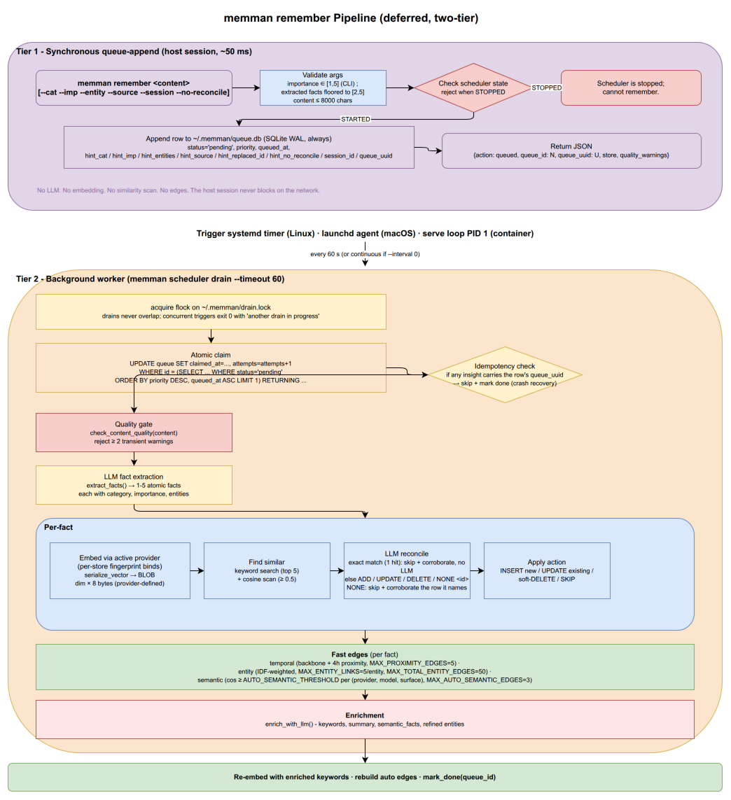
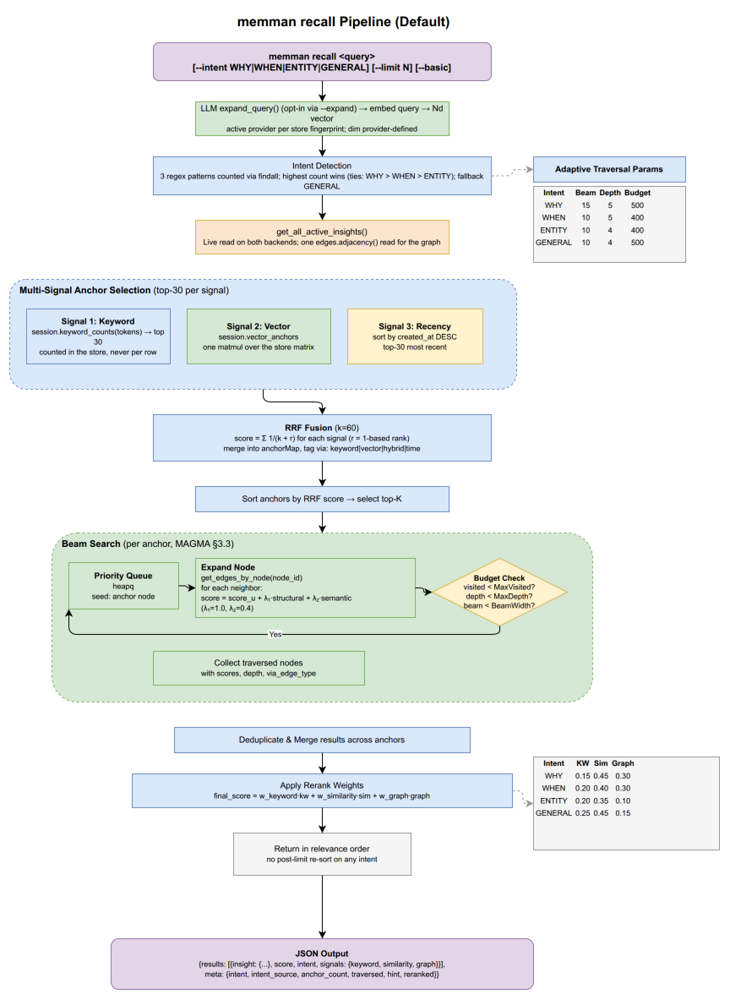

# 4. Read & Write Pipelines

[< Back to Design Overview](../DESIGN.md)

---

## 4.1 Write pipeline: remember (deferred, two-tier)

`memman remember` appends one row to the queue in ~50 ms. A user-scope scheduler (systemd timer on Linux, launchd agent on macOS) invokes the hidden worker `memman scheduler drain --timeout 60` every 60 s; the drain plans and applies each row out of band.



### Tier 1: synchronous queue-append (host session)

1. `memman remember [--cat X --imp Y --entity a --entity b --source S] "<text>"` validates input; the row also receives a `queue_uuid` minted at enqueue (the idempotency key).
2. Insert one row into the deferred-write queue with `status='pending'`, priority, queued_at, and the raw text + hints. The queue is always `~/.memman/queue.db` (SQLite WAL) regardless of any store's backend choice - it is a process-global write buffer, not per-store state.
3. Return `{action: queued, queue_id: N, queue_uuid: U, store: ...}` to the caller. `queue_id` addresses the queue row and is purged about a minute after the drain; `queue_uuid` is stamped on every insight the write produces, so it is the only handle that survives. `memman insights by-queue <U>` resolves it to those rows.

No LLM calls. No embeddings. No similarity scan. The host session never blocks.

Every write goes through the queue. When the scheduler is **stopped**, memman is recall-only and writes reject with a fixed error pointing at `memman scheduler start`.

### Tier 2: background worker (scheduler-driven)

`memman scheduler drain --timeout <seconds>` (hidden subcommand; only the trigger invokes it) runs under an environment-native trigger:

- **Linux host**: `systemctl --user` timer at `~/.config/systemd/user/memman-enrich.timer`, `Persistent=true` so sleep/off catch-up is automatic.
- **macOS host**: launchd agent at `~/Library/LaunchAgents/com.memman.enrich.plist` with `StartInterval=60`.
- **host without systemd / launchd** (e.g. a container): `memman scheduler serve --interval 60` runs in the foreground (as PID 1 in a container, where the loop exiting ends the container). Set `MEMMAN_SCHEDULER_KIND=serve`. The drain loop polls the state file every iteration so `scheduler stop` is observed within seconds; the loop then exits.

Per-blob processing inside `_process_queue_row`:

1. **Atomic claim** - `UPDATE queue SET claimed_at=..., attempts=attempts+1 WHERE id = (SELECT ... WHERE status='pending' ORDER BY priority DESC, queued_at ASC LIMIT 1) RETURNING ...`. The queue is SQLite WAL, so the claim is race-free under the WAL writer guarantee. Stale claims (>10 min) are reclaimable. Drains never overlap: an `fcntl.flock` on `~/.memman/drain.lock` gates `_drain_queue` regardless of which backend the store-under-drain routes to.
2. **Idempotency check** - if the target store already has any insight carrying the row's `queue_uuid` (a uuid4 minted at enqueue), skip and mark done (crash-recovery after partial commit). The uuid - not the integer row id - survives a `backup.restore` that rewinds the queue's AUTOINCREMENT counter; `source` is pure provenance and plays no part.
3. **Quality gate** - regex-based `check_content_quality()` returns advisory warnings; it never blocks the write.
4. **Plan the write**: the write adds a row, unless the caller named a `replace <id>` target, which the write replaces regardless of content.
5. **Enrichment**: LLM-proposed keywords over 200 chars are dropped post-parse (never truncated - a truncated keyword still lands in the enriched-text embed, preserving the pathology under a new name), before the count cap. The cap is a pathological-input guardrail, sized well above the longest legitimate string the fleet produces, not a retrieval tunable, and it lives post-parse so `prompt_version` is unaffected.
6. **Embed** once, after enrichment - keyword-enriched text when the enrichment carried keywords, else the content alone. Apply the plan: a `replace` supersedes its target, keeps the caller's entity list, and writes an oplog row with operation `replace` and detail `replaced by <id>`. A target that is no longer current by apply time (forgotten, or already superseded) is dropped: the oplog records operation `target-gone` against the new row, naming the requested target, and the write degrades to a plain add - the row IS stored, leaving `memman log list` the only place a caller learns a correction did not attach. The row is stamped `enriched_at` only when one pass writes both its enrichment and a vector. A failed enrichment call, or an embed that fails or cannot run, leaves the stamp off; after each drain the stranded-row sweep re-queues up to `MAINTENANCE_REENRICH_MAX` unstamped rows per touched store, and `link_pending` enriches and embeds them again. An enrichment body that decodes on neither draw is terminal: the row is stamped with empty keywords and summary, replacing any it held, so the sweep does not bill it again.
7. `mark_done(queue_id)` on success, or `mark_failed` (retry up to 5 times across stale-claim windows before status='failed'). A row that exhausts its retries stays in the queue at `status='failed'` with its text intact until `queue retry` requeues it.

Insert or replace failure (constraint violation, malformed payload) reaches `mark_failed` and consumes the retry budget, as does a missing embed credential. An enrichment call or an embed that still fails after the client's own retries does not fail the write: the row is stored without the stamp, and the stranded-row sweep retries it (step 6). Best-effort cleanup (HTTP session resets, platform probes, pool teardown) keeps narrow typed catches at `logger.debug`.

### Metadata precedence on a replace

A `replace` is not an in-place edit. `_apply_plan` supersedes the target and inserts one new row, so the target keeps its content behind `superseded_by` and leaves every active read; every field of the current view is decided by one of two rules, and a field governed by neither stays only on the predecessor. The target's pointer is written before the new row is inserted, so the target is already out of the active set when the new row lands. The split:

| Field                            | Winner                            | Why                                                                                         |
| -------------------------------- | --------------------------------- | ------------------------------------------------------------------------------------------- |
| `content`                        | incoming                          | the caller's text, stored as written; no model reads or rewords it                          |
| `category`                       | incoming                          | the caller's `--cat`, stored as passed (default `fact`)                                     |
| `importance`                     | incoming                          | the caller's `--imp`, stored as passed                                                      |
| `source`, `queue_uuid`, `author` | incoming                          | provenance names the write that produced this row                                           |
| `entities`                       | incoming, as given                | the caller's entity list; a CLI check caps a directly-typed list at `MAX_ROW_ENTITIES` (50) |
| `superseded_by`                  | predecessor's, set to the new row | the link `insights show --history` and `unsupersede` read                                   |
| `created_at`                     | new row's own                     | server-side default; the row is new                                                         |

Incoming-wins on the provenance fields is deliberate: `--source` is the only exact recall pre-filter, so a replaced row belongs to the namespace of the write that last touched it. The consequence worth knowing: a later write that passes no `--source` carries the `user` default, so it moves a replaced row out of a narrower namespace an earlier write had set. Scope an investigation with `--source` on **every** write that may replace into it, not only the first.

### Per-stage token accounting

Every `MemmanLLMClient.complete` call names its originating stage from a closed set (`enrichment`, `probe`, plus `harness` for off-pipeline measurement tooling - an unknown stage raises). The client reads the provider's `usage` block **per attempt inside the retry loop** - an empty HTTP-200 body retried twice is three billed completions, so success-only accounting undercounts - and accumulates into a process-wide ledger behind a `threading.Lock` (the drain processes rows concurrently, so event-order attribution is unrecoverable). The drain worker snapshots the ledger per row (each `queue_done`/`queue_failed` trace event carries the row's per-stage delta) and emits an `llm_usage_summary` trace event plus an `llm_usage` key in the drain's JSON output with the drain-level totals. An HTTP-200 response with no `usage` block counts the call under `missing_usage` without inventing zero tokens; non-2xx attempts land in `http_errors` rather than `calls`, so a retried rate-limit storm cannot inflate the billed-call signal, and an HTTP-200 whose body is not JSON is booked like an empty body and retried.

### LLM routing

Both the scheduler's enrichment path and `doctor`'s connectivity probe go through a single `MemmanLLMClient` that posts to the OpenAI-compatible `/chat/completions` endpoint configured via `MEMMAN_LLM_ENDPOINT` (default `https://openrouter.ai/api/v1`). Switching providers is one env edit - any vendor exposing an OpenAI-compat shim (OpenRouter, OpenAI, Anthropic, Google, Ollama, vLLM, LiteLLM, ...) is reachable without code changes. The client speaks one wire protocol; there are no per-vendor subclasses.

One model serves both: `MEMMAN_LLM_MODEL`, the worker's derived-metadata path (enrichment summaries/keywords) and `doctor`'s connectivity probe.

memman never switches the model on its own. On an OpenRouter endpoint the install seeds `qwen/qwen3-235b-a22b-2507` from `INSTALL_DEFAULTS`, and the operator changes it with `memman config set MEMMAN_LLM_MODEL <id>`. For any non-OpenRouter endpoint the install wizard prompts for the slug (vendor-native model ids like `gpt-4o-mini` or `qwen2.5:7b` don't share OpenRouter's `provider/model` slug shape), and a headless install with no model refuses.

On OpenRouter, `llm/openrouter_models.py` checks the configured model against two public catalogs that need no key:

- `/endpoints/zdr` must list a zero-data-retention endpoint for the exact model id on a vendor in `MEMMAN_LLM_PROVIDER_ONLY`. The vendor is the endpoint tag before its first `/`, and an empty pin admits every vendor, since the client then sends no `only` list.
- `/models` must carry no `expiration_date` for the model.

The install runs the check at once and prints the verdict; a catalog outage prints an error and the install still finishes. The scheduler drain runs it at most once a day, after the maintenance phase, and records `{model, checked_at, notice}` in `<data_dir>/model.state`. A failed fetch keeps the standing notice and restarts the clock. `memman prime` prints the recorded notice while it names the configured model. The check makes no LLM call, and the LLM client never reads a catalog: it sends the persisted id through unchanged.

### Operational controls

| Command                                   | Effect                                                                                     |
| ----------------------------------------- | ------------------------------------------------------------------------------------------ |
| `memman scheduler queue list [--limit N]` | inspect pending/done/failed rows                                                           |
| `memman scheduler queue retry <id>`       | re-queue a failed row                                                                      |
| `memman scheduler queue purge --done`     | delete completed rows                                                                      |
| `memman scheduler status`                 | install state, interval, next run, log paths                                               |
| `memman scheduler start`                  | activate the trigger (idempotent)                                                          |
| `memman scheduler stop`                   | deactivate the trigger; trigger files stay                                                 |
| `memman scheduler interval --seconds N`   | change cadence; min 60 s for systemd/launchd; serve mode accepts `>= 0` (`0` = continuous) |
| `memman scheduler trigger`                | dispatch a drain and return at once, without waiting for it (rejects when stopped)         |

`memman graph rebuild` re-enriches all already-stored insights through the full LLM pipeline - keywords, summary, and vector - useful after model/prompt changes; rejects when the scheduler is stopped.

---

## 4.2 Read pipeline: smart recall

`memman recall` combines multi-signal anchor selection with multi-factor re-ranking, then prints one plain-text line per row, best first: `<id8> <score> <created_at> <author> <category> | <text>`. `id8` is the first 8 characters of the id; `score` is the row's rank score to two decimals, comparable only within the same page; `author` is `-` when unset; `text` is the summary when the row has one, else the first 200 characters of content, with line breaks folded and `...` marking a cut. An empty page prints nothing and exits 0. Use `--basic` for SQL LIKE fallback, which prints the same line without the `score` field.

`--basic` returns before anchor selection and runs none of the steps below, so every flag that only feeds a step is inert there. `--cat`, `--source` and `--limit` stay fully active, with one trap: `--limit 0` means unbounded on the scored path, where the slice runs only when `limit > 0`, but the basic path passes the number straight into a SQL `limit ?`, so `--basic --limit 0` returns nothing at all.



### Step 1: Multi-signal anchor selection (RRF fusion)

Three signals run in parallel and fuse via Reciprocal Rank Fusion:

```
Signal 1: Keyword     → KeywordCounts(query_tokens) → top-30
Signal 2: Vector      → CosineSimilarity(query_vec, all_embeddings, top-30)
Signal 3: Recency     → sort by created_at DESC, top-30

RRF Score = Σ  1 / (k + r)    (k = 60, r = 1-based rank)
                 for each signal
```

Each insight may rank differently across signals; RRF fusion produces a composite ranking that does not collapse when any one signal is noisy.

**Rationale.**

- **`ANCHOR_TOP_K = 30`**: per-signal anchor pool size for the keyword and recency channels, given the flat insight hierarchy (no episode/narrative super-nodes). The 30 is not flat in every case: with `--cat` or `--source` set and `limit > 0`, the budget widens to `max(ANCHOR_TOP_K, limit)` so a filtered recall can still fill a large limit. Unfiltered recall keeps `ANCHOR_TOP_K` untouched, which is what stops a bare `max()` from silently overriding the ablation harness's `anchor_top_k` sweep. The vector channel takes `max(RERANK_SHORTLIST, ANCHOR_TOP_K)` rows instead, so it alone widens the pool the reranker sees.
- **`RRF_K = 60`**: the standard Reciprocal Rank Fusion constant. Fusion quality stays flat across a wide range of k around it.
- **No absolute cosine floor on the vector channel.** `VECTOR_SEARCH_MIN_SIM = 0.10` was deleted, along with the `min_sim` parameter it fed: a fixed cosine means different things under different embedding models, so the floor bound silently on a store whose cosines center low and could not be re-derived when the provider changed. Measured inert where it shipped - over 120 queries and 166,156 (query, row) cosines under `voyage-3-lite` it removed ZERO rows from any top-30 anchor set, though 5.85% of pairs fell below it. `vector_anchors` now returns positives only, which is the one floor that is model-invariant: an orthogonal row is orthogonal under every model. A store with fewer than `k` positive-cosine rows therefore returns fewer than `k` anchors, by design.
- **The keyword channel counts in the store, not in Python, and no longer tokenizes a row at recall time.** `RecallSession.keyword_counts` returns how many distinct query tokens each active insight holds, counted where the text lives. On SQLite that is an index probe per query token against an FTS5 table. On Postgres each row stores its own distinct token set in `insights.kw_tokens`, written by `keyword.insight_tokens` at insert and recomputed when entities change, so the count is one GIN-indexed array intersection. The count is identical to the Python route by construction: stopword filtering on the row side cannot change it, because query tokens are stopword-filtered too and only tokens present in both sides enter the intersection. The first version of this channel counted in the store but still re-expressed the tokenizer in SQL and scanned sequentially, which measured at 75% of recall latency on the largest Postgres store; the stored column is 97% faster and returns the same rows. Each step replaced a slower route and moved nothing else - the score formula, its `[0, 1]` range and every returned row are unchanged. FTS5 `match` takes a query language, so the probe is built from `tokenize` output and never from query text; 8 of 11 realistic queries handed to `match` raw raise a syntax error. `search/keyword.py` keeps the per-row route for insights not yet indexed.

### Step 2: Multi-factor re-ranking

For all collected candidates, a three-dimensional score is computed and combined via weighted sum:

```
keyword_score  = token_intersection / query_token_count
                 // the candidate's token set is content tokens UNION
                 // its entity-name tokens, so a stored entity name
                 // reaches the blend through this term
                 // the intersection is counted by the store, not by
                 // tokenizing every row per request -- one FTS5 probe
                 // per query token on SQLite, one query on Postgres
similarity     = cosine(vec_candidate, vec_query)
anchor_score   = (rrf_score - min) / (max - min)   // min-max normalization

final = w_kw·keyword + w_sim·similarity + w_an·anchor
```

The row sums to 1.0, so `final` is a weighted average carrying one range. `(w_kw, w_sim, w_an)` is `_RERANK_WEIGHTS_RAW = (0.25, 0.45, 0.15)` divided by its own sum. The division is computed at import, not written out, because no quotient here has an exact float literal; computing it also keeps the sum from drifting when someone edits the raw row. `anchor_score` is the min-max normalized RRF fusion score from Step 1 over the query's own candidate pool, so no score compares across queries, and it is the one term that carries the recency channel into `final`.

Note the interaction with the cross-encoder (Step 3): when rerank fires it overwrites `final` for the top `RERANK_SHORTLIST = 100` rows, so on a pool of 100 or fewer these weights decide nothing about the order the caller sees. Above 100 they decide which rows reach the reranker at all.

When the pool exceeds the shortlist, that splice leaves cross-encoder scores on the head and blended scores on the tail; a smaller pool is overwritten whole and has no tail. The limit slice normally drops the tail, but it runs only when `limit > 0`, so `--limit 0` (unbounded) or `--limit > 100` returns both scales in one list, ordered on one key. The order within the head and within the tail is each internally consistent; only a comparison ACROSS the boundary is meaningless. Nothing re-sorts after the slice.

**Fixed weights.** Step 2's reranker weights are one row, not a table:

| KW   | Sim      | Anchor |
| ---- | -------- | ------ |
| 0.25 | **0.45** | 0.15   |

**Rationale.**

- **KW / Sim / Anchor**: a final reranking stage that blends keyword, similarity, and the fused anchor score into one score.

Embeddings are Nd vectors from the store's bound provider (dim is provider-defined; current default is `voyage-3-lite`, 512-dim). The query is embedded once for both vector search and reranking.

### Step 3: Cross-encoder rerank

Rerank is on by default. The decision to run is resolved at recall time per call from config: `MEMMAN_RERANK_ENABLED_<store>` (per-store override) falls back to `MEMMAN_RERANK_ENABLED` (global default, `true` post-install). When enabled and the query has more than `MIN_RERANK_TOKENS` (default 2) whitespace tokens, the top `RERANK_SHORTLIST` (default 100) candidates from Step 2 are re-scored by the configured cross-encoder reranker (`MEMMAN_RERANK_PROVIDER`; current default `voyage` with model `rerank-3-lite`), and the rerank score replaces the multi-signal score for the final ordering. Operators disable rerank for a noisy store with `memman config set MEMMAN_RERANK_ENABLED_<store> false`.

Bi-encoder retrieval (Steps 1-3) embeds the query and each insight independently and ranks by cosine plus the three signals. A cross-encoder reads `(query, content)` together with full attention and outputs a relevance score directly, so it resolves cases where bi-encoder cosine misses the right answer despite low token overlap.

Failures (timeouts, non-200 responses) are caught and logged; the baseline ordering is returned unchanged. The 1-2 token query gate skips rerank when there is too little query signal for the cross-encoder to use.

### Why rerank is on by default

Rerank is enabled by default because a labeled-corpus evaluation showed it lifts retrieval quality where the bi-encoder is weakest, with no observed regression on the kinds of queries it was predicted to hurt: queries turning on rationale or timeline, initially predicted to regress under cross-encoder reranking, gained the most, because their bi-encoder baselines were the weakest. The per-store `MEMMAN_RERANK_ENABLED_<store>` knob exists for operators whose corpora prove to be exceptions.

**Rows are not re-ordered.** There is no post-limit sort: the returned order is relevance order at every `--limit`, so the first `n` rows of a page of `m` are exactly what a page of `n` returns. A chronological or topological re-sort of a page already cut by relevance asserts an ordering the result set does not contain - five rows dated across a year read as a timeline when they are the five most relevant, arranged to look like one. Relevance order asserts only what each row's visible `score` already shows. A chronological view comes from each row's `created_at`, printed on every line.

### Recall trace events

With debug tracing enabled (`MEMMAN_DEBUG=1` or `memman scheduler debug on`), `intent_aware_recall` emits per-phase events: `recall_anchors` (per-signal hit counts, fused pool size, `vector_k` - the size passed to the vector channel - and `vector_hits` against it, the measurement for whether a selective filter starves the vector scan), and `recall_rerank` (how many shortlist positions actually moved, diffed by id - the reranker replaces every score, so a score diff would always read "all moved"). The `trace.is_enabled()` gate is read once per recall, not per event site, because it can fall through to a file read on the synchronous hot path.

## 4.3 Model resilience

memman calls LLMs at write time (enrichment) and embedding models on every vector. Prompts get edited, models get upgraded, providers get swapped. The design goal is detection and re-run, not bit-identical output across versions.

Two principles:

1. **Keep slow work off the hot path.** The write path defers LLM work to the scheduler drain (Tier 2 in 4.1). The read path is embedding-only, with no LLM call of its own; the cross-encoder reranker is on by default but gated by the per-store config knob `MEMMAN_RERANK_ENABLED_<store>` (no CLI flag - the model never sees it). Where LLM judgment is unavoidable, the output is tagged with what produced it and re-runnable.
2. **Provenance + re-run beats deterministic-rule replacement.** Hard rules (length thresholds, importance clamps, similarity cutoffs) calcify with one model's behavior baked in. Provenance + re-run tracks what produced each row and re-derives when inputs change. Same precedent as the embed-fingerprint mechanism.

### Invalidation hooks

| Hook                                                             | Stored at | Detects                               | Operator action                                                                                                                                                                                                                            |
| ---------------------------------------------------------------- | --------- | ------------------------------------- | ------------------------------------------------------------------------------------------------------------------------------------------------------------------------------------------------------------------------------------------ |
| `embed_fingerprint`                                              | `meta`    | per-store embedder binding            | Each store's stored fingerprint binds the embedder used by recall, drain, and graph rebuild. Change the binding via `memman embed swap` (online, resumable shadow-column backfill) or `memman embed reembed` (offline, scheduler-stopped). |
| `embed_swap_state` / `embed_swap_cursor` / `embed_swap_target_*` | `meta`    | in-flight swap progress               | Written by `embed swap`; **deleted** on cutover or `--abort`. `memman doctor`'s `no_stale_swap_meta` check warns if any key remains on an idle store.                                                                                      |
| `insights.prompt_version`                                        | per row   | enrichment prompt or LLM model change | `memman doctor` warns; remediate via `memman graph rebuild --stale-only` or `UPDATE insights SET linked_at=NULL, enriched_at=NULL WHERE prompt_version='<old>';` then drain.                                                               |
| `linked_at` / `enriched_at`                                      | per row   | per-row pipeline-stage completion     | `link_pending` drains naturally.                                                                                                                                                                                                           |

Per-row provenance columns are preferred over global meta-key fingerprints because they expose the actual rebuild scope: how many rows came from which prompt or model. That distribution is what the operator needs to write a targeted hand-update SQL rather than rebuilding the whole store.

### What is NOT used

memman does not run multi-LLM consensus, calibrate against a target judgment distribution, or hold deterministic rules that override LLM output. Each adds permanent complexity that conflicts with future model improvements. Provenance + re-run keeps the implementation simple and lets future model upgrades be a deliberate operator action rather than a silent shift.
