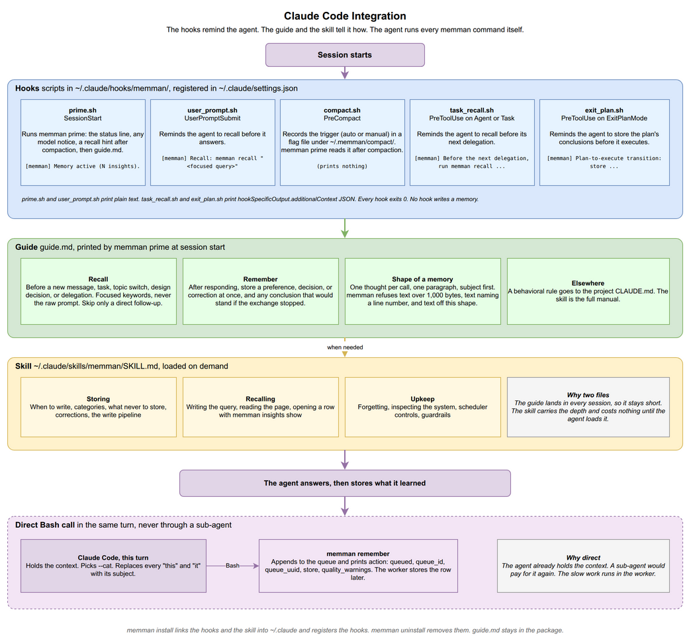

# 5. Claude Code Integration

[< Back to Design Overview](../DESIGN.md)

---



memman includes three parts for Claude Code integration: lifecycle hooks, a skill and a guide. `memman install` installs the hooks and the skill and registers each hook with Claude Code's [hook system](https://docs.anthropic.com/en/docs/claude-code/hooks). The hooks never write a memory. The agent runs every memory command itself.

## 5.1 Integration architecture

The integration runs at these points in a session:

1. **Session start.** `prime.sh` (SessionStart) runs `memman prime`, which prints a status line and the guide.
2. **Every user message.** `user_prompt.sh` (UserPromptSubmit) reminds the agent to recall.
3. **On demand.** Claude Code lists the memman skill by its description and loads `SKILL.md` when the agent invokes it.
4. **Before sub-agent delegation.** `task_recall.sh` (PreToolUse on Agent or Task) reminds the agent to recall before the next delegation.
5. **Before leaving plan mode.** `exit_plan.sh` (PreToolUse on ExitPlanMode) reminds the agent to store the decisions made during planning.
6. **After compaction.** `compact.sh` (PreCompact) writes a flag file. The SessionStart that follows compaction adds a recall reminder.

Each part has a separate role:

| Layer     | What                                         | Where                                            | Role                                                        |
| --------- | -------------------------------------------- | ------------------------------------------------ | ----------------------------------------------------------- |
| **Hooks** | Five shell scripts run on Claude Code events | `~/.claude/hooks/memman/`                        | Print the guide and remind the agent to recall and to store |
| **Skill** | `SKILL.md`, the full manual                  | `~/.claude/skills/memman/`                       | When to recall, what to remember, how to use each command   |
| **Guide** | `guide.md`, the recall and remember commands | The installed package, printed by `memman prime` | Shows the two commands in every session and names the skill |

**Why the guide stays small.** Claude Code truncates hook stdout above 10,000 bytes. It keeps a short preview, writes the rest to a file it never reads back, and reports no error. The injected text also adds to the cost of every later request in the session. The guide contains only what each session needs. The skill provides details when loaded on demand. `tests/test_setup.py::TestPrimeAndCompactHooks::test_prime_payload_reaches_the_model_whole` fails when the `memman prime` output reaches 10,000 bytes or loses either command.

## 5.2 Hook details

| Hook        | Event                     | Matcher        | Script                    | Output                   | Role                                                  |
| ----------- | ------------------------- | -------------- | ------------------------- | ------------------------ | ----------------------------------------------------- |
| `prime`     | SessionStart              | none           | `prime.sh`                | Plain text               | Status line, model notice, compaction reminder, guide |
| `remind`    | UserPromptSubmit          | none           | `user_prompt.sh`          | Plain text               | Recall reminder                                       |
| `compact`   | PreCompact + SessionStart | none           | `compact.sh` + `prime.sh` | Flag file                | Recall reminder after compaction                      |
| `recall`    | PreToolUse                | `Agent\        | Task`                     | `task_recall.sh`         | `additionalContext` JSON                              | Recall reminder before delegation |
| `exit_plan` | PreToolUse                | `ExitPlanMode` | `exit_plan.sh`            | `additionalContext` JSON | Reminder to store conclusions before execution        |

The Hook column gives the label `memman install` prints. Claude Code passes plain hook stdout to the agent only on SessionStart and UserPromptSubmit, so the two PreToolUse hooks print `{"hookSpecificOutput": {"hookEventName": "PreToolUse", "additionalContext": "..."}}` instead.

The reminder each hook delivers:

- `user_prompt.sh`: `[memman] Recall: memman recall "<focused query>"`
- `task_recall.sh`: `[memman] Before the next delegation, run memman recall "<focused query>" and carry anything relevant into its brief.` PreToolUse fires after the agent has written the brief, so the reminder applies to the next delegation.
- `exit_plan.sh`: `[memman] Plan-to-execute transition: store any conclusions, decisions, or preferences from this planning session via Bash (memman remember ...) before proceeding.`

**Prime hook.** `prime.sh` pipes the SessionStart JSON to the hidden command `memman prime`. When `memman` is not on PATH, it prints a warning that the hooks are inactive. `memman prime` prints, in order:

1. The status line, `[memman] Memory active (N insights).`, where N counts the current memories in the active store. When the store does not exist yet, or the count fails, the line is `[memman] Memory active.`
2. One `[memman]` model notice if the daily model check reports a problem with the configured model ([chapter 3](03-pipelines.md#daily-model-check)).
3. The compaction reminder when the session follows compaction.
4. The guide.

**Compact hook: passing a reminder through compaction.** Claude Code does not pass PreCompact stdout to the agent, so the reminder goes out on the SessionStart that follows:

1. `compact.sh` fires at PreCompact and writes the trigger and a UTC timestamp to `~/.memman/compact/<session_id>.json`.
2. After compaction, Claude Code fires SessionStart with `source` set to `compact`.
3. `memman prime` sees that source, reads the trigger from the flag file (default `auto`), and prints the recall reminder.

`memman prime` checks only `source`. The flag file supplies only the trigger, so the reminder appears even when `compact.sh` did not run. The flag directory is always `~/.memman/compact/`, regardless of `MEMMAN_DATA_DIR`.

```bash
# compact.sh (PreCompact) - writes the flag file
cat > "${COMPACT_DIR}/${SESSION_ID}.json" <<FLAGEOF
{"trigger":"${TRIGGER:-auto}","ts":"$(date -u +%Y-%m-%dT%H:%M:%SZ)"}
FLAGEOF
```

```
# memman prime output after compaction
[memman] Context was just compacted (auto). Recall critical context now: memman recall "<topic>"
```

## 5.3 Automated setup

`memman install` writes into `~/.claude/` when it detects Claude Code (a `claude` binary on PATH or an existing `~/.claude/`), or when `--target claude-code` is passed. Otherwise it installs the scheduler only. Installation creates the following links and settings:

| Target                              | What install writes                                                                       |
| ----------------------------------- | ----------------------------------------------------------------------------------------- |
| `skills/memman/SKILL.md`            | Symlink to `memman/setup/assets/claude/SKILL.md` in the installed package                 |
| `hooks/memman/<script>.sh`          | One symlink per hook script into the same package directory                               |
| `settings.json` `hooks`             | One entry per script, with the events and matchers above                                  |
| `settings.json` `permissions.allow` | One `Bash(memman <verb>:*)` entry for each of 11 commands the agent runs without a prompt |
| `guide.md`                          | Nothing. `memman prime` reads it from the package on every SessionStart                   |

- Install first removes every hook entry that mentions `memman`, so a second run leaves one set. Other hooks stay as they are.
- The 11 permitted commands are `doctor`, `forget`, `insights by-queue`, `insights review`, `insights show`, `recall`, `remember`, `replace`, `status`, `supersede` and `unsupersede`. In a terminal, install lists the entries and asks first. With `--no-wizard` or without a terminal, it adds them without asking.

**Upgrades.** `pipx upgrade memman` refreshes the hook scripts and `SKILL.md` through the symlinks, and `memman prime` reads the new `guide.md`. A change confined to those assets needs no reinstall. A change to a hook registration or the permission list does: only `memman install` rewrites `settings.json`. The `claude_hooks` check in `memman doctor` warns when the registrations differ from what install writes, and fails when a registered script is missing.

**Wizard.** In a terminal, install runs a wizard that asks for the LLM endpoint, the embedding provider and its key, the LLM key, a model slug on an endpoint other than OpenRouter, the backend, and a Postgres DSN when needed. The [USAGE guide](../USAGE.md#install-wizard) lists each step.

**Existing SQLite stores.** Install does not move existing SQLite stores to a newly chosen Postgres backend. `memman migrate` moves a store ([USAGE guide](../USAGE.md#migrating-between-sqlite-and-postgres)).

**Configure after install.** Install refuses a flag that conflicts with an env-file value and prints the `memman config set` command that changes it.

**Uninstall.** `memman uninstall` strips the secret keys (`MEMMAN_LLM_API_KEY`, `MEMMAN_OPENROUTER_API_KEY`, `MEMMAN_VOYAGE_API_KEY`, `MEMMAN_OPENAI_EMBED_API_KEY`, `MEMMAN_DEFAULT_POSTGRES_DSN`) and keeps the other settings, so a later install reuses them. It leaves the stores, queue and logs under `~/.memman/` in place. `pipx uninstall memman` removes the binary.

The [USAGE guide](../USAGE.md#install-and-uninstall) gives the full flag list.

## 5.4 Running memory commands directly through Bash

`SKILL.md` requires the agent to run `memman remember` directly through Bash in its own turn without delegating to a sub-agent. There are three reasons:

- **The command only queues a write.** It checks the text, appends one row to `queue.db` and returns. It makes no network call and opens no store. Enrichment and embedding run later in the background worker, so there is no slow work to delegate.
- **The agent holds the context.** It already knows the right `--cat`, and what each "this" or "it" refers to. Passing that context to a sub-agent would use more tokens.
- **A sub-agent learns nothing more.** `remember` returns `action: queued`, `queue_id`, `queue_uuid`, `store` and `quality_warnings` once the write is queued. The memory reaches recall after the next drain. A sub-agent would get the same reply the agent gets from one Bash call.
