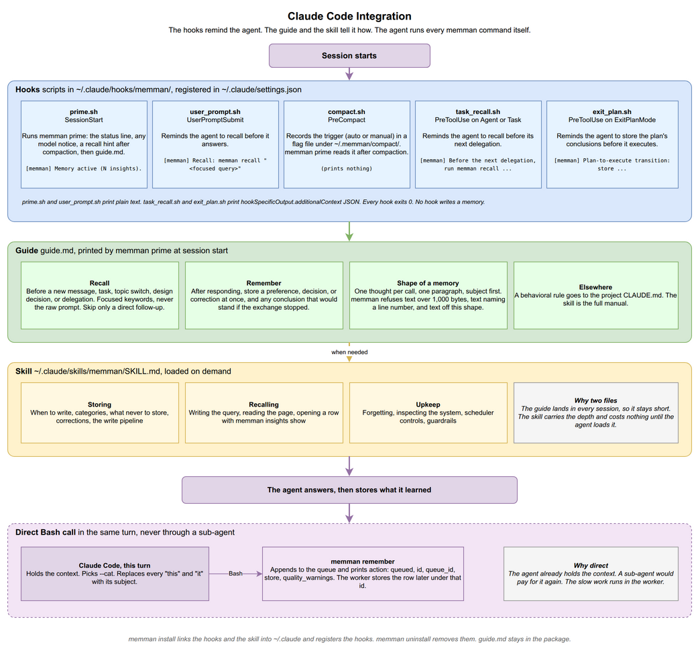

# 5. Claude Code integration

[Previous: lifecycle and embedding](04-lifecycle.md) | [Design overview](../DESIGN.md)

memman supplies hooks, a short session guide, and a skill manual. Together they tell the agent when and how to use memory. The agent runs every memory command itself; hooks provide instructions and reminders.

## 5.1 Integration architecture

| Part  | Role                                                                           | Location                                      |
| ----- | ------------------------------------------------------------------------------ | --------------------------------------------- |
| Hooks | Respond to session events and supply memory reminders.                         | `~/.claude/hooks/memman/`                     |
| Guide | Introduce recall, remember, and replace at session start.                      | Package `guide.md`, printed by `memman prime` |
| Skill | Explain memory selection, queries, corrections, and command details on demand. | `~/.claude/skills/memman/SKILL.md`            |



The guide stays short for two reasons:

- **Silent truncation.** Claude Code cuts hook stdout above 10,000 bytes. It keeps a short preview, writes the rest to a file it never reads back, and reports no error, so the agent acts on an instruction cut mid-sentence.
- **Cost.** Every injected byte bills on every later request in the session.

`tests/test_setup.py::TestPrimeAndCompactHooks::test_prime_payload_reaches_the_model_whole` fails when the `memman prime` output on a fresh data directory reaches 10,000 bytes or loses the recall, remember, or replace command. The model notice and the compaction line add to that payload in a live session. The skill carries the depth and loads on demand.

## 5.2 Hook details

| Script           | Event              | Matcher           | Effect                                                                                     |
| ---------------- | ------------------ | ----------------- | ------------------------------------------------------------------------------------------ |
| `prime.sh`       | `SessionStart`     | Any               | Print status, any model notice, a post-compaction reminder when applicable, and the guide. |
| `user_prompt.sh` | `UserPromptSubmit` | Any               | Remind the agent to recall before answering.                                               |
| `task_recall.sh` | `PreToolUse`       | `Agent` or `Task` | Remind the agent to recall before its next delegation.                                     |
| `exit_plan.sh`   | `PreToolUse`       | `ExitPlanMode`    | Remind the agent to save planning conclusions.                                             |
| `compact.sh`     | `PreCompact`       | Any               | Record the compaction trigger for the next session-start reminder.                         |

Claude Code passes plain hook stdout to the agent only on `SessionStart` and `UserPromptSubmit`, so those two hooks print text. The two pre-tool hooks put their reminder in `hookSpecificOutput.additionalContext`, with `hookEventName: PreToolUse`, because plain stdout on that event never reaches the agent.

The reminders:

- `user_prompt.sh`: `[memman] Recall: memman recall "<focused query>"`
- `task_recall.sh`: `[memman] Before the next delegation, run memman recall "<focused query>" and carry anything relevant into its brief.`
- `exit_plan.sh`: `[memman] Plan-to-execute transition: store any conclusions, decisions, or preferences from this planning session via Bash (memman remember ..., or memman replace <id> ... to correct a stored row) before proceeding.`

The delegation reminder concerns the **next** delegation because the current tool call's brief has already been written when the hook runs.

### Session start

`prime.sh` passes the session event to the hidden `memman prime` command. If the binary is missing from `PATH`, the script prints a warning. Otherwise, prime prints:

1. The status line `[memman] Memory active (N insights).`, where N counts the current memories in the active store. Without a store or a count, the line is `[memman] Memory active.`
2. Any recorded [model notice](03-pipelines.md#daily-model-check) for the configured model.
3. A recall reminder if the session started after compaction.
4. The guide from the installed package.

### Compaction

Claude Code drops `PreCompact` stdout, so the reminder rides on the session-start event that follows. `compact.sh` records the trigger and UTC timestamp in `~/.memman/compact/<session_id>.json`. When the next session-start event has `source: compact`, prime prints a recall reminder with that trigger, defaulting to `auto`:

```text
[memman] Context was just compacted (auto). Recall critical context now: memman recall "<topic>"
```

The event source determines whether the reminder appears; it still appears if the flag file is missing. The flag directory remains under `~/.memman`, regardless of `MEMMAN_DATA_DIR`.

## 5.3 Automated setup

`memman install` detects Claude Code through a `claude` binary on `PATH` or an existing `~/.claude` directory. `--claude-code` forces integration installation. Without detection or the flag, installation sets up only the scheduler.

| Target                                             | Installed content                      |
| -------------------------------------------------- | -------------------------------------- |
| `~/.claude/skills/memman/SKILL.md`                 | Symlink to the packaged skill.         |
| `~/.claude/hooks/memman/*.sh`                      | Symlinks to the five packaged scripts. |
| `~/.claude/settings.json`, key `hooks`             | Event registrations and matchers.      |
| `~/.claude/settings.json`, key `permissions.allow` | Eight `Bash(memman <verb>:*)` entries. |

The permitted commands are `doctor`, `forget`, `insights review`, `insights show`, `recall`, `remember`, `replace`, and `status`. In an interactive installation, memman lists the entries and asks before adding them. With `--no-wizard` or no terminal, it adds them without a prompt.

Installation replaces existing hook entries mentioning memman and preserves other hooks. Re-running it leaves one set of registrations. The guide needs no symlink because prime reads it from the package. Installation never moves an existing SQLite store to a newly chosen Postgres backend. `memman migrate` moves a store.

### Upgrades and removal

Package upgrades refresh the scripts, skill, and guide. Registration changes, scheduler-unit changes, and new installed defaults require another `memman install`. `doctor` checks hook registrations and missing scripts.

`memman uninstall` removes integration and scheduler setup while retaining stores, queue, and logs. The [usage guide](../USAGE.md#install-and-uninstall) owns the full installation flags, wizard steps, and settings-removal details.

## 5.4 Direct memory commands

The packaged skill instructs the agent to run `remember` directly through Bash during its own turn. Submission validates and queues the memory, then reads related memories without calling a model. The agent already has the context needed to write a self-contained claim and decide whether a related memory needs correction.

The worker handles summary generation and embedding later. Delegating submission would add another handoff without moving that background work out of the turn.

The guide and skill are package assets, so a customization edits the package source. An editable installation uses those edits at once. A change to a hook registration still requires `memman install`.
