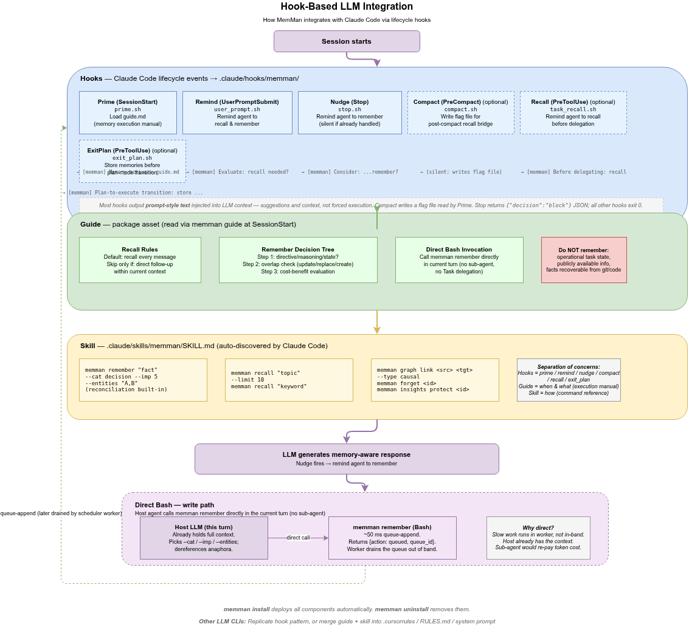

# 6. LLM CLI Integration

[< Back to Design Overview](../DESIGN.md)

---



memman ships three integration assets: lifecycle hooks, a skill file, and a behavioral guide. `memman install` deploys all three. Claude Code's [hook system](https://docs.anthropic.com/en/docs/claude-code/hooks) is the reference platform.

## 6.1 Integration architecture

Lifecycle order within a session:

1. **Session start** — `prime.sh` (SessionStart) loads `guide.md` (the memory execution manual).
2. **Every user message** — `user_prompt.sh` (UserPromptSubmit) reminds the agent to recall and remember.
3. The LLM responds; `SKILL.md` is auto-discovered for command syntax; `guide.md` rules apply.
4. **Before sub-agent delegation** — `task_recall.sh` (PreToolUse on Task) reminds the agent to recall first.
5. **Before plan exit** — `exit_plan.sh` (PreToolUse on ExitPlanMode) prompts memory storage before the transition.
6. **Turn end** — `stop.sh` (Stop) reminds the agent to evaluate "remember?".
7. **Context compacted** (asynchronous) — `compact.sh` (PreCompact) writes a flag file; the next `SessionStart` reads it for post-compact recall.

Three assets, three jobs:

| Layer     | What                                                               | Where                                       | Role                                                                                                                                                |
| --------- | ------------------------------------------------------------------ | ------------------------------------------- | --------------------------------------------------------------------------------------------------------------------------------------------------- |
| **Hooks** | Shell scripts triggered by Claude Code lifecycle events            | `.claude/hooks/memman/`                     | Prime (guide), Remind (recall & remember), Nudge (remember), Compact (pre-compact bridge), Recall (pre-delegation), ExitPlan (plan-mode transition) |
| **Skill** | `SKILL.md` — command reference in Claude Code skill format         | `.claude/skills/memman/`                    | Teaches the LLM *how* to use memman commands                                                                                                        |
| **Guide** | `guide.md` — execution manual for recall, remember, and delegation | Installed package (read via `memman guide`) | Teaches the LLM *when* to recall, *what* to remember, and *how* to delegate                                                                         |

## 6.2 Hook details

| Hook     | Event                     | Script                | Role                                    |
| -------- | ------------------------- | --------------------- | --------------------------------------- |
| Prime    | SessionStart              | prime.sh              | Inject guide + compact-recall hint      |
| Remind   | UserPromptSubmit          | user_prompt.sh        | Recall reminder                         |
| Nudge    | Stop                      | stop.sh               | Block-decision JSON; "remember?" prompt |
| Compact  | PreCompact + SessionStart | compact.sh + prime.sh | Flag-file relay across compaction       |
| Recall   | PreToolUse (Task)         | task_recall.sh        | Pre-delegation recall reminder          |
| ExitPlan | PreToolUse (ExitPlanMode) | exit_plan.sh          | Pre-execute storage reminder            |

Prime, Remind, Recall, and ExitPlan are plain `echo` shims to the agent; their bodies are visible in the package source. Two hooks need explanation:

**Stop hook — block-decision JSON contract.** Returns `decision: block` so the agent gets one more turn to evaluate memory. Directive-aware: prompts the agent to store if a user preference, decision, or conclusion emerged. Fires once per user turn (gated by a `stop_fired/` directory lock) and stays silent when `stop_hook_active` is true (preventing infinite loops):

```bash
INPUT=$(cat)
if echo "$INPUT" | grep -q '"stop_hook_active"[[:space:]]*:[[:space:]]*true'; then
  exit 0
fi
cat <<'EOF'
{"decision": "block", "reason": "[memman] Memory check: did the user state a preference, make a decision, give a correction, or reach a conclusion? If yes, call `memman remember \"<self-contained text>\"` directly via Bash in your next turn (no sub-agent, no delegation). Dereference anaphora before storing. Only skip if the exchange was purely open-ended questions with no resolution."}
EOF
```

**Compact hook — two-part flag-file relay.** PreCompact cannot inject context into the agent's conversation (stdout is verbose-mode only), so the solution uses a flag file:

1. `compact.sh` fires at PreCompact — writes a flag file to `~/.memman/compact/<session_id>.json` with the trigger type and timestamp.
2. After compaction, Claude Code fires SessionStart with `source=compact`.
3. `prime.sh` detects `source=compact`, reads the flag file for enrichment, and injects a recall instruction the agent can see.

`prime.sh` detects compaction from the SessionStart `source` field regardless of whether `compact.sh` ran; the flag file enriches the message with trigger type but is not required.

```bash
# compact.sh (PreCompact) — writes flag file
cat > "${COMPACT_DIR}/${SESSION_ID}.json" <<EOF
{"trigger":"${TRIGGER:-auto}","ts":"$(date -u +%Y-%m-%dT%H:%M:%SZ)"}
EOF

# prime.sh (SessionStart) — detects compact source, injects recall
if [ "$SOURCE" = "compact" ]; then
  echo "[memman] Context was just compacted (${TRIGGER:-auto}). Recall critical context now."
fi
```

Stale `stop_fired/` directories (older than 2 hours) are cleaned up by `prime.sh` at session start.

## 6.3 Automated setup

`memman install` deploys everything via symlinks into the installed package, so `pipx upgrade memman` refreshes hook scripts and SKILL.md automatically:

```
$ memman install

Detecting LLM CLI environments...
  ✓ Claude Code (v1.x)    ~/.claude/

Setting up Claude Code (~/.claude/)...

[1/2] Skill
  ✓ Skill     ~/.claude/skills/memman/SKILL.md

[2/2] Hooks
  ✓ Hook: prime     ~/.claude/hooks/memman/prime.sh
  ✓ Hook: remind    ~/.claude/hooks/memman/user_prompt.sh
  ✓ Hook: nudge     ~/.claude/hooks/memman/stop.sh
  ✓ Hook: compact   ~/.claude/hooks/memman/compact.sh
  ✓ Hook: recall    ~/.claude/hooks/memman/task_recall.sh
  ✓ Hook: exit_plan ~/.claude/hooks/memman/exit_plan.sh
  ✓ Settings         ~/.claude/settings.json (updated)
  ✓ Permission       Bash(memman:*) added to settings.json

Setup complete!
  Hooks   prime, remind, nudge, compact, recall, exit_plan

Start a new Claude Code session to activate.
```

Deployment model:

- `~/.claude/skills/memman/SKILL.md` → symlink into the installed package's `memman/setup/assets/claude/SKILL.md`.
- `~/.claude/hooks/memman/*.sh` → symlinks into the same package path. `prime.sh` is a thin shim that delegates to `memman prime` (status + compact hint + guide in one Python call).
- Shipped `guide.md` is never deployed to disk — `memman guide` reads it from the package via `importlib.resources` every time `prime.sh` fires.

`pipx upgrade memman` refreshes hook scripts and `SKILL.md` through the symlinks; `guide.md` reads live from the new package. Asset-only changes propagate without re-install.

See [USAGE.md § Install / Uninstall](../USAGE.md#install--uninstall) for the full flag matrix.

**Wizard backend prompt.** In a TTY without `OPENROUTER_API_KEY` / `VOYAGE_API_KEY` set, the install wizard prompts for each missing mandatory secret with masked input. The backend selector appears when the `memman[postgres]` extra is installed (psycopg + pgvector importable); without it, sqlite is the only path and the wizard short-circuits the backend prompt. When postgres is selected, the wizard writes `MEMMAN_DEFAULT_BACKEND=postgres` and `MEMMAN_BACKEND_default=postgres` plus the per-store DSN (`MEMMAN_POSTGRES_DSN_default`), probes the DSN with `psycopg.connect`, verifies the `pgvector` extension, and (for non-localhost DSNs) emits a hint about PgBouncer transaction pooling.

**SQLite stores not touched.** `memman install` does not migrate existing SQLite stores into a newly-selected Postgres backend. To move a specific store, run `memman migrate --store NAME` (or `--all`); the command echoes a plan, prompts for confirmation, and writes `MEMMAN_BACKEND_<store>=postgres` per migrated store on success. See [USAGE.md § Migrating between SQLite and Postgres](../USAGE.md#migrating-between-sqlite-and-postgres).

**Configure after install.** Conflicts between an `INSTALLABLE_KEYS` flag and an existing env-file value are rejected with the exact `memman config set ...` command to run — install never silently swallows a flag. `memman uninstall` strips secret keys (`OPENROUTER_API_KEY`, `VOYAGE_API_KEY`, `MEMMAN_OPENAI_EMBED_API_KEY`, `MEMMAN_DEFAULT_POSTGRES_DSN`, and any `MEMMAN_POSTGRES_DSN_<store>`) while preserving non-secret settings, so a later `memman install` resurrects preferences without re-export. The memory store, queue, and scheduler logs under `~/.memman/` are untouched. To remove the binary: `pipx uninstall memman`.

The Prime hook is always installed. Remind, Nudge, Compact, Recall, and ExitPlan hooks are optional (all enabled by default).

## 6.4 Direct-Bash invocation (no sub-agent)

The host agent calls `memman remember` via Bash in the same turn. No sub-agent, no Task delegation, no context isolation. Three reasons:

- **The binary is a fast queue-append** (~50 ms). The cost that would justify offloading to a sub-agent (LLM extraction, embedding, edge inference) does not run in-band — it runs in the scheduler worker out of band. The host turn pays only the queue-append latency.
- **The host LLM already holds the context** needed to choose the right `--cat`, `--imp`, `--entities`, and to dereference anaphora before storing. A sub-agent would pay tokens to re-read context the host already has.
- **One-way visibility** (writes are not recallable in the same turn) means there is no callback the sub-agent could provide that the host could not get itself. Recall remains a separate Bash call.

The shipped `guide.md` enforces this explicitly: *"call `memman remember "<self-contained text>"` directly via Bash in your current turn. No sub-agent delegation."*

## 6.5 Adapting to other LLM CLIs

For CLIs with hook support, replicate the Claude Code pattern: register lifecycle hooks that call memman commands, deploy the skill file, and provide the behavioral guide.

For CLIs without hook support, merge the recall/remember guidance into the corresponding system prompt or rules file:

- OpenClaw — `memman install --target openclaw` deploys skill + guide; hooks require manual plugin configuration.
- Others — system prompt / rules file.
