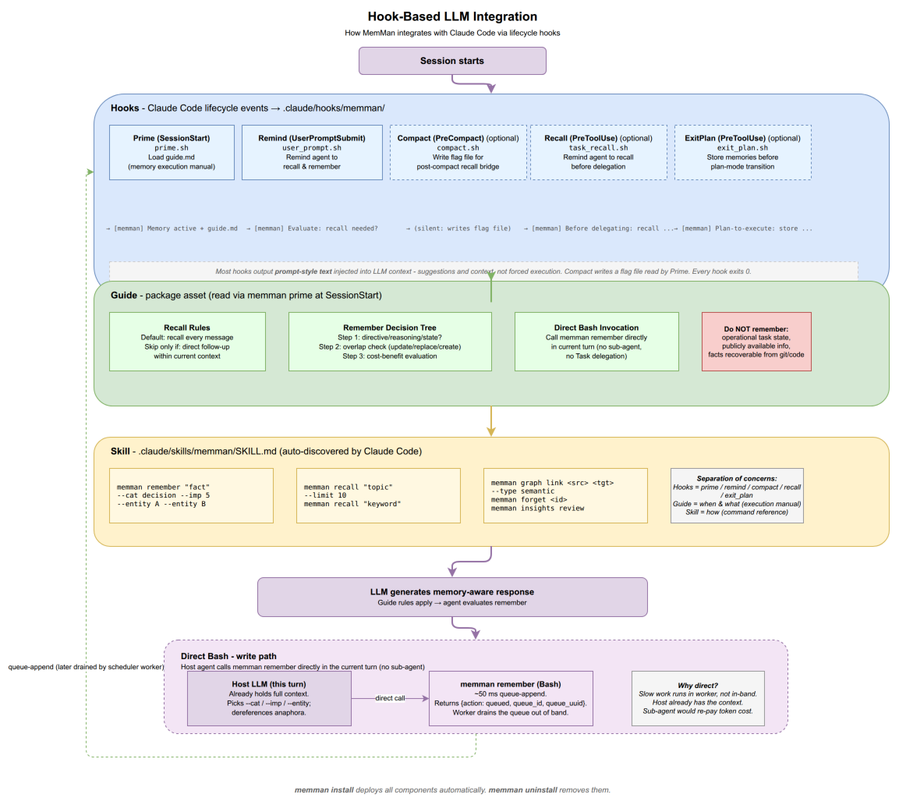

# 6. LLM CLI Integration

[< Back to Design Overview](../DESIGN.md)

---



memman ships three integration assets: lifecycle hooks, a skill file, and a behavioral guide. `memman install` deploys all three. memman integrates with Claude Code through its [hook system](https://docs.anthropic.com/en/docs/claude-code/hooks).

## 6.1 Integration architecture

Lifecycle order within a session:

1. **Session start** - `prime.sh` (SessionStart) loads `guide.md`, which carries the recall and remember commands and names the skill holding the rest.
2. **Every user message** - `user_prompt.sh` (UserPromptSubmit) reminds the agent to recall.
3. The LLM responds; `SKILL.md` is auto-discovered and holds the execution manual; `guide.md` rules apply.
4. **Before sub-agent delegation** - `task_recall.sh` (PreToolUse on Agent or Task) reminds the agent to recall first.
5. **Before plan exit** - `exit_plan.sh` (PreToolUse on ExitPlanMode) prompts memory storage before the transition.
6. **Context compacted** (asynchronous) - `compact.sh` (PreCompact) writes a flag file; the next `SessionStart` reads it for post-compact recall.

Three assets, three jobs:

| Layer     | What                                                         | Where                                       | Role                                                                                                                   |
| --------- | ------------------------------------------------------------ | ------------------------------------------- | ---------------------------------------------------------------------------------------------------------------------- |
| **Hooks** | Shell scripts triggered by Claude Code lifecycle events      | `.claude/hooks/memman/`                     | Prime (guide), Remind (recall), Compact (pre-compact bridge), Recall (pre-delegation), ExitPlan (plan-mode transition) |
| **Skill** | `SKILL.md` - execution manual in Claude Code skill format    | `.claude/skills/memman/`                    | Teaches the LLM *when* to recall, *what* to remember, and *how* to use memman commands                                 |
| **Guide** | `guide.md` - the recall and remember commands, and a pointer | Installed package (read via `memman prime`) | Carries the two commands into every session and names the skill that holds the manual                                  |

## 6.2 Hook details

| Hook     | Event                      | Script                | Role                               |
| -------- | -------------------------- | --------------------- | ---------------------------------- |
| Prime    | SessionStart               | prime.sh              | Inject guide + compact-recall hint |
| Remind   | UserPromptSubmit           | user_prompt.sh        | Recall reminder                    |
| Compact  | PreCompact + SessionStart  | compact.sh + prime.sh | Flag-file relay across compaction  |
| Recall   | PreToolUse (Agent or Task) | task_recall.sh        | Pre-delegation recall reminder     |
| ExitPlan | PreToolUse (ExitPlanMode)  | exit_plan.sh          | Pre-execute storage reminder       |

Prime, Remind, Recall, and ExitPlan are plain `echo` shims to the agent; their bodies are visible in the package source. One hook needs explanation:

**Compact hook - two-part flag-file relay.** PreCompact cannot inject context into the agent's conversation (stdout is verbose-mode only), so the solution uses a flag file:

1. `compact.sh` fires at PreCompact - writes a flag file to `~/.memman/compact/<session_id>.json` with the trigger type and timestamp.
2. After compaction, Claude Code fires SessionStart with `source=compact`.
3. `prime.sh` detects `source=compact`, reads the flag file for enrichment, and injects a recall instruction the agent can see.

`prime.sh` detects compaction from the SessionStart `source` field regardless of whether `compact.sh` ran; the flag file enriches the message with trigger type but is not required.

```bash
# compact.sh (PreCompact) - writes flag file
cat > "${COMPACT_DIR}/${SESSION_ID}.json" <<EOF
{"trigger":"${TRIGGER:-auto}","ts":"$(date -u +%Y-%m-%dT%H:%M:%SZ)"}
EOF

# prime.sh (SessionStart) - detects compact source, injects recall
if [ "$SOURCE" = "compact" ]; then
  echo "[memman] Context was just compacted (${TRIGGER:-auto}). Recall critical context now."
fi
```

## 6.3 Automated setup

`memman install` deploys everything via symlinks into the installed package, so `pipx upgrade memman` refreshes hook scripts and SKILL.md automatically:

```
$ memman install

Detecting LLM CLI environments...
  ✓ Claude Code (v1.x)    ~/.claude/

Setting up Claude Code (~/.claude/)...

[1/2] Skill
  ✓ Skill     ~/.claude/skills/memman/SKILL.md

[2/2] Hooks
  ✓ Hook: prime     ~/.claude/hooks/memman/prime.sh
  ✓ Hook: remind    ~/.claude/hooks/memman/user_prompt.sh
  ✓ Hook: compact   ~/.claude/hooks/memman/compact.sh
  ✓ Hook: recall    ~/.claude/hooks/memman/task_recall.sh
  ✓ Hook: exit_plan ~/.claude/hooks/memman/exit_plan.sh
  ✓ Settings         ~/.claude/settings.json (updated)
  ✓ Permissions      12 memman verbs added

Setup complete!
  Hooks   prime, remind, compact, recall, exit_plan

Start a new Claude Code session to activate.
```

Deployment model:

- `~/.claude/skills/memman/SKILL.md` → symlink into the installed package's `memman/setup/assets/claude/SKILL.md`.
- `~/.claude/hooks/memman/*.sh` → symlinks into the same package path. `prime.sh` is a thin shim that delegates to `memman prime` (status + compact hint + guide in one Python call).
- Shipped `guide.md` is never deployed to disk - `memman prime` reads it from the package via `importlib.resources` every time `prime.sh` fires.
- The host truncates hook stdout above 10,000 bytes, substituting a short preview and writing the rest to a file it never reads back. `guide.md` therefore stays small enough for the whole payload to arrive, and depth lives in `SKILL.md`, which loads on demand.

`pipx upgrade memman` refreshes hook scripts and `SKILL.md` through the symlinks; `guide.md` reads live from the new package. A change confined to those assets propagates without re-install. A change to the hook registrations themselves does not: `~/.claude/settings.json` holds the event and matcher set, and only `memman install` rewrites it.

See [USAGE.md § Install / Uninstall](../USAGE.md#install--uninstall) for the full flag matrix.

**Wizard backend prompt.** In a TTY without `MEMMAN_LLM_API_KEY` / `MEMMAN_VOYAGE_API_KEY` set, the install wizard first asks for the LLM endpoint URL (default OpenRouter) and then prompts for each missing mandatory secret with masked input. The backend selector appears when the `memman[postgres]` extra is installed (psycopg + pgvector importable); without it, sqlite is the only path and the wizard short-circuits the backend prompt. When postgres is selected, the wizard writes `MEMMAN_DEFAULT_BACKEND=postgres` and `MEMMAN_BACKEND_default=postgres` plus the per-store DSN (`MEMMAN_POSTGRES_DSN_default`), probes the DSN with `psycopg.connect`, verifies the `pgvector` extension, and (for non-localhost DSNs) emits a hint about PgBouncer transaction pooling.

**SQLite stores not touched.** `memman install` does not migrate existing SQLite stores into a newly-selected Postgres backend. To move a specific store, run `memman migrate --store NAME` (or `--all`); the command echoes a plan, prompts for confirmation, and writes `MEMMAN_BACKEND_<store>=postgres` per migrated store on success. See [USAGE.md § Migrating between SQLite and Postgres](../USAGE.md#migrating-between-sqlite-and-postgres).

**Configure after install.** Conflicts between an `INSTALLABLE_KEYS` flag and an existing env-file value are rejected with the exact `memman config set ...` command to run - install never silently swallows a flag. `memman uninstall` strips secret keys (`MEMMAN_LLM_API_KEY`, `MEMMAN_OPENROUTER_API_KEY`, `MEMMAN_VOYAGE_API_KEY`, `MEMMAN_OPENAI_EMBED_API_KEY`, `MEMMAN_DEFAULT_POSTGRES_DSN`, and any `MEMMAN_POSTGRES_DSN_<store>`) while preserving non-secret settings, so a later `memman install` resurrects preferences without re-export. The memory store, queue, and scheduler logs under `~/.memman/` are untouched. To remove the binary: `pipx uninstall memman`.

The Prime hook is always installed. Remind, Compact, Recall, and ExitPlan hooks are optional (all enabled by default).

## 6.4 Direct-Bash invocation (no sub-agent)

The host agent calls `memman remember` via Bash in the same turn. No sub-agent, no Task delegation, no context isolation. Three reasons:

- **The binary is a fast queue-append** (~50 ms). The cost that would justify offloading to a sub-agent (the content-hash lookup, enrichment, embedding, edge inference) does not run in-band - it runs in the scheduler worker out of band. The host turn pays only the queue-append latency.
- **The host LLM already holds the context** needed to choose the right `--cat`, `--imp`, `--entity`, and to dereference anaphora before storing. A sub-agent would pay tokens to re-read context the host already has.
- **One-way visibility** (writes are not recallable in the same turn) means there is no callback the sub-agent could provide that the host could not get itself. Recall remains a separate Bash call.

The shipped `SKILL.md` enforces this explicitly: *"directly in the current turn, never through a sub-agent."*
