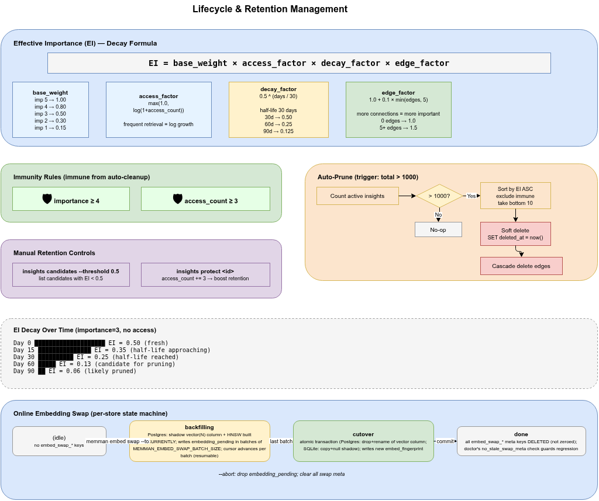

# 6. Lifecycle & Embedding

[< Back to Design Overview](../DESIGN.md)

---

Mnemon is not an append-only system. Effective memory management requires important memories to persist while outdated ones naturally decay.



## 6.1 Effective Importance (EI)

EI combines base importance, access frequency, time decay, and graph connectivity:

```
EI = base_weight(importance) × access_factor × decay_factor × edge_factor

base_weight:   imp 5 → 1.0,  4 → 0.8,  3 → 0.5,  2 → 0.3,  1 → 0.15
access_factor: max(1.0, log(1 + access_count))
decay_factor:  0.5 ^ (days_since_access / 30)     // half-life of 30 days
edge_factor:   1.0 + 0.1 × min(edge_count, 5)     // up to +0.5
```

Interpretation:
- **High importance** -> higher base score
- **Frequent access** -> logarithmic growth bonus
- **Long period without access** -> exponential decay (halves every 30 days)
- **Rich graph connections** -> indicates relevance to other knowledge, bonus applied

**Rationale:**

- **`base_weight` (1.0, 0.8, 0.5, 0.3, 0.15)**: Non-linear spacing creates a 6.7:1 ratio between importance 5 and 1. The largest gap (0.3→0.15) falls between importance 2→1, while the 0.8→0.5 gap between importance 4→3 reinforces the immunity boundary — importance 4+ is the "protected" tier.
- **`HALF_LIFE_DAYS = 30`**: One calendar month. Balances retention vs decay across typical project lifecycles: at 30 days EI halves, at 60 days quarters, at 90 days ~12.5%. Inspired by Ebbinghaus forgetting curve research but not derived from a specific paper — chosen as a round-number approximation for monthly project cadence. Not from MAGMA (the paper has no decay mechanism).
- **`edge_factor`: cap at 5 edges, +0.1 per edge (max +50%)**: Prevents highly-connected hub nodes from becoming permanently immune through connectivity alone.

## 6.2 Immunity Rules

The following insights are exempt from automatic cleanup:
- `importance >= 4` (high-value memories)
- `access_count >= 3` (frequently retrieved)

**Rationale:**

- **`importance >= 4`**: Follows directly from the importance scale definition — importance 4 = "immune to auto-pruning" (Section 3.1).
- **`access_count >= 3`**: Three independent retrievals provide statistical evidence of genuine utility, not coincidental access. The threshold is deliberately low — in a personal memory system, even two recalls suggest real value, but three provides a safety margin.

## 6.3 Auto-Pruning

Triggered when the total number of active insights exceeds **1000**:

1. Compute EI for all insights
2. Exclude immune insights
3. Take the lowest EI entries in ascending order (up to 10 per batch)
4. Soft-delete (set `deleted_at`)
5. Cascade-delete related edges

**Rationale:**

- **`MAX_INSIGHTS = 1000`**: Practical capacity for a single-user CLI memory system. Keeps SQLite scan cost bounded. Not from MAGMA (the paper specifies no storage capacity limit; its `Max Nodes: 200` is a per-query traversal budget, a different concept).
- **`PRUNE_BATCH_SIZE = 10`**: ~1% of MAX_INSIGHTS. Limits write amplification per `remember` call — a single insert never cascades into mass deletion.
- **`MAX_OPLOG_ENTRIES = 5000`**: 5× MAX_INSIGHTS; retains approximately five operations per insight on average. Sufficient audit trail without unbounded growth.

## 6.4 GC Command

Manual lifecycle management tool:

```bash
# View low-retention candidates
mnemon gc --threshold 0.5

# Retain a specific insight (increases access_count by +3)
mnemon gc --keep <id>

# Review stored insights for content quality issues
mnemon gc --review
```

`gc --review` scans all active insights against transient content patterns (AWS instance IDs, resource counts, verification receipts, deployment receipts, state observations, line number references). Returns flagged entries sorted by warning count. Note: since the remember pipeline now **rejects** content with 2+ quality warnings at write time, `gc --review` primarily catches insights stored before the hard gate was introduced, or single-warning content that accumulated additional transient characteristics over time.

**Rationale:**

- **`boost_retention +3`**: Deliberately matches the immunity threshold (`access_count >= 3`). A single `gc --keep` guarantees immunity regardless of prior access count — the insight crosses the threshold immediately.

---

## 6.5 Embedding Support

Voyage AI provides 512-dim embeddings for semantic search and graph connectivity.

### Voyage AI Integration

```
Mnemon ──HTTP──→ Voyage AI (api.voyageai.com)
                  └── voyage-3-lite
                      512-dim vector
```

- **Required**: `VOYAGE_API_KEY` environment variable
- Uses `httpx` (already a runtime dependency)

### Vector Storage

Vectors are serialized as little-endian float64 BLOBs stored in the `insights.embedding` column (512 x 8 = 4096 bytes/insight).

### Embedding in the Pipeline

- **Initial (remember — sequential)**: Each fact is embedded immediately after extraction
- **Merged (remember — sequential)**: If reconciliation merges facts, the merged text is re-embedded
- **Enriched (remember — parallel)**: After LLM enrichment extracts keywords, the insight is re-embedded with enriched text (content + keywords)
- **Recovery (`graph rebuild`)**: Re-enriches all insights through the full LLM pipeline and updates embeddings
- **Recall**: Expanded query is embedded for vector search anchors and reranking

### Management Commands

```bash
mnemon embed status              # View coverage
mnemon embed backfill            # Batch-generate embeddings for all insights
mnemon embed run <id>            # Generate for a single insight
```
